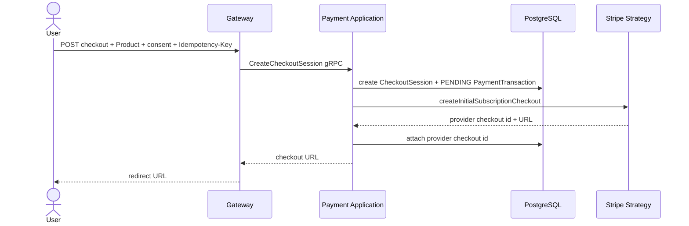
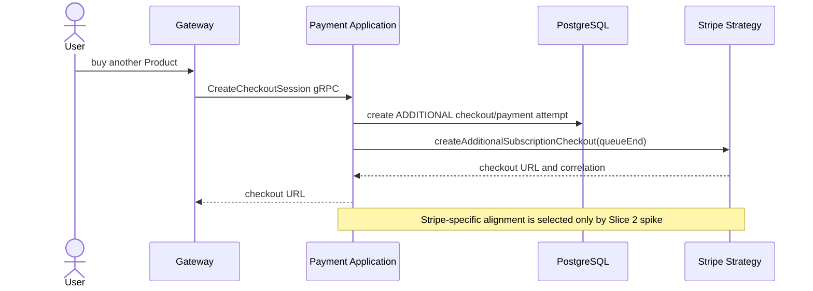
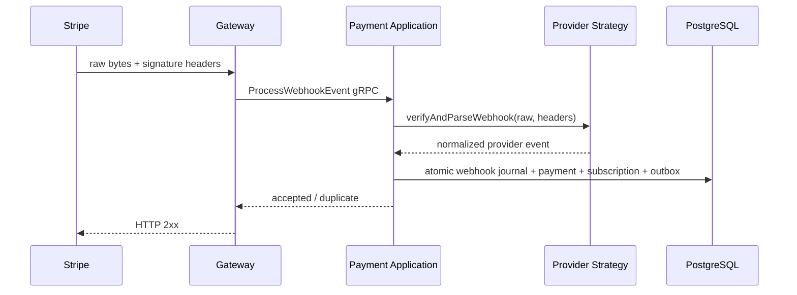
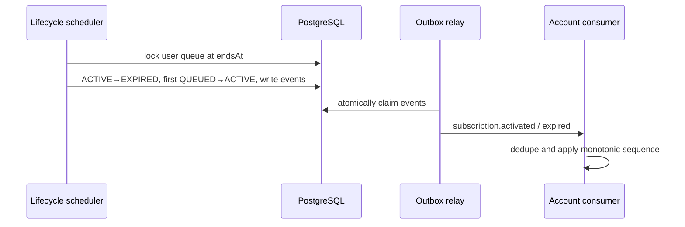
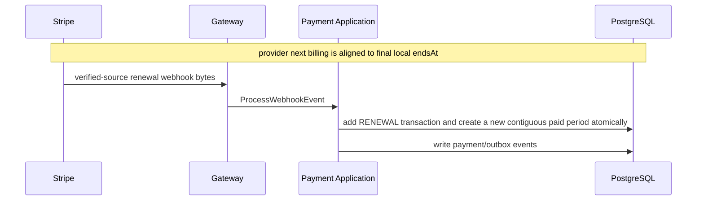
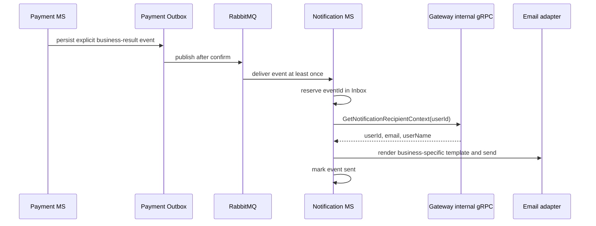
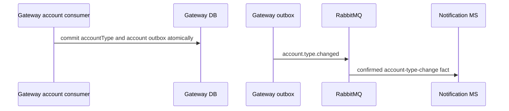
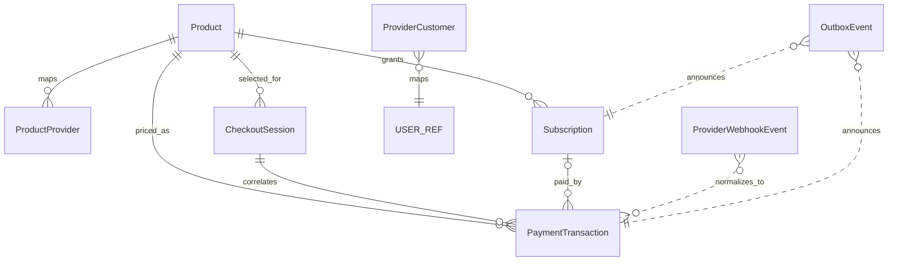

# Payment Microservice Modernization Plan

## 1. Goal and Scope

The goal is to replace the current non-runnable Payment MS skeleton with an incrementally deliverable payment capability that preserves Clean Architecture boundaries, supports Stripe in test mode, leaves a safe PayPal extension point, and implements paid subscription access through verified provider webhooks and a transactional outbox.

Scope:

- implement the business capabilities originally associated with P-007–P-012: checkout, verified/idempotent webhooks, subscription lifecycle, queries/history, auto-renew management, and outbox relay;
- repair prerequisites left incomplete in P-001–P-006: build/bootstrap integration, contracts, database foundation, domain model, repositories, provider abstraction, DI, and gRPC exception handling;
- correct P-013–P-015 integration defects in Gateway, account synchronization, and Notification MS;
- keep every slice independently reviewable, truthfully named, and compilable;
- use pnpm and the existing `DomainException` → gRPC → `DomainException` → HTTP pipeline.

Out of scope:

- P-016 and automated test implementation;
- production/live credentials and production rollout;
- a complete PayPal checkout/webhook implementation;
- refund and partial-refund use cases;
- reconciliation and provider dashboard provisioning automation;
- broad refactoring of neighboring microservices.

Current-state prerequisites that this plan explicitly repairs:

- Payment MS has no application handlers or gRPC controller;
- Payment providers and resolver are not registered in DI;
- Payment migrations are absent and the generated Prisma Client is stale;
- the current schema cannot represent money, multiple payments per subscription, provider customers, checkout correlation, webhook idempotency, or outbox publication;
- three Gateway payment CQRS handlers are defined but not registered;
- Gateway Application imports Stripe SDK types and Gateway verifies the Stripe signature;
- account and notification consumers have no durable event idempotency/order protection;
- Payment Docker/build/start flows do not consistently follow pnpm or include Payment MS.

No slice is executed by this document.

## Execution Ledger

Every agent must read this ledger before starting a task and reconcile the requested slice with its recorded state. The ledger is the execution source of truth, not commit messages or backlog labels.

Allowed statuses: `NOT_STARTED`, `IN_PROGRESS`, `BLOCKED`, `DONE`, `SUPERSEDED`.

Rules:

- At most one slice may be `IN_PROGRESS` at a time.
- A slice becomes `DONE` only after every acceptance criterion and validation requirement succeeds.
- Every `DONE` row must contain the dedicated commit SHA and a concise summary of validation results.
- A `DONE` slice is not executed again.
- Reopening a `DONE` slice is allowed only for a demonstrated regression; `Notes` must identify the evidence, reason, and authorizing task before the status changes.
- A superseded slice records its replacement slice(s) in `Notes` and is never executed.
- `BLOCKED` records the exact unmet dependency or stop condition in `Notes`.
- During an authorized slice task the local ledger may record `IN_PROGRESS`/`BLOCKED`, but it is never staged with the implementation.
- Because a commit cannot contain its own SHA, the implementation/validation task leaves the row short of `DONE`; after the separately authorized implementation commit is created, a separate authorized local-ledger action records its SHA, concise validation evidence, `Completed at`, and marks the row `DONE`.

### Local plan storage policy

- `PaymentServicePlan.md` is a local working execution ledger, intentionally left untracked and never staged or committed.
- Implementation commits contain only the code/configuration/schema/contracts explicitly owned by their slice; they never contain this plan.
- After an implementation commit is created by a separately authorized action, another separately authorized local-only action records the commit SHA, validation evidence, completion timestamp, and `DONE` in this ledger.
- `?? PaymentServicePlan.md` is expected working-tree state and is not an unrelated-change failure. Any other unexpected tracked or untracked change remains a stop condition.
- If the user later chooses to version this plan, this policy changes only through a separate explicit decision; no agent may infer that authorization from an implementation task.

| Slice | Name | Status | Commit SHA | Validation evidence | Completed at | Notes |
|---:|---|---|---|---|---|---|
| 1 | Repair Payment bootstrap, pnpm build, and start integration | DONE | ded1a37 | Baseline/final `pnpm run build:micro-payment-service`: PASS; package.json/script checks: PASS; `git diff --check`: PASS; scope/generated-file checks: PASS; Docker build not run (base image absent locally; network pull excluded). | 2026-08-15T16:54:54+03:00 | Dedicated implementation commit confirmed in branch history. |
| 2 | Validate Stripe checkout and billing alignment for prepaid queued subscriptions | DONE | f50ce96 | Stripe test-mode spike `SUPPORTED_WITH_CONSTRAINTS`: verified initial/additional/declined Checkout webhooks; Test Clock boundary, autoRenew lifecycle, queue rescheduling, idempotent finalize/pay, automatic fallback, renewal failure/cancellation; marker-scoped cleanup and final build/diff/security checks passed. | 2026-08-15T22:22:45+03:00 | Acceptance criteria complete. Commit SHA intentionally pending future authorized commit; Slice 3 not started. |
| 3 | Perform read-only Payment database preflight | DONE | f50ce96 | Authorized local provisioning created only `payment_db`; final transaction read-only=`on` and rolled back; PostgreSQL 16.14, public schema only, no tables/enums/indexes/constraints/migrations/data; diff and secret checks passed. | 2026-08-15T22:45:53+03:00 | `EMPTY_REPLACEABLE` for current local development only. Commit SHA intentionally pending; deployed environments require separate preflight. |
| 4 | Add compile-safe payment value objects and specifications | DONE | f50ce96 | 13 additive Domain files formatted; targeted ESLint PASS; Payment build PASS; diff/forbidden-import/`any`/legacy/restricted-artifact checks PASS. | 2026-08-15T23:14:50+03:00 | Acceptance criteria complete; commit SHA pending future authorized commit. Legacy imports remain unchanged; Slice 5 not started. |
| 5 | Implement ProductEntity | DONE | f50ce96 | ProductEntity plus shared interval-count specification formatted; targeted ESLint PASS; Payment build PASS; diff/dependency/mutator/legacy/restricted-artifact checks PASS. | 2026-08-15T23:22:44+03:00 | Acceptance criteria complete; commit SHA pending. Product remains additive beside legacy Plan; Slice 6 not started. |
| 6 | Implement CheckoutSessionEntity state machine | DONE | f50ce96 | CheckoutSessionEntity and concrete UUID/provider-ID/date validators formatted; targeted ESLint PASS; Payment build PASS; diff/dependency/field/setter/legacy checks PASS. | 2026-08-15T23:29:20+03:00 | Acceptance criteria complete; commit SHA pending. Entity remains additive/unwired; Slice 7 not started. |
| 7 | Specify target PaymentTransaction lifecycle without replacing legacy entity | DONE | f50ce96 | `prettier` targeted: pass; `eslint` targeted: pass; `pnpm run build:micro-payment-service`: pass; `git diff --check`: pass; static dependency scan: pass | 2026-08-15 | Implementation and validation complete; commit SHA intentionally pending. Transitional entity/file naming must be removed in Slice 11. |
| 8 | Specify paid-period and queue rules without replacing legacy SubscriptionEntity | DONE | f50ce96 | `prettier` targeted: pass; `eslint` targeted: pass; `pnpm run build:micro-payment-service`: pass; `git diff --check`: pass; static dependency scan: pass | 2026-08-16 | Implementation and validation complete; commit SHA intentionally pending. Transitional entity/file naming must be removed in Slice 11. |
| 9 | Implement ProviderWebhookEventEntity | DONE | f50ce96 | `prettier` targeted: pass; `eslint` targeted: pass; `pnpm run build:micro-payment-service`: pass; `git diff --check`: pass; static dependency scan: pass | 2026-08-16 | Implementation and validation complete; commit SHA intentionally pending. |
| 10 | Add compile-safe transaction and new-aggregate ports | DONE | f50ce96 | `prettier` targeted: pass; `eslint` targeted: pass; `pnpm run build:micro-payment-service`: pass; `git diff --check`: pass; static architecture scan: pass | 2026-08-16 | Implementation and validation complete; commit SHA intentionally pending. Legacy replacement remains atomic in Slice 11. |
| 11 | Atomically cut over Payment domain and persistence | DONE | f50ce96 | Prisma format/validate/generate: pass; initial migration applied to empty local payment_db; migrate status/read-only DB verification: pass; targeted ESLint/build/diff-check/static scans: pass | 2026-08-16 | Atomic domain/persistence cutover complete; commit SHA intentionally pending. No catalog seed created. |
| 12 | Add transactional outbox writer and event contracts | DONE | f50ce96 | Targeted Prettier/ESLint: PASS; Payment, Gateway, Notification builds: PASS; diff/secret/forbidden-import/direct-publish scans: PASS. | 2026-08-16T02:04:40+03:00 | Acceptance criteria complete; commit SHA intentionally pending. Slice 13 not started. |
| 13 | Define provider-neutral Strategy port | DONE | f50ce96 | Targeted Prettier/ESLint: PASS; Payment build: PASS; diff/forbidden-import/terminology/any/secret scans: PASS. | 2026-08-16T02:12:42+03:00 | Acceptance criteria complete; legacy provider surface retained for Slice 14 migration; commit SHA intentionally pending. |
| 14 | Register resolver and Stripe Strategy foundation | DONE | f50ce96 | Targeted Prettier/ESLint: PASS; Payment build: PASS; manual DI singleton/unsupported/guard checks: PASS; diff/dependency/API/legacy/fake/secret scans: PASS. | 2026-08-16T02:24:52+03:00 | Acceptance criteria complete; Stripe operations remain guarded for later slices; commit SHA intentionally pending. |
| 15 | Add safe PayPal Strategy skeleton | DONE | f50ce96 | Targeted Prettier/ESLint: PASS; Payment and Gateway builds: PASS; manual DI singleton/unsupported checks: PASS; diff/dependency/network/fake/secret scans: PASS. | 2026-08-16 | PAYPAL is a reserved transport code; Stripe remains the only operational provider; commit SHA intentionally pending. |
| 16 | Update Payment gRPC contracts and Gateway transport DTOs | DONE | f50ce96 | `pnpm run gen:contracts`: PASS; Gateway/Payment builds: PASS; targeted Prettier/ESLint: PASS; compatibility/dependency/any/secret/diff scans: PASS. | 2026-08-16 | Provider-neutral gRPC and Gateway transport contracts complete; runtime handlers remain deferred; commit SHA intentionally pending. |
| 17 | Add Payment gRPC controller and exception pipeline | DONE | fca158f | Payment/Gateway builds and targeted ESLint/Prettier: PASS; six RPC/handler registration and controlled gRPC error-path invocation: PASS; contract hashes/diff/secret/forbidden-dependency scans: PASS. | 2026-08-16 | Six compile-safe placeholders return `PAYMENT_OPERATION_NOT_READY`. |
| 18 | Implement initial Stripe checkout | DONE | aff7629 | Payment/Gateway builds, targeted ESLint/Prettier, Prisma validate/status, Stripe/DB correlation and idempotency checks: PASS; no automated tests. | 2026-08-16 | Real unpaid Stripe test Checkout created; same-key retry/conflict and PAYPAL unsupported paths verified. |
| 19 | Implement additional prepaid Stripe checkout | DONE | 275b549 | Payment build, targeted ESLint/Prettier, diff check, one unpaid payment-mode Checkout and same-key retry: PASS; no automated tests. | 2026-08-23 | Additional prepaid intent is CREATED/PENDING; existing ACTIVE subscription and auto-renew remain unchanged. |
| 20 | Move webhook verification and normalization into Stripe Strategy | DONE | 5cdaff7 | Payment/Gateway builds, targeted ESLint/Prettier, signed/tampered/ignored manual verification, hash/diff/dependency scans: PASS; no automated tests. | 2026-08-16 | Actionable verified events return retryable `PAYMENT_WEBHOOK_PROCESSING_NOT_READY` until Slice 21; webhook journal remains empty. |
| 21 | Implement webhook journal idempotency and claims | DONE | 4c1066e | Payment build, targeted ESLint/Prettier, diff check and signed ignored/actionable/tampered diagnostics: PASS; no automated tests. | 2026-08-16 | Journal registration, terminal duplicate handling, atomic claim/reclaim and guarded FAILED retry flow complete; business mutation remains Slice 22. |
| 22 | Complete first payment and create ACTIVE Subscription atomically | DONE | b181a20 | Verified Stripe payment, atomic DB state, V1 Outbox contracts, and one valid duplicate delivery: PASS; no automated tests. | 2026-08-16 | Blocker removed by the approved providerTransactionId-or-providerInvoiceId invariant and additive CHECK migration; duplicate returned 2xx without replaying business mutations. |
| 23 | Create paid QUEUED Subscription and switch auto-renew atomically | DONE | 0804e696bf11f88170d1ebe86caa60064ca357e4 | — | 2026-08-23 | Verified additional payment created the paid QUEUED period and aligned provider renewal atomically. |
| 24 | Implement safe outbox relay | DONE | 56fceec6187aa68e135049c54e169006b01b7a36 | Disposable concurrent claim, confirm, backoff, exhaustion, stale reclaim and mandatory-return verification: PASS; disabled boot/DI gate: PASS; no automated tests. | 2026-08-23 | Relay is operationally gated; the four real events remain PENDING; enable only after compatible durable consumers are available. |
| 25 | Implement subscription lifecycle scheduler | DONE | ddc381b7de4efd5768c8a7a2be550d4d4e61708c | Payment build, targeted ESLint/Prettier, diff check, natural-boundary concurrent claim and idempotent repeat: PASS; no automated tests. | 2026-08-23 | PostgreSQL-clock lifecycle advanced one contiguous paid queue atomically; scheduler remains operationally configurable. |
| 26 | Process recurring payment webhooks into new paid periods | DONE | 5f18a8d | Payment build, targeted ESLint/Prettier, diff check, isolated signed-fixture concurrency/recovery verification: PASS; no automated tests. | 2026-08-23 | Invoice-lifecycle renewal processing uses Schedule correlation, strict Product/Price/money validation, user locking, and idempotent journal/outbox completion. Actual Stripe Test Clock delivery and failure-to-success recovery are deferred to Slice 33/manual hardening. |
| 27 | Implement subscription queries and checkout status | DONE | 76397da | Payment/Gateway builds: PASS; targeted Prettier/ESLint: PASS; diff-check: PASS; contract/read-repo/mapper verification: PASS. Runtime DB smoke is deferred to Slice 33; builds and static query-path validation passed. | 2026-08-23 | — |
| 28 | Implement paginated payment history | DONE | 44ca98c | Contract extended with CheckoutPurpose; builds/ESLint/Prettier: PASS; diff-check: PASS. Runtime DB smoke deferred to Slice 33. | 2026-08-23 | — |
| 29 | Implement provider-confirmed toggle auto-renew | DONE | fd12119 | Bounded Stripe disable review: installed Stripe 22.3.1 typings, targeted Prettier/ESLint, Payment build, and `git diff --check`: PASS; no runtime/API/tests. | 2026-08-23 | `not_started` cancel uses `{}` plus idempotency options; `canceled` is no-op; `active` Schedule returns reconciliation; `completed/released` verifies restorable Subscription before period-end disable. Runtime DB/Stripe smoke deferred to Slice 33. Active provider-managed Schedule disable returns controlled reconciliation and is deferred for hardening. |
| 30 | Make account consumer idempotent and order-aware | DONE | 8bb542a | Prisma validate/generate: PASS; additive migration review: PASS; targeted Prettier/ESLint: PASS; Gateway build: PASS; `git diff --check`: PASS; runtime smoke deferred; no automated tests. | 2026-08-23 | Durable `common_exchange` account queue binds only activated/expired V1 events. Required development env: `PAYMENT_ACCOUNT_QUEUE_NAME=gateway-payment-account`. Runtime RabbitMQ/DB delivery and bounded retry/DLQ hardening deferred to Slice 33. Slice 31 remains NOT_STARTED. |
| 31 | Add internal notification recipient-context gRPC flow | DONE | 1ca8ded | `pnpm run gen:contracts` once: PASS; targeted Prettier/ESLint: PASS; Gateway/Notification builds: PASS; `git diff --check`: PASS; runtime gRPC smoke deferred; no automated tests. | 2026-08-23 | Added provider-neutral UserService RPC, Gateway hybrid gRPC lookup, Notification client/port, bounded timeout/retry defaults, and internal gRPC Service port. Runtime Gateway → Notification gRPC smoke deferred to Slice 33. Slice 32 remains NOT_STARTED. |
| 32 | Implement idempotent enriched payment notifications | DONE | 5a2b837 | Notification Prisma validate/generate: PASS; clean-checkout prebuild generation path: PASS; targeted Prettier/ESLint: PASS; Notification build: PASS; migration destructive-SQL check: PASS; `git diff --check`: PASS; runtime smoke deferred; no automated tests. | 2026-08-23 | One durable `common_exchange` queue binds six V1 payment/subscription facts with inbox/send state and recipient gRPC enrichment. Notification DB uses required `PRISMA_DB_URL`. Runtime RabbitMQ/SMTP/gRPC smoke deferred to Slice 33. Crash window after mail success before SENT remains deferred production hardening. Slice 33 remains NOT_STARTED. |
| 33 | Perform final manual integration validation | BLOCKED | `3ab33cf` | Payment flow and Notification delivery are verified; Gateway entitlement activation remains blocked. | 2026-08-23 | Gateway entitlement consumer is blocked by Prisma `P2010` in the advisory-lock raw query; the likely cause is Prisma deserialization of PostgreSQL `void`. The account remains PERSONAL and payment production activation is not approved. `PAYMENT_OUTBOX_RELAY_ENABLED` must remain `false`; live Stripe rollout remains deferred. Recommended future isolated fix: return a supported scalar boolean from the advisory-lock raw query, for example with `IS NULL AS "locked"`. The authenticated Payment/Notification path delivered two messages to Mailpit successfully. Existing local Outbox audit evidence is retained; purged diagnostic DLQ evidence is recorded in the preceding Phase 33 notes. Safe diagnostic logging commit: `3ab33cf`; UUID fix: `ad3c3c8`; single Idempotency-Key fix: `9e003ba`; SMTP fix: `851d815`; consumer registration fix: `4e5377c`. Initial production catalog policy: create Stripe Product/Price manually in Stripe Dashboard, create local `Product`/`ProductProvider` mappings manually in Prisma Studio, and verify IDs and amounts before activation; an admin provisioning endpoint/script remains deferred. |

Ledger note: Slices 2–16 share cumulative checkpoint `f50ce96`, combining the atomic Payment foundation, persistence cutover, provider/outbox foundation, and transport contracts in one authorized commit. This supersedes earlier per-slice notes that their SHA was pending.

## Slice Definition of Done

A slice is `DONE` only when all applicable conditions below are true:

- only the files declared by the slice were changed, apart from the intentionally untracked local ledger;
- no unrelated or accidental working-tree changes are present; `?? PaymentServicePlan.md` is the sole standing exception under the local plan policy;
- every affected application builds successfully;
- every consumer of changed shared contracts also builds successfully;
- Prisma source schema, migration SQL, and generated client are aligned whenever persistence is touched;
- generated files were produced by their generator and were not edited manually;
- Domain imports no Infrastructure, NestJS, Prisma, RabbitMQ, gRPC, Stripe SDK, or PayPal SDK types;
- Gateway Application imports no Stripe or PayPal SDK types;
- `git diff --check` passes for tracked and newly created files, using a safe no-index check for untracked files where necessary;
- every slice-specific acceptance criterion is satisfied and validation evidence is recorded;
- the Execution Ledger is updated truthfully;
- a dedicated commit is created only in a separately authorized task, and its SHA is then recorded in the ledger before status becomes `DONE`.

If a slice cannot meet these conditions without touching undeclared files, it remains `BLOCKED` until the plan/scope is explicitly updated; it must not silently expand itself.

## 2. Confirmed Business Decisions

1. Stripe is the primary provider and is implemented fully in test mode.
2. PayPal is optional. In the current scope it receives the common Strategy contract, DI registration, file structure, configuration placeholders, and a safe adapter skeleton only.
3. PAYPAL remains in REST/gRPC transport enums as a reserved provider code for compatibility and future extension; enum presence does not imply operational availability. Stripe is the only operational provider. The current PayPal Strategy never returns fake success or `false` and every operation throws a controlled `PROVIDER_NOT_SUPPORTED` `DomainException`. Full PayPal implementation remains deferred.
4. The internal catalog model is `Product`, never `Plan`.
5. Initial products support `WEEK × 1` and `MONTH × 1`; the model permits other positive `billingIntervalCount` values later.
6. A calendar month is not 30 days. Month addition uses the last valid day policy, for example 31 January + one month ends on the last valid day of February.
7. All timestamps are UTC. `startsAt` is inclusive; `endsAt` is exclusive. A subscription is active when `startsAt <= now < endsAt`.
8. Money is stored as integer minor units named `priceMinor` and `amountMinor`. Float, Double, and Prisma Decimal are forbidden. Currency is an uppercase ISO 4217 string stored as `String @db.VarChar(3)`.
9. Provider identifiers are stored in `ProductProvider`, not Stripe/PayPal columns and not one JSON mapping on Product.
10. `Order` and `OrderItem` are not part of the target model.
11. `CheckoutSession`, `PaymentTransaction`, and `ProviderWebhookEvent` are distinct concepts and tables.
12. One Subscription has many PaymentTransactions. A transaction may have no Subscription until the first payment succeeds.
13. A failed payment does not create a Subscription.
14. The success redirect is not proof of payment. Only a verified provider webhook confirms payment.
15. The first successfully paid period creates an `ACTIVE` Subscription with `autoRenew=true`.
16. An additional subscription is paid immediately through a full provider checkout. After a successful webhook it creates a fully paid `QUEUED` Subscription.
17. A new queued period starts at the `endsAt` of the user's last unfinished Subscription. Its `endsAt` is calculated by calendar addition of the purchased Product period.
18. `QUEUED → ACTIVE` never charges again because the queued period is already paid.
19. Only the last unfinished Subscription may have `autoRenew=true`. The previous Subscription is changed to `autoRenew=false` only after the new payment succeeds; failed payment leaves it unchanged.
20. When an ACTIVE Subscription ends, it becomes EXPIRED and the first QUEUED Subscription becomes ACTIVE. If no QUEUED period remains, Business entitlement ends at `endsAt`.
21. Provider recurring billing for the last paid Subscription begins only after the complete prepaid queue ends. Its next provider billing date must align with the final local `endsAt`, not the purchase date.
22. The concrete Stripe mechanism—Subscription Schedule, billing-cycle anchor, stored payment method, Checkout/setup combination, or another supported mechanism—is not selected until the dedicated technical spike validates it.
23. The local Subscription queue is the source of truth for Business entitlement; provider state is the source of truth for external charging/billing state.
24. Disabling auto-renew does not shorten an already paid period. Business remains until `endsAt`.
25. Auto-renew belongs to the last Subscription in the paid unfinished queue: ACTIVE when no QUEUED row exists, otherwise the last QUEUED row with the greatest sequence. Enable/disable is allowed for that ACTIVE or QUEUED tail after provider confirmation; prior unfinished rows must have `autoRenew=false`. Tail ownership is verified by the Application transaction under a user lock and additionally protected by the Slice 11 partial unique index. If provider recurring state cannot be restored, return a controlled error and require a new checkout.
26. Disabling provider auto-renew changes `autoRenew` and confirmed provider state only; it does not change Subscription status or `endsAt`.
27. In the current scope ACTIVE normally transitions to EXPIRED. `CANCELED` is reserved for a future explicit cancel/refund use case; ordinary ACTIVE → CANCELED is not implemented by current slices.
28. A failed recurring charge does not remove already paid Business access before `endsAt`.
29. Every successful recurring payment creates a new `PaymentTransaction(kind=RENEWAL)` and a new paid Subscription period. It never changes historical `startsAt`/`endsAt`; the new period starts exactly at the prior paid queue boundary and is created idempotently.
30. `PaymentKind` is `PURCHASE` or `RENEWAL`. First and additional purchases are distinguished by `CheckoutPurpose`, not PaymentKind.
31. Payment history is paginated and exposes payment date, price, currency, Product, Product interval, provider, PaymentKind, and payment status.
32. Current subscription output includes Product, `startsAt`, `endsAt`, `nextBillingAt`, `autoRenew`, status, and following QUEUED periods.
33. Refund/partial-refund states are represented in the model, but their use cases are deferred.
34. Provider Strategy verifies webhook signatures and normalizes provider events. Gateway passes raw bytes, provider code, and required signature headers without importing Stripe SDK types or interpreting provider business events.
35. Account Type changes only through RabbitMQ integration events.
36. `PaymentSucceeded` is a monetary fact and never changes account type. `SubscriptionActivated` is the entitlement fact. `SubscriptionExpired` may switch to PERSONAL only when there is no active replacement and the event is not stale.
37. Notification MS interprets the business result carried by the event; it never infers event meaning from current `accountType`, because account and notification consumers are asynchronous and may observe different ordering.
38. Notification MS enriches payment/subscription events through an internal provider-neutral Gateway gRPC lookup `GetNotificationRecipientContext(userId)` and uses the result only for recipient/profile fields.
39. A notification that must confirm an account type actually committed by Gateway uses a separate future flow: Gateway account consumer commit → Gateway outbox → `account.type.changed` → Notification MS. It is not inferred from a Payment event and is not implemented without its own authorized slice.
40. Payment MS publishes integration events only by writing OutboxEvent in the same database transaction as the business change.
41. Outbox delivery is at-least-once, never promised as exactly-once. Consumers must be idempotent.

## 3. Terminology

- **Product**: immutable-in-material-fields version of an internally sold billing period and price.
- **ProductProvider**: environment-specific mapping from Product to a provider product/recurring price/plan.
- **ProviderCustomer**: mapping from Inctagram `userId` to a provider customer/subscriber identifier.
- **CheckoutSession**: local correlation record for one provider checkout attempt; it is not a monetary transaction.
- **Subscription**: one successfully paid local Business-entitlement period in the user's ordered queue.
- **ACTIVE subscription**: the single paid period currently satisfying `startsAt <= now < endsAt`.
- **QUEUED paid subscription**: a fully paid future period that starts after earlier paid periods and requires no charge when activated.
- **Recurring subscription**: provider billing arrangement associated with the last renewable local period and aligned to the end of all prepaid periods.
- **PaymentTransaction**: one initiated or completed monetary charge attempt, with immutable amount/currency snapshots.
- **ProviderWebhookEvent**: idempotency and processing journal for one provider event, separate from monetary transactions.
- **OutboxEvent**: durable integration-event record published asynchronously to RabbitMQ.
- **Business entitlement**: the account's right to BUSINESS access derived from the local active paid period.
- **Provider billing state**: external customer/subscription/invoice/payment state reported by Stripe or PayPal.
- **autoRenew**: desired renewal of the last unfinished local Subscription; it is not itself proof of provider state.
- **nextBillingAt**: expected next provider charge time, aligned with the end of the full prepaid local queue.

## 4. Target Architecture

Boundaries:

- **Gateway** owns public REST and webhook endpoints, authentication, raw-body capture, provider header allowlisting, REST DTO validation, and gRPC error-to-HTTP conversion. It contains no provider SDK or provider event interpretation.
- **Payment API** owns gRPC controllers/mappers and `GrpcExceptionInterceptor`; it converts transport DTOs into application commands and never implements business rules.
- **Payment Application** owns CQRS/use-case orchestration, transaction boundaries, repository/strategy ports, idempotency decisions, and `DomainException` mapping.
- **Payment Domain** owns entities, value objects, calendar/money invariants, and state transitions. It imports no NestJS, Prisma, gRPC, RabbitMQ, Stripe, or PayPal types.
- **Payment Infrastructure** owns Prisma, PostgreSQL locking, provider SDK adapters, resolver implementation, webhook verification, RabbitMQ relay, schedules, and config.
- **Stripe Strategy** implements the provider-neutral port in test mode and hides all Stripe concepts.
- **PayPal Strategy** is registered safely but rejects unsupported operations with `PROVIDER_NOT_SUPPORTED`.
- **PostgreSQL** stores catalog mappings, checkout/payment/webhook/subscription state, and outbox records.
- **RabbitMQ** receives only confirmed outbox publications through the existing topic exchange.
- **Account consumer** changes account type from entitlement events using Inbox/ProcessedEvent and ordering guards.
- **Notification consumer** receives an explicit payment/subscription business fact, deduplicates it, obtains only recipient/profile context through internal Gateway gRPC, and sends one template email. It never reads current accountType to reinterpret the event.
- **Gateway notification-recipient API** is an internal gRPC controller over Gateway-owned user/profile data. It exposes no public REST route and never synchronously calls Notification MS.

### First purchase



### Additional prepaid QUEUED period



### Webhook processing



### ACTIVE expiry and QUEUED activation



### Recurring renewal after prepaid queue



### Notification recipient enrichment



The current owned user/profile model has no confirmed locale field, so `locale` is not added to this contract. It may be added later only after locale becomes real owned data.

For notifications whose meaning is “Gateway has committed account type X”, the distinct planned architecture is:



This second flow is not substituted for payment/subscription notifications and requires a separately authorized implementation slice before it is enabled.

## 5. Target Database Model

All primary and foreign identifiers are PostgreSQL UUIDs unless the identifier is provider-owned. Provider codes and environments are strings validated by application value objects/registry so adding a provider does not require a database enum migration.

### Product

- Purpose: versioned internal catalog of sold periods.
- Fields: `id`, unique `code`, `name`, `billingInterval`, `billingIntervalCount`, `priceMinor`, `currency @db.VarChar(3)`, `isActive`, `createdAt`, `updatedAt`.
- Enum: `BillingInterval { WEEK, MONTH }` initially.
- Relations: 1:N ProductProvider, CheckoutSession, Subscription, PaymentTransaction.
- Constraints/indexes: unique `code`; index `(isActive, billingInterval)`; DB checks `billingIntervalCount > 0`, `priceMinor > 0`, uppercase/length-three currency.
- Lifecycle: create active; deactivate when superseded. Material price/period/currency fields are never edited after use.
- Forbidden storage: provider IDs or provider JSON.
- Historical policy: Product is a catalog version; old records remain referenced. PaymentTransaction separately snapshots amount/currency.

### ProductProvider

- Purpose: Product mapping for a provider environment.
- Fields: `id`, `productId`, `provider`, nullable `providerProductId`, required provider-owned `providerBillingId`, `environment`, `isActive`, `createdAt`, `updatedAt`.
- Relations: N:1 Product.
- Constraints: unique `(provider, providerBillingId, environment)` and `(productId, provider, environment)`; index `productId`; optional index `(provider, environment, isActive)`.
- Lifecycle: deactivate old mapping; create a new mapping when provider price/plan changes.
- Forbidden storage: credentials, webhook secrets, arbitrary provider JSON.
- Provider billing mapping: `providerBillingId` stores a Stripe Price ID, PayPal Plan ID, or equivalent recurring billing configuration identifier for a future provider; lookup scope is provider + billing identifier + environment.

### ProviderCustomer

- Purpose: map user to provider customer/subscriber.
- Fields: `id`, `userId`, `provider`, `providerCustomerId`, `createdAt`, `updatedAt`.
- Constraints: unique `(userId, provider)` and `(provider, providerCustomerId)`.
- Lifecycle: created idempotently when first required; never copied into Domain entities unrelated to provider orchestration.
- Forbidden storage: payment method/card details and credentials.

### CheckoutSession

- Purpose: local correlation and idempotency record for an attempted purchase.
- Fields: `id`, `userId`, `productId`, `provider`, `purpose`, `status`, nullable `providerCheckoutId`, unique `idempotencyKey`, nullable `expiresAt`, nullable `completedAt`, timestamps.
- Enums: `CheckoutPurpose { INITIAL_SUBSCRIPTION, ADDITIONAL_SUBSCRIPTION }`; `CheckoutStatus { CREATED, COMPLETED, EXPIRED, FAILED }`.
- Relations: N:1 Product; 1:N PaymentTransaction.
- Constraints/indexes: unique `idempotencyKey`; unique nullable `(provider, providerCheckoutId)`; index `(userId, createdAt)` and `(status, expiresAt)`.
- Lifecycle: CREATED → COMPLETED/EXPIRED/FAILED.
- Forbidden storage: price supplied by client, provider SDK object, raw webhook payload.
- Snapshot: purpose/provider and Product reference describe what the user attempted to buy.

### Subscription

- Purpose: one paid Business-entitlement period in a user's ordered queue.
- Fields: `id`, `userId`, `productId`, `provider`, nullable `providerSubscriptionId`, nullable `providerScheduleId`, nullable `providerStatus`, `sequence`, `status`, `autoRenew`, `startsAt`, `endsAt`, nullable `nextBillingAt`, timestamps.
- Enum: `SubscriptionStatus { ACTIVE, QUEUED, EXPIRED, CANCELED }`.
- Relations: N:1 Product; 1:N PaymentTransaction.
- Constraints/indexes:
  - unique `(userId, sequence)`;
  - nullable unique `(provider, providerSubscriptionId)` and `(provider, providerScheduleId)`;
  - index `(userId, status, sequence)` and `(status, endsAt)`;
  - PostgreSQL partial unique index: one row per user where `status='ACTIVE'`;
  - PostgreSQL partial unique index: one row per user where `autoRenew=true AND status IN ('ACTIVE','QUEUED')`.
- Lifecycle in current scope: created only after successful payment as ACTIVE or QUEUED; ACTIVE → EXPIRED; QUEUED → ACTIVE; EXPIRED terminal. `CANCELED` is reserved for a future explicit cancel/refund use case and has no ordinary current-scope transition.
- Forbidden storage: provider payload, price/currency instead of transaction snapshot, unverified payment state.
- Snapshot: Product reference and exact period boundaries remain historical.

### PaymentTransaction

- Purpose: one initiated or actual monetary charge attempt.
- Fields: `id`, `userId`, `productId`, nullable `subscriptionId`, nullable `checkoutSessionId`, `provider`, `kind`, `status`, `amountMinor`, `currency @db.VarChar(3)`, unique `idempotencyKey`, nullable `providerTransactionId`, nullable `providerInvoiceId`, nullable `failureCode`, nullable `failureMessage`, nullable `paidAt`, nullable `refundedAt`, timestamps.
- Enums: `PaymentKind { PURCHASE, RENEWAL }`; `PaymentTransactionStatus { PENDING, PROCESSING, SUCCEEDED, FAILED, REFUNDED, PARTIALLY_REFUNDED }`.
- Relations: N:1 Product; N:1 optional Subscription; N:1 optional CheckoutSession.
- Constraints/indexes: unique `idempotencyKey`; nullable unique `(provider, providerTransactionId)`; indexes `(userId, createdAt)`, `(subscriptionId, createdAt)`, `(checkoutSessionId)`, `(status, createdAt)`.
- Lifecycle: PENDING → PROCESSING → SUCCEEDED/FAILED; SUCCEEDED → REFUNDED/PARTIALLY_REFUNDED. Successful/terminal transitions are protected.
- Forbidden storage: provider event ID, raw webhook payload, card/payment-method secrets.
- Historical snapshots: `amountMinor`, `currency`, provider, kind, paid/refund times. Product catalog version supplies immutable name/interval history.

### ProviderWebhookEvent

- Purpose: idempotent journal of incoming provider events.
- Fields: `id`, `provider`, `providerEventId`, `eventType`, `status`, JSON `payload`, `attempts`, nullable `processingError`, nullable `ignoredReason`, `receivedAt`, nullable `processedAt`, timestamps. `processingError` is exclusive to FAILED; `ignoredReason` is exclusive to the normal IGNORED outcome.
- Enum: `ProviderWebhookEventStatus { RECEIVED, PROCESSING, PROCESSED, FAILED, IGNORED }`.
- Constraint/indexes: unique `(provider, providerEventId)`; indexes `(status, receivedAt)` and `(provider, eventType, receivedAt)`.
- Lifecycle: RECEIVED → PROCESSING → PROCESSED/FAILED/IGNORED; timed-out PROCESSING can be reclaimed safely.
- Forbidden storage: signature secrets, authorization headers, full sensitive payment method data. Payload is minimized/redacted provider event data needed for audit/recovery.

### OutboxEvent

- Purpose: durable at-least-once integration event.
- Fields: `id`, `aggregateType`, `aggregateId`, `eventType`, `eventVersion`, `routingKey`, JSON `payload`, `status`, `attempts`, `availableAt`, nullable `lockedAt`, nullable `lockedBy`, nullable `lastError`, `occurredAt`, nullable `publishedAt`, `createdAt`.
- Enum: `OutboxStatus { PENDING, PROCESSING, PUBLISHED, FAILED }`.
- Indexes: `(status, availableAt, occurredAt)` and `(aggregateType, aggregateId, eventVersion)`; event ID is the primary consumer-idempotency key.
- Lifecycle: PENDING → PROCESSING → PUBLISHED; recoverable PROCESSING → PENDING; exhausted attempts → FAILED.
- Forbidden storage: credentials, provider signatures, unrestricted provider payload.



`USER_REF` is a logical external user identifier; Payment DB has no cross-database foreign key to Gateway.

## 6. State Machines

All invalid transitions throw `DomainException`. `BadRequest` is used for malformed requested transitions, `Conflict` for state/idempotency conflicts, `NotFound` for missing owned resources, and `ServiceUnavailable` for provider availability failures. Provider-specific reason identifiers remain provider-neutral error metadata/messages.

### CheckoutSession

| Transition | Trigger / preconditions | Transaction and side effects | Forbidden / error |
|---|---|---|---|
| new → CREATED | Valid active Product/mapping, supported provider, unique idempotency key | Create checkout + PENDING transaction atomically | duplicate key with different request: Conflict |
| CREATED → COMPLETED | Verified matching successful webhook | Same transaction as payment/subscription/outbox | repeat is idempotent; mismatched provider/user/product: Conflict |
| CREATED → FAILED | Provider creation failure or verified failed checkout/payment | Mark attempt failed; no Subscription | terminal rewrite: Conflict |
| CREATED → EXPIRED | trusted expiry time/provider event | Mark only; no Subscription | completion after confirmed expiry requires provider reconciliation, not blind transition |

### Subscription

| Transition | Trigger / preconditions | Transaction and side effects | Forbidden / error |
|---|---|---|---|
| new paid → ACTIVE | First verified successful payment; valid period; no ACTIVE row | Link transaction, set sequence, outbox activation | unpaid creation or duplicate ACTIVE: Conflict |
| new paid → QUEUED | Verified additional payment; existing unfinished queue | start at queue end; switch prior autoRenew only in same transaction | failed/unverified payment: Conflict |
| QUEUED → ACTIVE | Previous ACTIVE reaches endsAt; this is first queue row | Previous → EXPIRED, this → ACTIVE, entitlement events | any charge at activation; non-head queue activation: Conflict |
| ACTIVE → EXPIRED | `now >= endsAt` | activate next queue or emit entitlement loss | before endsAt: BadRequest; repeat is no-op/idempotent |
| ACTIVE/QUEUED tail autoRenew false/true | owned last paid unfinished subscription; tail verified under user lock; provider operation confirmed | persist desired/provider state only; status and endsAt remain unchanged | non-tail, EXPIRED, or CANCELED: Conflict |

Current-scope Domain methods are `createPaidActive`, `createPaidQueued`, `activateQueued`, `expire`, `enableAutoRenew`, and `disableAutoRenew`. Product/provider/period fields have no public setters. Every mutation calls `touch()`. A future explicit cancel/refund slice may add a guarded `cancel` transition; no current slice calls ACTIVE → CANCELED.

### PaymentTransaction

| Transition | Trigger / preconditions | Side effects | Forbidden / error |
|---|---|---|---|
| new → PENDING | checkout/renewal attempt created with positive Money snapshot | persist idempotency key | invalid money/currency: BadRequest |
| PENDING → PROCESSING | provider request begins or normalized event claimed | increment/record processing context outside Domain | terminal transaction restart: Conflict |
| PENDING/PROCESSING → SUCCEEDED | verified event with matching amount/currency | set provider IDs, paidAt, link Subscription if created | SUCCEEDED → FAILED or second success: Conflict/idempotent same event |
| PENDING/PROCESSING → FAILED | verified/provider failure | failure code/message; no new Subscription | SUCCEEDED → FAILED: Conflict |
| SUCCEEDED → PARTIALLY_REFUNDED/REFUNDED | deferred verified refund flow | refund snapshot | use cases deferred; invalid amount: BadRequest |

### ProviderWebhookEvent

| Transition | Trigger / preconditions | Transaction and side effects | Forbidden / error |
|---|---|---|---|
| new → RECEIVED | signature verified and provider event ID normalized | insert under unique provider/event key | invalid signature: BadRequest; no journal insert |
| RECEIVED/eligible FAILED → PROCESSING | atomic row claim, attempts below max | lock/claim metadata | concurrent claim: return accepted/in-progress |
| PROCESSING → PROCESSED | business changes and outbox commit | set processedAt in same business transaction | duplicate returns success without replay |
| PROCESSING → IGNORED | verified unsupported benign event | record reason | no business mutation |
| PROCESSING → FAILED | controlled processing failure | record sanitized error/attempt | retry only under explicit policy |

### OutboxEvent

| Transition | Trigger / preconditions | Side effects | Forbidden / error |
|---|---|---|---|
| new → PENDING | business transaction emits integration event | stored in same Prisma transaction | direct Application publish forbidden |
| PENDING/recoverable → PROCESSING | atomic `SKIP LOCKED` claim | set worker/lock, increment attempts | another worker cannot claim same row |
| PROCESSING → PUBLISHED | RabbitMQ publisher confirm received | set publishedAt | `publish()` boolean alone is insufficient |
| PROCESSING → PENDING | transient failure/backoff or stale-lock recovery | set availableAt, clear lock, retain error | attempts exhausted instead become FAILED |
| PROCESSING → FAILED | maximum attempts reached | retain diagnostic state | no automatic retry |

## 7. Calendar and Money Rules

- `BillingInterval` initially supports WEEK and MONTH; `billingIntervalCount` is a positive integer.
- WEEK adds exactly seven calendar days per count in UTC.
- MONTH uses UTC calendar arithmetic with last-valid-day clamping; it never multiplies by 30 days.
- `startsAt` is inclusive and `endsAt` exclusive.
- Queue computation starts from the greatest `endsAt` among ACTIVE/QUEUED rows, or from `now` for the first paid period.
- Calendar calculation is centralized in a pure domain `BillingPeriod`/calendar service and never delegated to provider timestamps.
- `Money` holds positive integer `amountMinor` and uppercase three-character currency.
- Float, Double, Decimal, implicit string amounts, and provider-formatted decimal strings are forbidden in Domain/persistence.
- Product price is authoritative at checkout creation. PaymentTransaction snapshots `amountMinor` and currency and is never repriced from the current catalog.
- Material Product fields are immutable after first use; price/period changes create a new Product version/code and deactivate the old one.

## 8. Provider Strategy

Application port shape:

```text
PaymentProviderStrategy
  code
  createInitialSubscriptionCheckout(command) -> CheckoutCreationResult
  createAdditionalSubscriptionCheckout(command) -> CheckoutCreationResult
  disableAutoRenew(command) -> ProviderSubscriptionState
  enableAutoRenew(command) -> ProviderSubscriptionState
  verifyAndParseWebhook(command) -> NormalizedProviderEvent
  synchronizeNextBilling(command) -> ProviderSubscriptionState
  getSubscriptionState(command) -> ProviderSubscriptionState
```

All commands/results are provider-neutral named types under Payment Application. They contain internal/provider string identifiers, UTC dates, integer minor units, currency, URLs, raw bytes, and allowlisted signature headers—but no SDK objects.

- `IPaymentProviderResolver.resolve(providerCode)` is an application port.
- Infrastructure `PaymentProviderResolver` receives already instantiated strategies through Nest DI and returns an instance, not a class constructor.
- Stable DI tokens identify the strategy collection/resolver; Application never calls `new Stripe...`.
- Stripe adapter owns Customer, Checkout Session, Product/Price, Subscription/Schedule, anchor, Invoice, PaymentIntent, signature verification, and event normalization.
- The Slice 2 spike selects the supported Stripe test-mode billing-alignment mechanism. Until then, shared Domain names do not mention schedules or anchors.
- PayPal adapter structurally implements the port. Every incomplete operation throws `DomainException` with reason `PROVIDER_NOT_SUPPORTED`; it never returns `false`.
- Invalid signature maps to BadRequest; unsupported provider to BadRequest/`PROVIDER_NOT_SUPPORTED`; provider timeout/unavailability to ServiceUnavailable/GatewayTimeout; provider request rejection to a sanitized BadRequest or Conflict as appropriate.
- Provider errors retain safe diagnostic codes but never log credentials, signatures, raw sensitive payload, or full SDK objects.

Normalized webhook variants include at least checkout/payment succeeded, payment failed, renewal succeeded, renewal failed, provider-reported cancellation, and ignored. Provider-reported cancellation is normalized for audit/controlled handling but does not authorize the reserved local ACTIVE → CANCELED transition in the current scope. Each variant carries provider code, provider event ID/type, correlation identifiers, provider transaction/invoice identifiers when available, occurred time, amount/currency when monetary, and a sanitized payload.

## 9. Transaction and Concurrency Rules

- Provider API calls cannot participate in a PostgreSQL transaction. Local intent is committed first with a stable idempotency key; provider call uses a derived provider idempotency key; local completion is then committed conditionally.
- Provider failure marks the existing CheckoutSession/PaymentTransaction failed in a compensating local transaction. If the provider succeeded but the local update failed, retry uses the same provider idempotency key and correlation record; no second provider object is created.
- All checkout-webhook business mutations for one normalized event occur in one Prisma interactive transaction: webhook status, checkout, payment, subscription queue, autoRenew switch, and outbox.
- Purchase success and lifecycle transitions serialize per `userId` with PostgreSQL transaction-scoped advisory locking or an equivalently proven row-lock mechanism implemented behind a repository transaction port.
- The transaction reads ACTIVE/QUEUED rows ordered by `sequence`, calculates the next sequence and exact dates, then writes under the same lock.
- Partial unique indexes are the final integrity backstop for one ACTIVE and one unfinished autoRenew=true row.
- Concurrent delivery of the same webhook is serialized by unique `(provider, providerEventId)` plus conditional claim/row lock. A processed duplicate returns success without repeating side effects.
- Two distinct checkout webhooks for one user serialize by user lock and form deterministic successive queue positions.
- Provider API idempotency keys derive from stable local CheckoutSession/PaymentTransaction IDs, not timestamps.
- `desired autoRenew` is changed locally only after provider confirmation where a provider call is required. On ambiguous timeout, retain the last confirmed local state, record the error, and expose a retryable controlled failure.
- Outbox claim uses a short DB transaction with `FOR UPDATE SKIP LOCKED` (or proven equivalent), then publishes outside the transaction and marks PUBLISHED only after publisher confirm.
- Crash after broker confirm but before DB update can duplicate delivery; consumers must deduplicate by `eventId`.

## 10. gRPC Contracts

### CreateCheckoutSession

- Request: trusted `userId` from Gateway auth context, `productId`, provider code, `autoRenewConsent`, backend-controlled `successUrl`, `cancelUrl`, `idempotencyKey`.
- Response: `checkoutSessionId`, `checkoutUrl`, optional `expiresAt`.
- Untrusted/forbidden client data: price, currency, provider plan ID, period dates, body-supplied user ID.
- Errors: Product/mapping not found, inactive Product, unsupported provider, idempotency conflict, provider unavailable.
- Idempotency: same key and same canonical request returns the existing result; same key with different input is Conflict.
- Proto change: add consent/idempotency and response correlation fields; provider should use shared enum/string consistently.

### ProcessWebhookEvent

- Request: provider code, exact raw bytes, allowlisted signature headers map. Remove caller-supplied `eventType` as an authoritative field.
- Response: `accepted`, `duplicate`, normalized internal status; duplicate processed events still return success.
- Errors: invalid signature/payload is BadRequest; transient internal/provider dependency is retryable 5xx.
- Idempotency: unique normalized provider event ID.
- Compatibility: Gateway removes Stripe SDK parsing and forwards bytes/headers only; provider-specific HTTP status mapping remains transport-level.

### GetSubscriptions

- Request: trusted `userId`.
- Response: current ACTIVE Subscription, ordered QUEUED periods, Product code/name/interval/count, UTC boundaries, `nextBillingAt`, autoRenew, provider, status.
- Errors: none for empty result; return empty/current-absent response rather than NotFound.
- Idempotency: read-only.

### GetPaymentHistory

- Request: trusted `userId`, validated page/pageSize.
- Response: transaction ID, paid/created date, amountMinor, currency, Product name/interval/count, provider, kind/status, pagination.
- Errors: invalid pagination BadRequest.
- Idempotency: read-only; deterministic ordering by date then ID.

### ToggleAutoRenew

- Request: trusted userId, subscriptionId, enabled.
- Response: success, confirmed local autoRenew, optional nextBillingAt/provider status.
- Errors: ownership/not found, invalid state, provider not restorable, provider unavailable.
- Idempotency: requesting current confirmed state succeeds without another mutation.

### GetCheckoutSessionStatus (new)

- Required because redirect is not proof of payment and the UI needs a provider-neutral polling/status endpoint.
- Request: trusted userId and checkoutSessionId.
- Response: CREATED/COMPLETED/EXPIRED/FAILED plus resulting subscription ID when completed; never exposes provider payload.
- Idempotency: read-only.

### GetNotificationRecipientContext (internal User/Gateway contract)

- Service owner: Gateway, over Gateway-owned user/profile data; this is not a Payment RPC.
- Request: `userId` from an internal Notification MS call.
- Response: `userId`, `email`, `userName`.
- `locale` is omitted because current code/model does not establish it as owned data.
- Errors: NotFound is controlled and recorded by Notification without retrying forever; UNAVAILABLE/DEADLINE_EXCEEDED uses bounded retry/backoff and then DLQ.
- Idempotency: read-only.
- Exposure: internal gRPC only, no public REST endpoint.
- Dependency rule: Notification calls Gateway for enrichment; Gateway never synchronously calls Notification, preventing a call cycle.
- Semantic rule: response fields address/render the email only. They cannot override or infer the event's payment/subscription/account meaning.
- Runtime rule: Slice 31 first verifies Gateway's HTTP+gRPC bootstrap, package/service registration, internal deployment port, and graceful shutdown. Current code already uses `GATEWAY_GRPC_HOST`/`GATEWAY_GRPC_PORT` and Notification uses `GATEWAY_SERVICE_GRPC_URL`; those established equivalents are retained unless execution-time preflight disproves their suitability.

All Payment gRPC handlers use `GrpcExceptionInterceptor`. Gateway clients use `GrpcErrorMapper`, and the global HTTP filter remains the final DomainException-to-HTTP boundary. Generated TypeScript is regenerated only in the respective contract slices (Slices 16 and 31), never edited manually.

## 11. RabbitMQ and Outbox

The existing `common_exchange` topic exchange and shared routing-key contracts remain the topology source. Payment does not publish directly from Application.

| Event | Routing key / aggregate | Payload | Consumers and effect |
|---|---|---|---|
| PaymentSucceeded v1 | `payment.succeeded`; PAYMENT_TRANSACTION | eventId/version/occurredAt, transactionId, userId, subscriptionId, productId, amountMinor, currency, provider, `kind=PURCHASE|RENEWAL`, checkoutPurpose, subscriptionStatus | Notification sends one monetary receipt. Account consumer does not grant entitlement from this event. |
| PaymentFailed v1 | `payment.failed`; PAYMENT_TRANSACTION | event metadata, transactionId, userId, productId, amountMinor, currency, provider, kind, checkoutPurpose, safe failureCode | Notification sends one failed-payment email; no accountType effect. |
| QueuedSubscriptionPurchased v1 | `subscription.queued`; SUBSCRIPTION | event metadata, userId, subscriptionId, subscriptionSequence, productId, startsAt, endsAt, amountMinor, currency, provider | Notification confirms the fully paid future period. It does not grant entitlement or change accountType. |
| SubscriptionActivated v1 | `subscription.activated`; SUBSCRIPTION | event metadata, userId, subscriptionId, subscriptionSequence, startsAt, endsAt, productId | Account consumer sets BUSINESS if newer; Notification sends activation email. This notification is required, not optional/deferred. |
| SubscriptionExpired v1 | `payment.subscription.expired`; SUBSCRIPTION | event metadata, userId, subscriptionId, subscriptionSequence, endsAt, `hasActiveReplacement`, optional replacementSubscriptionId | Account sets PERSONAL only if no replacement and non-stale. Notification sends expiry-without-replacement only; replacement transition is covered by activation. |
| SubscriptionAutoRenewChanged v1 | `subscription.auto-renew.changed`; SUBSCRIPTION | event metadata, userId, subscriptionId, enabled, effectiveAt, nullable nextBillingAt, provider | Notification confirms enabled/disabled because ToggleAutoRenew is in current scope; no accountType effect. |

`subscription.activated` is added because a successful payment for a QUEUED period must not grant access early. Money success, paid-queue creation, and entitlement activation are three different facts.

Outbox writer receives a Prisma transaction client/transaction abstraction and writes event metadata/payload in the same transaction as payment/subscription changes. Relay behavior:

1. atomically claim eligible PENDING/stale PROCESSING records using `SKIP LOCKED`;
2. mark PROCESSING with worker ID, lock time, and incremented attempts;
3. publish persistent message to `common_exchange` and await publisher confirm;
4. mark PUBLISHED with `publishedAt` only after confirm;
5. on transient error clear lock and set exponential-backoff `availableAt`;
6. recover stale PROCESSING records after configured timeout;
7. mark FAILED after configured maximum attempts;
8. accept duplicate delivery as normal at-least-once behavior.

Gateway account and Notification consumers each persist `ProcessedIntegrationEvent`/Inbox records atomically with their local effect. Account consumer also persists a monotonic entitlement cursor based on subscription sequence/event version so stale expiry cannot overwrite newer activation. Queue names and bindings are explicit and separate per service.

Notification enrichment is strictly:

`Payment MS → Outbox → RabbitMQ → Notification MS → internal Gateway gRPC → recipient context → template → email adapter`.

Internal gRPC `GetNotificationRecipientContext`:

- request: `userId`;
- response: `userId`, `email`, `userName`;
- `locale` is intentionally absent because it is not confirmed in the current owned user/profile model;
- Gateway serves the request from owned user/profile data through an internal gRPC controller, with no public REST endpoint;
- Notification client has a bounded timeout, bounded retry with backoff for transient UNAVAILABLE/DEADLINE_EXCEEDED, controlled not-found handling, and no call cycle from Gateway back to Notification.

The lookup enriches recipient/profile fields only. Notification selects its template from the immutable event business result and never from current `accountType`.

| Notification fact | Routing key | Event data needed | Gateway recipient fields | Template purpose | Idempotency key | Retry / DLQ |
|---|---|---|---|---|---|---|
| successful payment | `payment.succeeded` | transaction/product/amount/currency/provider/kind/purpose/status | email, userName | monetary receipt for purchase or renewal | eventId + template version | retry recipient lookup/email transient failures with bounded backoff; terminal not-found/sanitized invalid event to DLQ |
| failed payment | `payment.failed` | transaction/product/amount/currency/provider/kind/purpose/failureCode | email, userName | payment failure and next safe action | eventId + template version | same bounded retry; DLQ after max attempts |
| paid QUEUED purchase | `subscription.queued` | subscription/product/sequence/startsAt/endsAt/amount/currency | email, userName | confirm paid future access dates without implying current activation | eventId + template version | same bounded retry/DLQ |
| subscription activated | `subscription.activated` | subscription/product/sequence/startsAt/endsAt | email, userName | confirm Business period is now active | eventId + template version | same bounded retry/DLQ |
| subscription expired with no replacement | `payment.subscription.expired` | subscription/sequence/endsAt/hasActiveReplacement=false | email, userName | confirm paid access ended | eventId + template version | ignore notification when replacement=true; otherwise bounded retry/DLQ |
| auto-renew enabled/disabled | `subscription.auto-renew.changed` | subscription/enabled/effectiveAt/nextBillingAt/provider | email, userName | confirm renewal preference/provider-confirmed result | eventId + template version | same bounded retry/DLQ |

If product requirements later demand a message that confirms Gateway has actually committed `accountType`, Gateway's account consumer must atomically commit the account change plus its own outbox event `account.type.changed`. Notification then consumes that separate fact. No current payment event is reinterpreted as confirmation of Gateway persistence.

## 12. Incremental Implementation Slices

### Slice 1 — Repair Payment bootstrap, pnpm build, and start integration

Goal: Make the existing Payment skeleton build/start through the monorepo's pnpm conventions without adding business behavior.
Why now: Every later slice needs a truthful compile/start baseline.
Depends on: None.
Unlocks: All later slices.

Files to create: none.
Files to modify: `package.json`; `apps/micro-payment-service/Dockerfile`; narrowly required Payment bootstrap/module files and deployment probe config.
Files explicitly not touched: Payment domain, Prisma schema/migrations, proto, Gateway payment business flow.

Database impact: None.
Contract impact: None.
Configuration impact: Ensure Payment start flow uses existing Payment env names; do not add secrets.

Implementation steps:
1. Add Payment to the appropriate aggregate build/start flow and use `pnpm` in Docker.
2. Verify gRPC bootstrap and restrict HTTP to health/probe needs only; expose no Payment business HTTP API.
3. Remove only bootstrap blockers such as stale empty aggregation wiring when necessary.

Acceptance criteria:
- `pnpm run build:micro-payment-service` succeeds with the checked-in/generated baseline available to the slice.
- `start:all` or a clearly named aggregate script includes Payment MS.
- Dockerfile no longer installs/runs with npm.

Validation commands:
- `pnpm run build:micro-payment-service`
- `git diff --check`

Manual verification:
- Start Payment with non-secret local test config and confirm gRPC bind/health behavior.

Risks:
- Current generated Prisma client is stale; Slice 1 must not regenerate it or touch Plan-based persistence. The coordinated repair is Slice 11.

Rollback/recovery:
- Revert only bootstrap/script/Docker changes; no data rollback.

Suggested commit:
`P-007 chore(payment): repair pnpm build and service startup`

### Slice 2 — Validate Stripe checkout and billing alignment for prepaid queued subscriptions

Goal: Select a supported Stripe test-mode mechanism for immediate payment plus delayed recurring billing.
Why now: The answer controls Stripe adapter implementation and must not leak into the shared model.
Depends on: Slice 1.
Unlocks: Slices 11, 14, 18, 19, and 26.

Files to create: `docs/payment/stripe-billing-alignment-spike.md` and a disposable, non-production spike script if needed.
Files to modify: at most package scripts for an explicitly named non-production spike command.
Files explicitly not touched: domain model, Prisma schema/migrations, production provider adapter, public contracts.

Database impact: None.
Contract impact: None.
Configuration impact: Uses only Stripe test credential/mapping names from Section 14.

Implementation steps:
1. Verify the installed Stripe SDK behavior for Checkout, payment-method retention, providerSubscriptionId timing, Subscription Schedule, and billing-cycle alignment.
2. Exercise initial payment, prepaid additional payment, future first recurring charge, failure, provider-reported cancellation behavior, and relevant webhook sequences in test mode; do not treat that provider observation as approval for a local ACTIVE → CANCELED transition.
3. Record the chosen provider-internal flow, rejected alternatives, webhook sources, constraints, and rollback fallback.

Acceptance criteria:
- The document proves how the additional period is paid now while the next recurring charge occurs at the final local `endsAt`.
- The moment provider identifiers become available and authoritative webhooks are documented.
- No Stripe scheduling term enters the Domain contract.

Validation commands:
- Run only the documented opt-in spike command with test credentials.
- `pnpm run build:micro-payment-service`
- `git diff --check`

Manual verification:
- Inspect Stripe test dashboard/timeline and recorded webhook order without using live credentials.

Risks:
- Current Stripe API/SDK may not support the required combination without a different provider flow.

Rollback/recovery:
- Delete test-mode spike objects and revert spike-only files; stop for architectural discussion if no compliant flow exists.

Suggested commit:
`P-007 docs(payment): validate Stripe prepaid queue billing alignment`

### Slice 3 — Perform read-only Payment database preflight

Goal: Determine whether Payment databases contain schema/data that must be preserved before creating the first migration.
Why now: No Payment migration history exists; assuming an empty DB is unsafe.
Depends on: Slice 1.
Unlocks: Domain preparation and the atomic persistence cutover in Slice 11.

Files to create: `docs/payment/payment-db-preflight.md` containing sanitized structure/count findings only.
Files to modify: none.
Files explicitly not touched: schema, migrations, generated client, data.

Database impact: Read-only queries only.
Contract impact: None.
Configuration impact: Uses runtime/direct DB connection names without recording values.

Implementation steps:
1. Inspect table/constraint/migration metadata and row counts in each in-scope non-production Payment DB.
2. Classify each DB as empty/replaceable or populated/requiring data migration.
3. Record a migration path and explicit destructive-approval requirement.

Acceptance criteria:
- No write query is executed.
- The next slice knows whether replacement initial migration is safe.

Validation commands:
- Review DB client history/read-only transaction output.
- `pnpm run build:micro-payment-service`
- `git diff --check`

Manual verification:
- A maintainer confirms the classified environments and preservation requirements.

Risks:
- Inaccessible deployed DB leaves migration strategy unresolved.

Rollback/recovery:
- Documentation-only revert; stop if DB state cannot be established.

Suggested commit:
`P-007 docs(payment): record database migration preflight`

### Slice 4 — Add compile-safe payment value objects and specifications

Goal: Add only independent provider-neutral money, currency, interval, provider-code, idempotency, and calendar primitives without changing symbols imported by legacy persistence.
Why now: Reusable target rules can be prepared safely, but replacement enums/entities must wait for the atomic compile cutover.
Depends on: Slices 1 and 3.
Unlocks: Slices 5–10.

Files to create: isolated files under `apps/micro-payment-service/src/modules/payment/domain/{enums,value-objects,specifications}` whose names do not replace existing legacy imports.
Files to modify: additive payment domain exports only when they cannot change resolution of a legacy symbol.
Files explicitly not touched: `plan-type.enum.ts`, `payment-transaction-status.enum.ts`, all existing entities, legacy interfaces/mappers/repositories, Prisma artifacts, provider SDK adapters, contracts.

Database impact: None.
Contract impact: None.
Configuration impact: None.

Implementation steps:
1. Add target-only, non-colliding concepts such as PaymentKind, CheckoutPurpose, BillingInterval, provider code, and idempotency key without importing Prisma enums.
2. Implement Money/Currency and BillingPeriod calendar arithmetic as independent value objects/specifications.
3. Use `DomainException` and explicit return types in new files; do not rewrite legacy entities/enums or add compatibility aliases/V2 names.

Acceptance criteria:
- Month clamp/UTC/inclusive-exclusive rules are encoded once.
- No infrastructure import exists in Domain.
- Legacy `PlanEntity`, `PlanTypeDomain`, `PaymentTransactionEntity`, `PaymentTransactionStatusDomain`, and `SubscriptionEntity` remain byte-for-byte usable by their current mappers/repositories.
- `pnpm run build:micro-payment-service` passes after the additive change.

Validation commands:
- `pnpm run build:micro-payment-service`
- `pnpm exec eslint "apps/micro-payment-service/src/modules/payment/domain/**/*.ts"`

Manual verification:
- Evaluate documented boundary examples such as 31 January and leap-year February.

Risks:
- JavaScript Date mutation/timezone leakage; an export/name collision could silently redirect a legacy import and is a stop condition.

Rollback/recovery:
- Revert new isolated domain files.

Suggested commit:
`P-007 feat(payment): add compile-safe payment value objects`

### Slice 5 — Implement ProductEntity

Goal: Add immutable Product behavior beside the still-required legacy PlanEntity.
Why now: Checkout and history need the target catalog model, but legacy Plan persistence must remain compilable until Slice 11.
Depends on: Slice 4.
Unlocks: Slices 6–8 and 10.

Files to create: `domain/entities/product.entity.ts`.
Files to modify: additive domain exports only if they do not alter legacy resolution.
Files explicitly not touched: `plan.entity.ts`, `plan-type.enum.ts`, existing PaymentTransaction/Subscription entities and enums, legacy interfaces/mappers/repositories, providers, proto.

Database impact: None.
Contract impact: None.
Configuration impact: None.

Implementation steps:
1. Extend current `BaseDomainEntity` and expose behavior-oriented reads.
2. Guard code/name/interval/count/Money and active/deactivate lifecycle.
3. Prohibit material mutation; call `touch()` on deactivation. Do not wire ProductEntity into Plan-based persistence yet.

Acceptance criteria:
- Product contains no provider IDs.
- No public setters or Prisma types exist.
- `PlanEntity` and its enums/imports remain unchanged and current Plan mapper/repository still compile.
- No `V2Entity` or one-use compatibility adapter is introduced.

Validation commands:
- `pnpm run build:micro-payment-service`

Manual verification:
- Review valid WEEK/MONTH construction and invalid zero price/count behavior.

Risks:
- Existing Plan persistence remains temporarily untouched and compilable; new ProductEntity is not wired to it before atomic Slice 11.

Rollback/recovery:
- Remove the additive ProductEntity/export only; legacy Plan flow remains intact.

Suggested commit:
`P-007 feat(payment): add product domain model`

### Slice 6 — Implement CheckoutSessionEntity state machine

Goal: Model checkout correlation separately from money.
Why now: Provider calls need durable local intent.
Depends on: Slices 4 and 5.
Unlocks: Slice 10 and checkout use cases after persistence cutover.

Files to create: `domain/entities/checkout-session.entity.ts`.
Files to modify: domain exports only.
Files explicitly not touched: PaymentTransaction, providers, Gateway.

Database impact: None.
Contract impact: None.
Configuration impact: None.

Implementation steps:
1. Add factory for CREATED checkout with purpose and idempotency.
2. Add attach-provider, complete, fail, and expire behaviors with guards.
3. Call `touch()` and return Date copies where applicable.

Acceptance criteria:
- Terminal transitions cannot be overwritten.
- Checkout stores no price or raw provider payload.

Validation commands:
- `pnpm run build:micro-payment-service`

Manual verification:
- Walk the transition table in Section 6.

Risks:
- Provider checkout ID may be unavailable until after API response; nullable state must be explicit.

Rollback/recovery:
- Revert isolated entity.

Suggested commit:
`P-007 feat(payment): model checkout session lifecycle`

### Slice 7 — Specify target PaymentTransaction lifecycle without replacing legacy entity

Goal: Encode reusable target monetary-transition rules without modifying the PaymentTransactionEntity consumed by legacy Prisma mapping.
Why now: The final aggregate needs reviewed invariants, while replacing its constructor/status/imports before Slice 11 would break the current mapper and repositories.
Depends on: Slices 4 and 5.
Unlocks: Slice 10 and payment webhook behavior after persistence cutover.

Files to create: lasting independent `domain/specifications/payment-transaction-lifecycle.specification.ts` and non-colliding supporting target types where required.
Files to modify: additive domain exports only if compile-safe.
Files explicitly not touched: `domain/entities/payment-transaction.entity.ts`, `payment-transaction-status.enum.ts`, legacy interfaces/mappers/repositories, webhook journal, providers, Prisma artifacts.

Database impact: None.
Contract impact: None.
Configuration impact: None.

Implementation steps:
1. Express the allowed pending/processing/succeed/fail/refund transition matrix as a reusable pure specification using `PaymentKind.PURCHASE` or `PaymentKind.RENEWAL`; CheckoutPurpose distinguishes initial/additional purchases.
2. Specify Money snapshots, optional checkout/subscription links, terminal-state guards, and provider-event separation without importing or wrapping the legacy entity.
3. Leave removal of legacy `Record<string, any>`, provider event fields, constructor shape, and status enum to Slice 11.

Acceptance criteria:
- SUCCEEDED cannot become FAILED or succeed twice.
- subscriptionId is optional and non-unique conceptually.
- The existing PaymentTransactionEntity and every current mapper/repository import remain unchanged and compilable.
- The specification is production-worthy target domain code, not a temporary compatibility layer or V2 entity.

Validation commands:
- `pnpm run build:micro-payment-service`

Manual verification:
- Review all transition guards and DomainException codes.

Risks:
- Refund states exist without current use cases; expose no premature public method beyond guarded provider-confirmed transition.

Rollback/recovery:
- Revert only the independent specification/types.

Suggested commit:
`P-007 feat(payment): specify monetary transaction lifecycle`

### Slice 8 — Specify paid-period and queue rules without replacing legacy SubscriptionEntity

Goal: Encode reusable paid-period, queue, calendar-boundary, and auto-renew rules without changing the SubscriptionEntity consumed by legacy persistence.
Why now: Core entitlement invariants need review before cutover, but the final entity constructor/status shape is compile-coupled to current mappers until Slice 11.
Depends on: Slices 4 and 5.
Unlocks: Slice 10 and success/lifecycle/toggle use cases after persistence cutover.

Files to create: lasting independent `domain/specifications/subscription-period.specification.ts` and `subscription-queue.specification.ts`, plus non-colliding supporting types if required.
Files to modify: additive domain exports only if compile-safe.
Files explicitly not touched: `domain/entities/subscription.entity.ts`, its legacy DTO/types, legacy interfaces/mappers/repositories, scheduler, provider adapters, Prisma artifacts.

Database impact: None.
Contract impact: None.
Configuration impact: None.

Implementation steps:
1. Specify creation boundaries for paid ACTIVE and paid QUEUED periods, contiguous sequence/date calculation, and single-renewable-tail rules as pure reusable policies.
2. Specify Section 6 guards for activation, expiry, enable/disable auto-renew, and reserved CANCELED behavior without calling or adapting the legacy entity.
3. Defer replacement of boolean `isActive`, arbitrary setters, constructor shape, and mutation/touch behavior to Slice 11.

Acceptance criteria:
- Invalid periods/states throw DomainException.
- QUEUED activation performs no payment operation.
- Product/provider/period cannot be arbitrarily changed.
- The existing SubscriptionEntity and every current mapper/repository import remain unchanged and compilable.
- No temporary wrapper, compatibility branch, or V2 entity exists.

Validation commands:
- `pnpm run build:micro-payment-service`

Manual verification:
- Walk first purchase, queued purchase, expiry, and invalid transition examples.

Risks:
- Cross-subscription invariants require the transaction service and DB constraints, not one entity alone.

Rollback/recovery:
- Revert only the independent specifications/types.

Suggested commit:
`P-007 feat(payment): specify subscription paid-period rules`

### Slice 9 — Implement ProviderWebhookEventEntity

Goal: Model incoming event processing independently of money.
Why now: Webhook idempotency cannot be embedded in PaymentTransaction.
Depends on: Slice 4.
Unlocks: Slices 10, 20–23.

Files to create: `domain/entities/provider-webhook-event.entity.ts`.
Files to modify: domain exports.
Files explicitly not touched: webhook controller/strategy, repositories.

Database impact: None.
Contract impact: None.
Configuration impact: None.

Implementation steps:
1. Add received factory and processing/processed/failed/ignored transitions.
2. Guard claims/attempts and sanitize stored failure detail.
3. Keep payload typed as unknown/provider-neutral JSON value, never `any`.

Acceptance criteria:
- Processed event cannot replay business transitions.
- Sensitive headers/signatures are not entity data.

Validation commands:
- `pnpm run build:micro-payment-service`

Manual verification:
- Review duplicate and failed-retry transitions.

Risks:
- JSON typing must remain compatible with Prisma only in mapper layer.

Rollback/recovery:
- Revert isolated entity.

Suggested commit:
`P-007 feat(payment): add provider webhook event lifecycle`

### Slice 10 — Add compile-safe transaction and new-aggregate ports

Goal: Add only persistence abstractions that do not change interfaces implemented by legacy Plan/Subscription/PaymentTransaction repositories.
Why now: The atomic cutover needs a provider-neutral transaction boundary and ports for additive aggregates, while replacement ports tied to changed legacy entities must move with their implementations in Slice 11.
Depends on: Slices 5–9.
Unlocks: Atomic persistence cutover in Slice 11 and all later use cases.

Files to create: `IPaymentUnitOfWork`/transaction callback types and focused ports for additive Product, CheckoutSession, and ProviderWebhookEvent concepts where those signatures use only already-added stable types.
Files to modify: additive application/domain exports only if compile-safe.
Files explicitly not touched: existing Plan, Subscription, and PaymentTransaction repository/query interfaces; Prisma implementations; existing entities/enums; SDK adapters; Gateway.

Database impact: None.
Contract impact: None.
Configuration impact: None.

Implementation steps:
1. Define compile-independent command/query ports only for already additive aggregates and focused idempotency/provider lookups.
2. Define a transaction context abstraction that does not import Prisma types and can later group business writes/outbox.
3. Document the final Subscription/PaymentTransaction/replacement catalog port signatures for Slice 11, but do not replace the legacy interfaces or add compatibility/V2 ports in this slice.

Acceptance criteria:
- Domain/Application have no Prisma import.
- Added ports support webhook lookup/idempotency and the transaction abstraction required by the cutover.
- Existing Plan/Subscription/PaymentTransaction repositories still satisfy their unchanged interfaces and Payment MS builds.

Validation commands:
- `pnpm run build:micro-payment-service`

Manual verification:
- Trace every planned use case against available methods; remove unused generic CRUD.

Risks:
- Over-general ports can recreate an anemic persistence API; changing a legacy interface early would break its current implementation and is a stop condition.

Rollback/recovery:
- Revert interface-only change.

Suggested commit:
`P-007 refactor(payment): add compile-safe persistence ports`

### Slice 11 — Atomically cut over Payment domain and persistence

Goal: Replace the compile-coupled legacy Plan/Subscription/PaymentTransaction domain and persistence graph together with schema, migration, generated client, mappers, repositories, and DI in one indivisible cutover.
Why now: Replacing either legacy entities or generated Prisma types alone breaks the current mapper/repository graph. Independent value objects/specifications and additive aggregates are ready, so every coupled symbol can now move in one buildable state.
Depends on: Slices 2–10, including a resolved DB preflight and Stripe mapping findings.
Unlocks: Slice 12 and every provider/application slice.

Files to create: first migration under `apps/micro-payment-service/src/core/prisma/migrations/...`; final isolated Prisma mappers/repositories/unit-of-work and any final replacement repository/query ports that could not compile safely before this cutover.
Files to modify: final `product.entity.ts`, `subscription.entity.ts`, `payment-transaction.entity.ts`, their target enums/types; `apps/micro-payment-service/src/core/prisma/schema.prisma`; generated Payment Prisma client through the generator; all compile-coupled legacy payment interfaces/mappers/repositories; `payment.module.ts`; migration lock metadata if generated.
Files to delete: `plan.entity.ts`, old Plan enums/interfaces/repositories and superseded legacy-only mapper code after all imports are replaced in this same slice.
Files explicitly not touched: provider SDK adapters, gRPC/proto/Gateway, RabbitMQ relay, scheduler, neighboring services.

Database impact: Create the approved eight-model schema and explicit partial indexes/check constraints. Use replacement initial migration only for a DB proven empty/replaceable by Slice 3; populated DB requires an approved staged data migration inside this same cutover boundary.
Contract impact: None.
Configuration impact: `PRISMA_DB_URL`, `PRISMA_DB_URL_DIRECT`; no secret values or unrelated config changes.

Implementation steps:
1. Finalize ProductEntity and atomically replace legacy SubscriptionEntity and PaymentTransactionEntity using the Slice 4/7/8 rules; remove PlanEntity/old Plan enums only while replacing every consumer/import in the same slice. Do not create V2 entity names or disposable compatibility code.
2. Replace source schema with Product, ProductProvider, ProviderCustomer, CheckoutSession, Subscription, PaymentTransaction, ProviderWebhookEvent, OutboxEvent, native UUIDs, integer money, and all expressible constraints; generate/review migration SQL including PostgreSQL partial unique indexes and positive/currency checks.
3. Regenerate Prisma Client, replace all compile-critical legacy ports/mappers/repositories, wire the unit of work and DI, remove every old Plan/entity/generated import, and run the Payment build before this indivisible slice may complete. Stop before destructive populated-DB work without explicit approval.

Acceptance criteria:
- There is no committed intermediate state in which schema/client/repositories disagree.
- Final ProductEntity, SubscriptionEntity, PaymentTransactionEntity, source schema, migration SQL, generated client, ports, mappers, repositories, and DI all use the approved names/cardinalities.
- PlanEntity, old Plan enums/repositories, old entity constructor/status imports, and stale generated imports are absent only after all their consumers are replaced in this slice.
- No Plan/Order/OrderItem/provider-specific Product columns, Decimal money, `any`, wrong enum mapping, null-loss, or 1:1 Subscription/PaymentTransaction remains.
- Empty list queries return `[]`; exact idempotency/provider/user-queue queries and user-level PostgreSQL serialization are implemented.
- Partial unique indexes/check constraints exist in the reviewed SQL and disposable DB.
- Payment MS builds after generation; no generated file is edited manually.

Validation commands:
- `pnpm exec prisma validate --config apps/micro-payment-service/src/core/prisma/prisma.config.ts`
- `pnpm run prisma:payment:generate`
- apply migration only to an approved disposable DB, then `pnpm exec prisma migrate status --config apps/micro-payment-service/src/core/prisma/prisma.config.ts`
- `pnpm run build:micro-payment-service`
- `pnpm exec eslint "apps/micro-payment-service/src/modules/payment/{domain,application,infrastructure}/**/*.ts"`
- `git diff --check`

Manual verification:
- Compare every table/index/check/FK with Section 5; compare generated schema with source; inspect final entity transitions and repository query/lock behavior against the final ports; search for stale Plan and legacy entity imports.

Risks:
- This slice is intentionally larger because final entities, old Plan removal, schema/client, mappers/repositories, DI, and compile repair are technically indivisible. Existing data or an untracked generated-client policy may block it.
- Advisory locking is PostgreSQL-specific and remains Infrastructure-only.

Rollback/recovery:
- Before a shared DB change, revert the entire cutover as one unit. A disposable DB may be recreated. A populated DB requires backup/forward recovery and explicit approval; no fictional safe down migration is promised.

Suggested commit:
`P-007 refactor(payment): atomically cut over payment domain and persistence`

### Slice 12 — Add transactional outbox writer and event contracts

Goal: Make integration-event creation available inside business transactions before any webhook writes state.
Why now: Success use cases must never publish directly or commit without their event.
Depends on: Slice 11.
Unlocks: Slices 22–26 and the relay in Slice 24.

Files to create: Payment outbox writer; `subscription-activated.event.ts`; versioned updates to existing payment event contracts.
Files to modify: `libs/contracts/src/index.ts`; Payment DI.
Files explicitly not touched: RabbitMQ relay, consumers, webhook business handlers.

Database impact: Writes existing OutboxEvent through transaction context.
Contract impact: Versioned provider-neutral payloads from Section 11.
Configuration impact: Shared exchange remains a constant, not a secret.

Implementation steps:
1. Define event envelope and payload contracts with eventId/version/occurredAt, PURCHASE/RENEWAL kind, CheckoutPurpose, queued-purchase, activation, expiry, and auto-renew facts.
2. Implement writer that requires transaction context.
3. Prevent direct Rabbit publisher dependency in Application.

Acceptance criteria:
- Writer cannot be called without the current unit of work.
- Money success and entitlement activation are separate event types.

Validation commands:
- `pnpm run build:micro-payment-service`
- `pnpm run build:main-gateway-service`
- `pnpm run build:micro-notification-service`

Manual verification:
- Review payload backward-compatibility and consumer migration notes.

Risks:
- Changing shared events before consumers are ready; use additive/versioned fields and stage consumer changes.

Rollback/recovery:
- Revert additive contracts/writer before producers emit them.

Suggested commit:
`P-007 feat(payment): add versioned transactional outbox events`

### Slice 13 — Define provider-neutral Strategy port

Goal: Replace the domain-to-infrastructure interface with Application-owned operations/types.
Why now: SDK adapters and use cases need a stable clean boundary.
Depends on: Slices 4 and 10; findings from Slice 2.
Unlocks: Stripe/PayPal implementations.

Files to create: `application/ports/payment-provider.strategy.ts`, resolver port, command/result/error types.
Files to modify: remove old `domain/interfaces/payment.provider.interface.ts` and misspelled checkout types once unused.
Files explicitly not touched: Stripe/PayPal adapters, Gateway, database.

Database impact: None.
Contract impact: Internal only.
Configuration impact: None.

Implementation steps:
1. Define Section 8 operations with parameter objects and explicit result types.
2. Define normalized webhook union and safe provider error mapping contract.
3. Ensure raw bytes/headers enter only verification operation.

Acceptance criteria:
- No infrastructure or SDK import exists in Domain/Application port types.
- No boolean/false error result exists.

Validation commands:
- `pnpm run build:micro-payment-service`

Manual verification:
- Check that a hypothetical third provider can implement the port without schema or handler changes.

Risks:
- Choosing DTOs before Spike 2 evidence; block if spike has not resolved required Stripe correlation fields.

Rollback/recovery:
- Revert internal interface replacement.

Suggested commit:
`P-007 refactor(payment): define provider-neutral payment strategy`

### Slice 14 — Register resolver and Stripe Strategy foundation

Goal: Return an injected Stripe strategy instance through stable DI.
Why now: Use cases must not construct providers or resolve Nest class types.
Depends on: Slices 2 and 13.
Unlocks: Stripe checkout/webhook slices.

Files to create/modify: Stripe adapter, resolver, DI tokens, Payment module registration.
Files explicitly not touched: checkout use cases, webhook controller, PayPal implementation.

Database impact: None.
Contract impact: None.
Configuration impact: `STRIPE_SECRET_KEY`, `STRIPE_WEBHOOK_SECRET`, provider environment.

Implementation steps:
1. Replace `ProvidersFactory` with injected instance resolver.
2. Initialize Stripe SDK in Infrastructure and map SDK exceptions safely.
3. Add structural methods whose business behavior is filled by later slices without fake success.

Acceptance criteria:
- `resolve('STRIPE')` returns one injected instance.
- Application imports no Stripe type.

Validation commands:
- `pnpm run build:micro-payment-service`

Manual verification:
- Resolve configured/unknown provider and inspect controlled errors without calling live APIs.

Risks:
- SDK initialization may validate credentials during bootstrap; keep calls lazy where appropriate.

Rollback/recovery:
- Revert resolver/DI registration.

Suggested commit:
`P-007 refactor(payment): register Stripe strategy resolver`

### Slice 15 — Add safe PayPal Strategy skeleton

Goal: Preserve provider extensibility without claiming PayPal works.
Why now: Resolver behavior and public availability must be explicit before endpoints launch.
Depends on: Slices 13 and 14.
Unlocks: Future PayPal work only.

Files to create/modify: PayPal adapter and DI registration/config validation.
Files explicitly not touched: removal of PAYPAL from transport contracts, PayPal checkout/webhook business flow.

Database impact: None.
Contract impact: None.
Configuration impact: PayPal placeholders remain optional until PayPal is enabled.

Implementation steps:
1. Implement common interface structurally.
2. Throw controlled `PROVIDER_NOT_SUPPORTED` for incomplete operations.
3. Preserve PAYPAL as a reserved transport-supported code while documenting that only Stripe is operational and PayPal operations return `PROVIDER_NOT_SUPPORTED`.

Acceptance criteria:
- No method returns false or fake URL/success.
- Missing PayPal secrets do not block Stripe-only startup.

Validation commands:
- `pnpm run build:micro-payment-service`

Manual verification:
- Resolve PayPal internally and confirm a controlled unsupported error with no external call.

Risks:
- Existing required PayPal config currently blocks startup; validation ownership must become conditional.

Rollback/recovery:
- Remove skeleton registration without affecting Stripe.

Suggested commit:
`P-007 feat(payment): add safe unsupported PayPal strategy`

### Slice 16 — Update Payment gRPC contracts and Gateway transport DTOs

Goal: Make contracts carry trusted checkout/idempotency data and raw webhook headers without Stripe types.
Why now: Server/controller and Gateway flows need one compatible contract.
Depends on: Slices 12 and 13.
Unlocks: Slice 17 onward.

Files to create/modify: `libs/contracts/src/proto/payment.proto`, generated payment types, Gateway payment DTOs/mappers, abstract client interface.
Files explicitly not touched: Payment business handlers, provider SDK behavior, consumers.

Database impact: None.
Contract impact: Add fields/RPC from Section 10; regenerate via `gen:contracts` only here.
Configuration impact: None.

Implementation steps:
1. Update five existing RPCs and add GetCheckoutSessionStatus.
2. Represent signature headers as transport strings/bytes and remove authoritative eventType.
3. Remove Stripe.Event from Gateway Application command and update neutral mappers.

Acceptance criteria:
- Gateway Application has no Stripe import.
- Raw payload remains bytes and generated package/service names match both sides.

Validation commands:
- `pnpm run gen:contracts`
- `pnpm run build:main-gateway-service`
- `pnpm run build:micro-payment-service`

Manual verification:
- Compare proto fields/trust table with Section 10.

Risks:
- Contract change requires coordinated Gateway/Payment deployment; preserve compatible field numbering and additive changes where possible.

Rollback/recovery:
- Roll back Gateway and Payment contract consumers together.

Suggested commit:
`P-007 feat(contracts): align payment gRPC transport`

### Slice 17 — Add Payment gRPC controller and exception pipeline

Goal: Register all Payment RPC handlers and establish the existing DomainException transport path.
Why now: No business slice is reachable without a server boundary.
Depends on: Slice 16.
Unlocks: Checkout/webhook/query/toggle handlers.

Files to create: Payment gRPC controller and transport mappers.
Files to modify: `payment.module.ts`; Gateway `payments.module.ts` handler registrations; gRPC adapter return types.
Files explicitly not touched: provider business implementation and database schema.

Database impact: None.
Contract impact: Implements generated interfaces without further proto change.
Configuration impact: Existing gRPC host/port and Gateway URL.

Implementation steps:
1. Add controller methods delegating only to CQRS.
2. Apply `GrpcExceptionInterceptor` consistently.
3. Register existing and placeholder handlers so no route fails from missing CQRS metadata; unsupported operations return controlled DomainException until their slice.

Acceptance criteria:
- Package/service/method registration matches generated client.
- DomainException maps to gRPC and back to Gateway HTTP.
- No Nest HTTP exception is thrown in Gateway application/adapter.

Validation commands:
- `pnpm run build:micro-payment-service`
- `pnpm run build:main-gateway-service`

Manual verification:
- Invoke a controlled unsupported RPC and inspect mapped HTTP response.

Risks:
- Placeholder handlers must not imply successful business behavior.

Rollback/recovery:
- Revert controller/module registrations.

Suggested commit:
`P-007 feat(payment): register gRPC API and error mapping`

### Slice 18 — Implement initial Stripe checkout

Goal: Create durable initial checkout/payment intent and return a real Stripe test URL.
Why now: Foundation, provider, persistence, and transport are ready.
Depends on: Slices 2, 11, 14, 17.
Unlocks: Webhook completion.

Files to create/modify: create-checkout command/handler, Stripe initial-checkout method, Gateway checkout DTO/controller mapping.
Files explicitly not touched: subscription creation, webhook success logic, additional queue behavior.

Database impact: Create CheckoutSession and PENDING PaymentTransaction; idempotent ProviderCustomer mapping.
Contract impact: Uses Slice 16 contract.
Configuration impact: Stripe test key, ProductProvider mappings, success/cancel URLs.

Implementation steps:
1. Validate auth-derived user, active Product/mapping, provider availability, consent, and idempotency.
2. Persist local intent atomically, call Stripe with stable idempotency, then attach provider identifiers.
3. On provider failure mark local attempt failed and throw mapped DomainException.

Acceptance criteria:
- Repeated identical request returns same checkout outcome and creates no duplicate provider checkout.
- No Subscription is created before webhook.

Validation commands:
- `pnpm run build:micro-payment-service`
- `pnpm run build:main-gateway-service`

Manual verification:
- Create one Stripe test checkout and inspect local checkout/payment correlation.

Risks:
- Provider success/local update failure; retry must reuse the same idempotency key.

Rollback/recovery:
- Disable endpoint/strategy operation; retain attempt records for audit.

Suggested commit:
`P-007 feat(payment): create initial Stripe checkout`

### Slice 19 — Implement additional prepaid Stripe checkout

Goal: Create an immediate payment checkout whose future recurring billing aligns to the current queue end.
Why now: It uses the validated Slice 2 provider mechanism.
Depends on: Slices 2 and 18.
Unlocks: QUEUED subscription webhook completion.

Files to create/modify: checkout handler purpose selection and Stripe additional-checkout/alignment implementation.
Files explicitly not touched: shared Domain with Stripe schedule/anchor concepts; subscription creation before webhook.

Database impact: ADDITIONAL CheckoutSession and PENDING transaction only.
Contract impact: No new provider-specific fields.
Configuration impact: Stripe test mapping only.

Implementation steps:
1. Determine purpose and final local queue end under a consistent read/serialization policy.
2. Call the provider-internal alignment flow selected by Slice 2.
3. Persist correlation needed for later verified webhook and future billing synchronization.

Acceptance criteria:
- Additional checkout charges now and records no Subscription before success.
- Expected next billing is final queue end, not purchase anniversary.

Validation commands:
- `pnpm run build:micro-payment-service`

Manual verification:
- Use Stripe test clock/dashboard behavior documented by Slice 2.

Risks:
- This is the highest provider-specific risk; stop if live SDK behavior differs from spike evidence.

Rollback/recovery:
- Disable additional checkout while preserving initial checkout.

Suggested commit:
`P-007 feat(payment): create aligned prepaid Stripe checkout`

### Slice 20 — Move webhook verification and normalization into Stripe Strategy

Goal: Make Gateway a raw transport and Payment Infrastructure the signature/event boundary.
Why now: Business webhook work must consume trusted normalized events only.
Depends on: Slices 14, 16, and 17.
Unlocks: Idempotent processing.

Files to create/modify: Stripe verification/normalizer; Payment webhook handler; Gateway webhook controller/mapper; remove Gateway Stripe service/types/constants and SDK config use when unused.
Files explicitly not touched: subscription/payment mutations and outbox relay.

Database impact: None yet.
Contract impact: Uses raw payload/header contract.
Configuration impact: Stripe webhook secret moves to Payment owner; Gateway no longer requires it.

Implementation steps:
1. Gateway allowlists signature headers and forwards exact raw bytes.
2. Stripe Strategy verifies signature and maps supported events to normalized union.
3. Invalid/unsupported events map to controlled invalid or IGNORED outcomes without sensitive logging.

Acceptance criteria:
- Gateway imports no Stripe SDK.
- Tampered payload is rejected before any DB mutation.

Validation commands:
- `pnpm run build:main-gateway-service`
- `pnpm run build:micro-payment-service`

Manual verification:
- Send signed and tampered Stripe test webhook payloads and inspect status without logging secrets.

Risks:
- Proxy/body middleware may alter bytes; raw-body preservation is a stop condition.

Rollback/recovery:
- Re-enable previous endpoint only as a coordinated rollback; do not run two verifiers concurrently.

Suggested commit:
`P-008 refactor(payment): verify Stripe webhooks in provider strategy`

### Slice 21 — Implement webhook journal idempotency and claims

Goal: Record and safely deduplicate normalized provider events before side effects.
Why now: Every later webhook mutation relies on exactly-once local effects over at-least-once delivery.
Depends on: Slices 9, 11, and 20.
Unlocks: Payment/subscription webhook handlers.

Files to create/modify: process-webhook command/handler; webhook repository claim methods.
Files explicitly not touched: specific success/failure business mutations, consumers.

Database impact: Insert/update ProviderWebhookEvent.
Contract impact: duplicate returns accepted response.
Configuration impact: optional processing stale timeout/attempt limit.

Implementation steps:
1. Insert/lock by `(provider, providerEventId)` and classify new/processed/in-progress/retryable.
2. Execute handler dispatch under event/user transaction rules.
3. Mark processed/ignored/failed with safe diagnostics and return 2xx for processed duplicate.

Acceptance criteria:
- Concurrent duplicate events cause one local side-effect execution.
- Duplicate processed delivery returns success.

Validation commands:
- `pnpm run build:micro-payment-service`

Manual verification:
- Deliver the same signed test event twice/concurrently and inspect one journal/business execution.

Risks:
- Crash/rollback timing around claim; behavior must match Section 9 before merge.

Rollback/recovery:
- Disable webhook endpoint; retain journal records.

Suggested commit:
`P-008 feat(payment): make webhook processing idempotent`

### Slice 22 — Complete first payment and create ACTIVE Subscription atomically

Goal: Turn verified initial payment into money history, ACTIVE entitlement, and outbox events.
Why now: Initial checkout and idempotency are ready.
Depends on: Slices 12, 18, and 21.
Unlocks: First complete paid flow and account activation.

Files to create/modify: normalized initial-success/failure handlers and application transaction service.
Files explicitly not touched: queued purchase and recurring renewal.

Database impact: Update checkout/transaction/webhook; create ACTIVE Subscription and OutboxEvents in one transaction.
Contract impact: Emit PaymentSucceeded/Failed and SubscriptionActivated v1.
Configuration impact: None.

Implementation steps:
1. Validate correlation, `kind=PURCHASE`, INITIAL_SUBSCRIPTION purpose, provider amount/currency, and terminal transaction state.
2. Under user lock create first paid ACTIVE period, complete transaction/checkout, and journal event.
3. Write payment and activation outbox events atomically; failure creates no Subscription.

Acceptance criteria:
- Success produces one ACTIVE autoRenew=true Subscription and linked SUCCEEDED transaction.
- Failed payment produces FAILED transaction/event only.

Validation commands:
- `pnpm run build:micro-payment-service`

Manual verification:
- Complete successful and failed Stripe test checkouts; inspect atomic DB state/outbox.

Risks:
- Provider amount/currency mismatch must stop with no entitlement.

Rollback/recovery:
- Disable webhook business dispatcher; preserve journal/attempt records and reconcile manually before retry.

Suggested commit:
`P-008 feat(payment): activate first subscription after verified payment`

### Slice 23 — Create paid QUEUED Subscription and switch auto-renew atomically

Goal: Append a paid future period and move renewal ownership only after verified success.
Why now: Additional checkout and first success behavior exist.
Depends on: Slices 19, 21, and 22.
Unlocks: Lifecycle activation and final billing behavior.

Files to create/modify: additional-payment success handler and queue transaction service.
Files explicitly not touched: scheduler and recurring renewal handling.

Database impact: Create QUEUED Subscription; update prior/new autoRenew and payment/outbox in one user-serialized transaction.
Contract impact: PaymentSucceeded reports QUEUED status; no SubscriptionActivated event yet.
Configuration impact: None.

Implementation steps:
1. Lock user queue and calculate sequence/start/end from the current final unfinished period.
2. Create QUEUED paid row, link SUCCEEDED transaction, disable prior autoRenew, enable new autoRenew.
3. Persist billing-alignment identifiers/state plus PaymentSucceeded and QueuedSubscriptionPurchased outbox facts; failed payment changes none of the queue.

Acceptance criteria:
- One unfinished row has autoRenew=true after commit.
- No account activation event is emitted for future QUEUED access.

Validation commands:
- `pnpm run build:micro-payment-service`

Manual verification:
- Pay a second test checkout and inspect contiguous dates, sequence, autoRenew, and outbox.

Risks:
- Concurrent distinct payments; advisory lock and partial indexes must produce deterministic queue order.

Rollback/recovery:
- Disable additional purchases; do not delete already paid queue rows.

Suggested commit:
`P-009 feat(payment): append paid queued subscription atomically`

### Slice 24 — Implement safe outbox relay

Goal: Publish persisted integration events with atomic claims and confirms.
Why now: Business flows now generate outbox records.
Depends on: Slices 12, 22, and 23.
Unlocks: Reliable consumers.

Files to create: Payment outbox relay/claim repository and focused configuration.
Files to modify: Payment module schedule/DI registration.
Files explicitly not touched: business handlers and neighboring consumer databases.

Database impact: State transitions on OutboxEvent.
Contract impact: Publishes existing event envelope.
Configuration impact: RabbitMQ URL, relay cron/batch/attempt/backoff/lock settings.

Implementation steps:
1. Implement `SKIP LOCKED` atomic claim and stale PROCESSING recovery.
2. Use confirm channel/persistent messages on `common_exchange`.
3. Mark published after confirm; backoff/retry and finally FAILED after max attempts.

Acceptance criteria:
- Two relay instances cannot claim one row concurrently.
- Crash-after-publish behavior is documented as possible duplicate, not exactly-once.

Validation commands:
- `pnpm run build:micro-payment-service`

Manual verification:
- Run two workers against disposable records; simulate broker failure and stale lock.

Risks:
- Incorrect confirm handling can lose events.

Rollback/recovery:
- Stop relay workers; PENDING/PROCESSING records remain durable and recoverable.

Suggested commit:
`P-012 feat(payment): relay outbox events with atomic claims`

### Slice 25 — Implement subscription lifecycle scheduler

Goal: Expire due ACTIVE periods and activate the first paid QUEUED period without charging.
Why now: Queue creation and reliable outbox exist.
Depends on: Slices 23 and 24.
Unlocks: Continuous entitlement lifecycle.

Files to create: lifecycle command/service and scheduler.
Files to modify: Payment module schedule registration.
Files explicitly not touched: provider charge logic and consumer implementations.

Database impact: ACTIVE→EXPIRED, QUEUED→ACTIVE, outbox writes in one transaction.
Contract impact: SubscriptionExpired and SubscriptionActivated events.
Configuration impact: `SUBSCRIPTION_CHECK_CRON`, batch/lock settings.

Implementation steps:
1. Claim due users/rows safely and serialize each user queue.
2. Expire current row, activate queue head without provider call, or record entitlement loss.
3. Emit ordered/versioned events in the same transaction.

Acceptance criteria:
- QUEUED activation never creates a PaymentTransaction or provider charge.
- Exactly one local ACTIVE row remains or none when queue is empty.

Validation commands:
- `pnpm run build:micro-payment-service`

Manual verification:
- Advance disposable timestamps and inspect transitions/outbox ordering.

Risks:
- Scheduler overlap/clock boundaries; DB time and row claims must be authoritative.

Rollback/recovery:
- Stop scheduler; rerun idempotently after correcting state.

Suggested commit:
`P-009 feat(payment): advance paid subscription queue`

### Slice 26 — Process recurring payment webhooks into new paid periods

Goal: Record renewals/failures and create one new contiguous paid Subscription period only from verified provider events.
Why now: Billing alignment and local queue lifecycle are established.
Depends on: Slices 2, 21, 24, and 25.
Unlocks: End-to-end recurring behavior.

Files to create/modify: recurring success/failure application handlers and Stripe normalization mappings.
Files explicitly not touched: refund use cases and reconciliation job.

Database impact: New RENEWAL PaymentTransaction, new paid Subscription period, webhook journal, and outbox atomically; historical Subscription boundaries are never updated.
Contract impact: PaymentSucceeded/Failed v1.
Configuration impact: None beyond Stripe webhook config.

Implementation steps:
1. Correlate invoice/payment/subscription to the last renewable local Subscription and deduplicate by provider event/transaction/invoice identifiers.
2. On success snapshot money in a new `kind=RENEWAL` transaction and create exactly one new Subscription whose `startsAt` equals the final paid queue `endsAt` and whose `endsAt` is calendar-derived from Product. Apply the same queue-state rule: QUEUED while an earlier paid period is still active, or ACTIVE only when the boundary is already due and no other ACTIVE row remains.
3. Preserve every previous Subscription's historical boundaries; on failure record FAILED transaction/event while preserving paid entitlement until its existing endsAt.

Acceptance criteria:
- Renewal success is idempotent, creates one new period, preserves prior periods, and begins exactly after prepaid queue end.
- Failure never prematurely sets account PERSONAL.

Validation commands:
- `pnpm run build:micro-payment-service`

Manual verification:
- Use Stripe test clock and verified renewal/failure events.

Risks:
- Provider webhook ordering and invoice correlation are high risk; stop on ambiguous mapping.

Rollback/recovery:
- Disable recurring dispatcher; retain events for later controlled replay/reconciliation.

Suggested commit:
`P-009 feat(payment): process recurring Stripe payments`

### Slice 27 — Implement subscription queries and checkout status

Goal: Return current ACTIVE plus ordered QUEUED periods and redirect-safe checkout state.
Why now: The write model is stable.
Depends on: Slices 17 and 25.
Unlocks: User-visible subscription state.

Files to create/modify: Payment query handlers/read repositories/mappers; Gateway query handler registration and response DTOs.
Files explicitly not touched: payment history and toggle behavior.

Database impact: Read-only queries.
Contract impact: Implements GetSubscriptions and GetCheckoutSessionStatus.
Configuration impact: None.

Implementation steps:
1. Query owned ACTIVE/QUEUED records with Product details in deterministic sequence.
2. Map UTC timestamps and nullable nextBillingAt correctly.
3. Add Gateway REST status endpoint and complete Swagger documentation/auth.

Acceptance criteria:
- Empty user returns an empty/absent current model.
- Success redirect page can poll status without assuming payment success.

Validation commands:
- `pnpm run build:micro-payment-service`
- `pnpm run build:main-gateway-service`

Manual verification:
- Query users with none, ACTIVE only, and ACTIVE+QUEUED states.

Risks:
- Contract timestamp conversion and backward-compatible REST shape.

Rollback/recovery:
- Revert additive query/status endpoints.

Suggested commit:
`P-010 feat(payment): expose subscription and checkout status`

### Slice 28 — Implement paginated payment history

Goal: Expose truthful monetary history from PaymentTransaction snapshots.
Why now: Transaction lifecycle and Product versioning are stable.
Depends on: Slices 17, 22, 23, and 26.
Unlocks: UC-4 payment history.

Files to create/modify: history query handler/repository/mapper and Gateway DTO/handler registration.
Files explicitly not touched: refund commands and provider APIs.

Database impact: Read-only indexed pagination.
Contract impact: Use amountMinor integer and complete Product interval/status fields.
Configuration impact: None.

Implementation steps:
1. Query by user with stable `(createdAt,id)` ordering and validated page limits.
2. Map historical amount/currency/Product version/provider/`PURCHASE|RENEWAL` kind/status; CheckoutPurpose supplies initial/additional purchase detail where applicable.
3. Replace ambiguous string amount DTOs.

Acceptance criteria:
- Total/pages are consistent and no current Product price is substituted for transaction snapshot.

Validation commands:
- `pnpm run build:micro-payment-service`
- `pnpm run build:main-gateway-service`

Manual verification:
- Inspect multi-page initial/failed/renewal history.

Risks:
- Offset pagination cost; current contract is page-based, so add indexes and defer cursor change unless proven necessary.

Rollback/recovery:
- Revert query endpoint changes.

Suggested commit:
`P-010 feat(payment): expose paginated payment history`

### Slice 29 — Implement provider-confirmed toggle auto-renew

Goal: Safely enable/disable renewal for an owned ACTIVE renewable Subscription.
Why now: Provider state and subscription state machine are available.
Depends on: Slices 14, 17, 23, and 26.
Unlocks: UC-2.

Files to create/modify: toggle command/handler, provider strategy methods, Gateway handler registration/DTO mapping.
Files explicitly not touched: cancellation/refund flows.

Database impact: Update autoRenew/providerStatus/nextBillingAt after confirmed provider operation; never update Subscription status or paid-period boundaries.
Contract impact: Implement ToggleAutoRenew response details and emit `subscription.auto-renew.changed` through the transactional outbox after confirmed change.
Configuration impact: None.

Implementation steps:
1. Validate ownership, ACTIVE/last-renewable state, and idempotent current state.
2. Call provider outside DB transaction with stable operation idempotency where supported.
3. Persist only confirmed autoRenew/provider state plus outbox fact; ambiguous failure retains last confirmed state and returns controlled error. Do not implement ACTIVE → CANCELED.

Acceptance criteria:
- Disable does not change status, endsAt, or current entitlement.
- Irrecoverably canceled provider state returns controlled new-checkout guidance.

Validation commands:
- `pnpm run build:micro-payment-service`
- `pnpm run build:main-gateway-service`

Manual verification:
- Toggle a Stripe test subscription off/on and simulate non-restorable state.

Risks:
- Provider/local state divergence after timeout.

Rollback/recovery:
- Stop toggle endpoint and reconcile ambiguous records before retry.

Suggested commit:
`P-011 feat(payment): confirm subscription auto-renew changes`

### Slice 30 — Make account consumer idempotent and order-aware

Goal: Apply entitlement events once and prevent stale expiry from downgrading newer access.
Why now: Final event semantics and producer are stable.
Depends on: Slices 12, 24, and 25.
Unlocks: Reliable BUSINESS/PERSONAL synchronization.

Files to create/modify: Gateway Prisma Inbox/ProcessedEvent and entitlement cursor migration/model; account consumer/handler; Rabbit binding config.
Files explicitly not touched: Payment business model and unrelated Gateway modules.

Database impact: Gateway-owned inbox/cursor tables or equivalent fields, with migration.
Contract impact: Consume SubscriptionActivated/Expired v1; PaymentSucceeded has no accountType effect.
Configuration impact: explicit account queue name and `common_exchange` binding.

Implementation steps:
1. Persist eventId dedupe and monotonic subscription sequence/version with account update atomically.
2. Set BUSINESS only on SubscriptionActivated; set PERSONAL on non-stale SubscriptionExpired only when `hasActiveReplacement=false`; never infer entitlement from PaymentSucceeded.
3. Ack duplicates/stale events safely; configure retry/DLQ according to existing broker conventions.

Acceptance criteria:
- Duplicate event changes account at most once.
- Delayed expiry cannot override newer activation.
- Notification ordering cannot affect account decisions, and account ordering cannot change the business fact already carried by notification events.
- A future strict “account type was committed” notification is documented as Gateway commit + Gateway outbox + `account.type.changed`, but is not emitted in this slice.

Validation commands:
- `pnpm run build:main-gateway-service`

Manual verification:
- Deliver duplicate and out-of-order activation/expiry messages.

Risks:
- Existing users have no entitlement cursor; bootstrap/default ordering must be conservative.

Rollback/recovery:
- Stop consumer queue; preserve inbox records and replay after correction.

Suggested commit:
`P-014 feat(accounts): apply payment entitlement events safely`

### Slice 31 — Add internal notification recipient-context gRPC flow

Goal: Verify and complete Gateway's hybrid HTTP/internal-gRPC runtime so Notification MS can enrich events with owned recipient/profile data without public REST or account-state inference.
Why now: Final event semantics exist, and notification templates need email/userName. The slice must not assume a Gateway gRPC server merely because a client/contract exists.
Depends on: Slice 16 and the existing user/profile ownership in Gateway.
Unlocks: Slice 32.

Files to create: provider-neutral `GetNotificationRecipientContext` proto/generated contract or focused service addition under the existing user package; Gateway internal gRPC query/controller mapper; Notification gRPC client/adapter; internal-only Service/port manifest if the deployment has no internal gRPC Service.
Files to modify: shared contract exports/generation inputs; `apps/main-gateway-service/src/main.ts`, `gateway.config.ts`, Users module/gRPC registration and `deployment.yaml`/actual deployment Service templates as required by preflight; Notification user gRPC client module/config/env constants; shutdown wiring for both applications where current lifecycle handling is incomplete.
Files explicitly not touched: Payment business handlers, account consumer, public REST controllers/routes, public Ingress exposure, email templates, event consumer idempotency.

Database impact: Read-only Gateway user/profile query; no migration.
Contract impact: Register a provider-neutral user/recipient package/service method with request `userId` and response `userId`, `email`, `userName`. Do not add locale unless a later owned locale model exists; preserve existing user RPC consumers.
Configuration impact: Validate the existing Gateway bind names `GATEWAY_GRPC_HOST`/`GATEWAY_GRPC_PORT` and Notification target `GATEWAY_SERVICE_GRPC_URL`, plus bounded timeout/retry-count/backoff settings. These are the project's existing equivalents of the proposed semantic names `GATEWAY_INTERNAL_GRPC_HOST`, `GATEWAY_INTERNAL_GRPC_PORT`, and `GATEWAY_INTERNAL_GRPC_URL`; do not introduce duplicate aliases unless preflight proves the existing names cannot safely represent the internal listener.

Implementation steps:
1. Preflight Gateway bootstrap/config/deployment. Confirm whether HTTP plus `connectMicroservice(Transport.GRPC)`/`startAllMicroservices()` actually bind together, whether package/proto/controller registration matches, whether `GATEWAY_GRPC_HOST`/`GATEWAY_GRPC_PORT` fail fast, and whether shutdown hooks and an internal Service port exist. Current repository evidence shows a hybrid listener in `apps/main-gateway-service/src/main.ts` and validated bind fields in `gateway.config.ts`, but execution must re-check rather than assume that state remains deployable.
2. If the listener is absent or incomplete, add the minimal hybrid HTTP + internal gRPC bootstrap; otherwise extend the existing listener. Register/generate the provider-neutral recipient service/method and Gateway controller over owned user/profile data with the existing `DomainException` → `GrpcExceptionInterceptor` error pipeline, while keeping existing REST operational.
3. Add/adjust the internal deployment container/Service port and network exposure so cluster-internal callers can reach gRPC but public Ingress cannot. Validate host/port/URL using the existing equivalent env names selected above.
4. Register the Notification gRPC client with `GATEWAY_SERVICE_GRPC_URL`, bounded deadline, and retry only for transient UNAVAILABLE/DEADLINE_EXCEEDED; map NotFound to a controlled terminal enrichment result for later DLQ handling.
5. Enable/verify graceful shutdown so Gateway closes HTTP and its gRPC server and Notification closes its gRPC client/channel; ensure Gateway has no synchronous call back to Notification and expose no recipient-context REST route.

Acceptance criteria:
- Gateway's existing REST endpoints remain reachable while the internal gRPC listener is running; both transports start from one supported bootstrap.
- Internal gRPC binds to the validated host/port and is reachable through an internal deployment Service only, with no public Ingress route/port.
- Notification obtains userId/email/userName through internal gRPC only.
- No public REST recipient-context endpoint exists and no synchronous Gateway → Notification call exists.
- No locale is invented, no accountType is returned/used, and no Stripe/PayPal type appears.
- NotFound, unavailable, timeout, and successful paths are distinguishable and controlled.
- The focused controller uses the existing DomainException → gRPC error pipeline.
- Gateway and Notification close their gRPC server/client connections cleanly during application shutdown, together with their existing transports.
- Gateway and Notification builds both pass after generated contract changes.

Validation commands:
- `pnpm run gen:contracts`
- `pnpm run build:main-gateway-service`
- `pnpm run build:micro-notification-service`
- render/validate the Gateway deployment and assert the gRPC Service port has no public Ingress mapping
- `git diff --check`

Manual verification:
- Start Gateway HTTP and internal gRPC simultaneously; exercise an existing REST endpoint, query existing/missing users from Notification through gRPC, simulate timeout/unavailable, verify the gRPC port is not public, then send shutdown and confirm both server and client connections close.

Risks:
- A source-level hybrid listener can still be unreachable because the deployment exposes only the HTTP container/Service port; bootstrap, Service, and Ingress checks are one acceptance boundary.
- Reusing an existing generic user RPC may expose extra fields or different semantics; add the focused method under the provider-neutral user/recipient contract rather than coupling templates to an oversized DTO.

Rollback/recovery:
- Roll back Gateway bootstrap/deployment, contract registration, and Notification client together; preserve the original REST port and existing user RPCs, and leave payment events durable in queues/outbox.

Suggested commit:
`P-015 feat(notification): add recipient context gRPC enrichment`

### Slice 32 — Implement idempotent enriched payment notifications

Goal: Send each scoped payment/subscription email once using the event business fact plus Gateway recipient enrichment.
Why now: Final event payloads/topology and recipient gRPC are ready.
Depends on: Slices 12, 24, 25, 29, and 31.
Unlocks: Reliable P-015 integration and final validation.

Files to create: Notification-owned ProcessedEvent/Inbox persistence/migration or approved durable equivalent; templates/commands for queued purchase, activation, expiry-without-replacement, and auto-renew change.
Files to modify: payment event consumer/DTOs/message factory; existing payment templates as needed; explicit topic binding/queue/retry/DLQ configuration.
Files explicitly not touched: Payment producer semantics, Gateway accountType state, public REST, future `account.type.changed` flow, unrelated notification retry controller.

Database impact: Notification-owned inbox/send-state table. Email side effect uses RESERVED/SENDING/SENT or equivalent durable state because DB and mail send are not one transaction.
Contract impact: Consume `payment.succeeded`, `payment.failed`, `subscription.queued`, `subscription.activated`, `payment.subscription.expired`, and `subscription.auto-renew.changed` v1 payloads.
Configuration impact: notification payment queue/bindings, recipient gRPC timeout/retry, consumer retry/backoff/max attempts and DLQ names.

Implementation steps:
1. Bind one durable Notification queue explicitly to all six routing keys and reserve `eventId + templateVersion` before enrichment/send.
2. Select the template solely from routing key/event business result, fetch email/userName through Slice 31, and never read accountType to reinterpret the event.
3. Implement the Section 11 template purposes and bounded retry/DLQ behavior; skip expiry email when `hasActiveReplacement=true`; ack already-SENT duplicates.

Acceptance criteria:
- Duplicate delivery yields one completed email per event/template version.
- All six scoped facts have explicit DTO, template purpose, recipient enrichment, idempotency, and failure policy.
- SubscriptionActivated notification is implemented, not optional/deferred.
- PaymentSucceeded never changes accountType and queued purchase never implies current activation.
- NotFound and exhausted transient failures reach a diagnosable DLQ path without infinite requeue.
- Notification and shared-contract consumers build.

Validation commands:
- `pnpm run build:micro-notification-service`
- `pnpm run build:main-gateway-service`
- `pnpm run build:micro-payment-service`
- `git diff --check`

Manual verification:
- Deliver each event, duplicates, out-of-order account/notification processing, missing recipient, gRPC timeout, and mail failure/retry.

Risks:
- Email send and DB cannot share one transaction; use durable send state and provider message idempotency when available.
- Strict confirmation of committed Gateway accountType is impossible from payment events and remains disabled until a dedicated `account.type.changed` slice is authorized.

Rollback/recovery:
- Pause Notification payment queue, retain inbox/DLQ state, and resume after repair; do not repurpose accountType lookup as a shortcut.

Suggested commit:
`P-015 feat(notification): send idempotent enriched payment notifications`

### Slice 33 — Perform final manual integration validation

Goal: Validate the complete test-mode flow without implementing P-016 automated tests.
Why now: All planned capabilities and consumer protections are present.
Depends on: Slices 1–32.
Unlocks: Discussion of production hardening/deferred work.

Files to create: sanitized manual validation report under `docs/payment/` if requested.
Files to modify: only defect fixes split into separate truthful follow-up slices/commits; do not hide fixes in validation commit.
Files explicitly not touched: P-016 tests, live credentials, production rollout.

Database impact: Test data only in an approved development environment.
Contract impact: None expected.
Configuration impact: Test credentials only.

Implementation steps:
1. Validate initial success/failure, duplicate webhook, additional queue, expiry/activation, renewal/failure, queries, toggle, outbox retry, and consumer ordering.
2. Verify Gateway-only public access and gRPC/Rabbit boundaries.
3. Record remaining technical defects and stop rather than broad-fix them in this slice.

Acceptance criteria:
- Every confirmed business scenario has a recorded manual result.
- No live charge/credential or P-016 test is used.

Validation commands:
- All five service build scripts.
- `git diff --check`

Manual verification:
- Follow a reviewed Stripe test-mode checklist and inspect DB/Rabbit/account/email outcomes.

Risks:
- Environment-specific topology may reveal deployment defects.

Rollback/recovery:
- Stop test services, cancel/delete test provider objects as supported, retain audit records, and revert only isolated defect commits.

Suggested commit:
`P-015 docs(payment): record manual integration validation`

Ordering differences from the initial 33-direction list:

- DB preflight precedes schema/migration because current DB emptiness is unknown.
- Before Slice 11, only additive Product/Checkout/Webhook aggregates, independent value objects/specifications, and ports that do not alter legacy implementations are introduced. Legacy PlanEntity, PaymentTransactionEntity, SubscriptionEntity, their enums/interfaces, and all mapper imports remain intact and compilable.
- Final Product/Subscription/PaymentTransaction entities, PlanEntity removal, schema, first migration, generated Prisma Client, compile-critical ports/mappers/repositories, stale-import removal, and DI repair are one atomic Slice 11. This deliberately sacrifices a smaller diff to avoid any committed state where either domain constructors or generated Plan types disagree with legacy infrastructure.
- Webhook entity and outbox writer are implemented before webhook business side effects.
- Outbox relay follows the first event-producing use cases but the writer exists before them; records can accumulate durably without direct publish.
- QUEUED creation and previous/new autoRenew switch are one slice because splitting their transaction would violate an approved invariant.
- Notification recipient-context gRPC is isolated from event/template/idempotency work, while both follow final event semantics.
- Account and Notification idempotency follow final event semantics to avoid implementing temporary incompatible inbox contracts.

## 13. Migration Strategy

1. Payment migration history is currently absent and the local generated client differs from source schema.
2. Slice 3 performs read-only preflight before any schema application. A developer database is not assumed empty.
3. If an environment is confirmed empty/replaceable, an initial replacement migration may create the target schema directly.
4. If data exists, migration becomes a separately reviewed staged data migration: create target tables, map existing Plan/Subscription/PaymentTransaction data where semantically possible, validate, cut over, and only then remove old structures.
5. Current data cannot be silently invented: unknown currency/units, missing provider subscription IDs, and ambiguous event/payment records require explicit mapping decisions or quarantine.
6. Partial unique indexes and check constraints are reviewed in SQL because Prisma schema may not express them.
7. Migration is first exercised only on a disposable/backup-restorable database. Destructive operations require explicit approval naming the exact environment and backup.
8. Slice 11 finalizes the compile-coupled Product/Subscription/PaymentTransaction entities, removes Plan only with all its consumers, reviews source schema/migration SQL before generation, generates the client, replaces ports/mappers/repositories/DI, and passes the Payment build before the atomic slice can be committed.
9. A rollback migration is not described as safe where data could be lost. Before production rollout, recovery is backup/restore or a reviewed forward migration.

## 14. Configuration and Test Credentials

Only names are listed; values must never be committed or printed.

| Name | Owner | Required / validation | Environment | First used |
|---|---|---|---|---|
| `STRIPE_SECRET_KEY` | Payment MS | required when Stripe enabled; non-empty/test-key policy | test now, live deferred | Slice 14 |
| `STRIPE_WEBHOOK_SECRET` | Payment MS | required when Stripe webhook enabled | test now, live deferred | Slice 20 |
| `STRIPE_TEST_WEEK_PRODUCT_ID` | Payment provisioning/preflight | required for initial WEEK mapping or replaced by DB provisioning input | test only | Slice 2/11 provisioning |
| `STRIPE_TEST_WEEK_PRICE_ID` | Payment provisioning/preflight | required for WEEK ProductProvider | test only | Slice 2/11 |
| `STRIPE_TEST_MONTH_PRODUCT_ID` | Payment provisioning/preflight | required for MONTH mapping | test only | Slice 2/11 |
| `STRIPE_TEST_MONTH_PRICE_ID` | Payment provisioning/preflight | required for MONTH ProductProvider | test only | Slice 2/11 |
| `PAYMENT_PROVIDER_ENVIRONMENT` | Payment MS | required enum `test`; `live` deferred | both | Slice 11/14 |
| `SUCCESS_PAYMENT_URL` | Gateway backend config | required trusted absolute redirect URL | test now | Slice 18 |
| `CANCEL_PAYMENT_URL` | Gateway backend config | required trusted absolute redirect URL | test now | Slice 18 |
| `PAYPAL_CLIENT_ID` | Payment MS | optional while PayPal unsupported; non-empty if enabled | sandbox placeholder | Slice 15 |
| `PAYPAL_CLIENT_SECRET` | Payment MS | optional while unsupported; secret validation if enabled | sandbox placeholder | Slice 15 |
| `PAYPAL_WEBHOOK_ID` | Payment MS | optional while unsupported | sandbox placeholder | Slice 15 |
| `PAYPAL_MODE` | Payment MS | optional enum sandbox/live; sandbox only in current scope | sandbox | Slice 15 |
| `PRISMA_DB_URL` | Payment MS | required runtime PostgreSQL URL | per environment | Slice 1 |
| `PRISMA_DB_URL_DIRECT` | Prisma migration tooling | required for migration commands | per environment | Slice 3/11 |
| `GRPC_HOST` | Payment MS | required host string | all | Slice 1 |
| `GRPC_PORT` | Payment MS | required numeric port | all | Slice 1 |
| `PAYMENT_SERVICE_GRPC_URL` | Gateway | required host:port | all | Slice 17 |
| `GATEWAY_GRPC_HOST` | Gateway | existing required/non-empty internal gRPC bind host; semantic equivalent of proposed `GATEWAY_INTERNAL_GRPC_HOST` | all | Existing; revalidated in Slice 31 |
| `GATEWAY_GRPC_PORT` | Gateway | existing required numeric internal gRPC bind/container/Service port; semantic equivalent of proposed `GATEWAY_INTERNAL_GRPC_PORT` | all | Existing; deployment completed in Slice 31 |
| `GATEWAY_SERVICE_GRPC_URL` | Notification MS | existing required host:port for Gateway internal gRPC; semantic equivalent of proposed `GATEWAY_INTERNAL_GRPC_URL` | all | Existing; focused recipient client in Slice 31 |
| `NOTIFICATION_RECIPIENT_GRPC_TIMEOUT_MS` | Notification MS | positive bounded integer | all | Slice 31 |
| `NOTIFICATION_RECIPIENT_GRPC_MAX_RETRIES` | Notification MS | non-negative bounded integer | all | Slice 31 |
| `NOTIFICATION_RECIPIENT_GRPC_RETRY_BACKOFF_MS` | Notification MS | positive bounded integer | all | Slice 31 |
| `RABBITMQ_URL` | Payment/Gateway/Notification | required connection URL in each owner | all | Slices 24, 30, 32 |
| `PAYMENT_EVENTS_EXCHANGE` | shared topology config/constant | required to equal existing `common_exchange`; validate consistency | all | Slices 12, 24 |
| `PAYMENT_ACCOUNT_QUEUE_NAME` | Gateway | required durable queue | all | Slice 30 |
| `PAYMENT_NOTIFICATION_QUEUE_NAME` | Notification MS | required durable queue | all | Slice 32 |
| `SUBSCRIPTION_CHECK_CRON` | Payment MS | required valid cron when scheduler enabled | all | Slice 25 |
| `OUTBOX_RELAY_CRON` | Payment MS | required valid cron when relay enabled | all | Slice 24 |
| `PAYMENT_OUTBOX_BATCH_SIZE` | Payment MS | positive integer with safe default | all | Slice 24 |
| `PAYMENT_OUTBOX_MAX_ATTEMPTS` | Payment MS | positive integer | all | Slice 24 |
| `PAYMENT_OUTBOX_LOCK_TIMEOUT_SECONDS` | Payment MS | positive integer | all | Slice 24 |
| `PAYMENT_WEBHOOK_PROCESSING_TIMEOUT_SECONDS` | Payment MS | positive integer | all | Slice 21 |

`DATABASE_URL` in current PaymentConfig is not the runtime Prisma owner and should be removed/deprecated in the focused configuration portion of Slice 1/11 rather than kept as a second ambiguous DB URL. Gateway must stop owning Stripe secrets after Slice 20. Shared exchange/routing keys remain contracts/topology constants where possible; environment variables must not permit services to silently choose different exchange names.

Gateway gRPC naming decision: repository preflight found `GATEWAY_GRPC_HOST` and `GATEWAY_GRPC_PORT` in Gateway config/bootstrap and `GATEWAY_SERVICE_GRPC_URL` in Notification config/client registration. They already carry the meanings requested for `GATEWAY_INTERNAL_GRPC_HOST`, `GATEWAY_INTERNAL_GRPC_PORT`, and `GATEWAY_INTERNAL_GRPC_URL`; Slice 31 keeps the established names and makes their internal-only purpose explicit instead of adding a second set of aliases. Renaming them later requires a separate coordinated configuration/deployment decision.

## 15. Deferred Work

- Complete PayPal checkout, webhook verification, recurring lifecycle, and sandbox validation.
- Refund use case.
- Partial refund use case.
- Live credentials and secret rotation.
- Production rollout/cutover.
- P-016 automated/integration/e2e tests.
- Provider/local reconciliation job.
- Expanded metrics, tracing, alerting, and provider-safe observability.
- Manual replay tooling for FAILED outbox records.
- Additional currencies.
- Additional billing intervals/count product catalog UX.
- Provider dashboard/Product/Price/Plan provisioning automation.
- Initial production catalog provisioning is manual: create Stripe Product/Price in the Stripe Dashboard, create matching local `Product`/`ProductProvider` rows through Prisma Studio, and verify IDs and amounts before activation. An admin provisioning endpoint/script remains deferred.
- Automated test-clock scenario suite after P-016 is authorized.
- A separately authorized Gateway account outbox slice that emits `account.type.changed` after the account consumer commits accountType, plus its distinct Notification template/consumer. This is required only for notifications that explicitly confirm persisted Gateway account state; current payment/subscription notifications do not wait for it.

## 16. Technical Risks

Confirmed business rules above are not open questions. Only implementation feasibility/details below may stop a slice.

| Technical risk | Why it exists | Validating slice | Safe default | Stop condition |
|---|---|---|---|---|
| Stripe prepaid queue billing alignment | Payment occurs now but recurring starts at final queue end | 2, 19, 26 | Disable additional checkout; retain initial flow | No Stripe-supported test-mode flow meets dates without violating local truth |
| Future payment-method retention | Recurring charge needs a reusable provider method after immediate purchase | 2 | Do not promise auto-renew for additional purchase | Spike cannot prove compliant retention/consent behavior |
| providerSubscriptionId timing | Current code assumes it exists at checkout creation; provider may supply it later | 2, 18–21 | Keep nullable and correlate by checkout/customer | No reliable webhook correlation path exists |
| Subscription Schedule/anchor limits | Provider API restrictions may prevent chosen timeline | 2, 19 | Keep provider concepts out of Domain and disable affected path | Required schedule/anchor cannot be created or updated reliably |
| Provider/DB consistency | No distributed transaction spans Stripe and PostgreSQL | 18, 19, 29 | Stable idempotency, durable intent, controlled retry; never create duplicate charge | Provider result is ambiguous and cannot be queried/reconciled safely |
| Webhook ordering | Different provider events may arrive late or out of order | 20, 21, 26 | Apply monotonic terminal guards and acknowledge benign stale events | Event mapping lacks provider time/version/correlation needed to decide safely |
| Concurrent purchases | Two paid checkouts can complete simultaneously | 11, 21, 23 | User-level DB serialization plus partial unique indexes | Lock mechanism cannot be proven across replicas |
| Existing Payment DB state | No migrations exist and deployed state is unknown | 3, 11 | Read-only preflight; no destructive migration | DB cannot be inspected/backed up or data semantics are unmappable |
| Persistence cutover compile safety | Early replacement of PaymentTransactionEntity/SubscriptionEntity breaks legacy mappers, while a new generated client removes Plan types | 4–11 | Slices 4–10 are additive and preserve all legacy imports; Slice 11 atomically replaces final entities, Plan, schema/client, ports/mappers/repositories, DI | Any pre-11 slice changes a legacy entity/enum/interface, or the full Slice 11 Payment build cannot pass |
| RabbitMQ consumer ordering | At-least-once and routing keys may reorder entitlement events | 12, 24, 30, 32 | Inbox dedupe, explicit business facts, monotonic entitlement cursor | Payload lacks sequence/version to reject stale downgrade |
| Outbox publish acknowledgement | Basic `publish()` does not prove broker acceptance | 24 | Confirm channel; leave record retryable on uncertainty | Broker/client setup cannot provide confirms |
| Recipient enrichment availability/topology | Notification needs Gateway-owned email/userName; source bootstrap may exist while deployment omits its internal gRPC port | 31, 32 | preflight hybrid bootstrap, existing validated gRPC env names, internal-only Service, bounded retry, controlled NotFound/DLQ; never infer from accountType | Internal gRPC cannot provide stable owned recipient data without public exposure or a call cycle |
| Notification exactly-once side effect | Email send and inbox DB are not one transaction | 32 | durable send state and duplicate-safe provider key where available | Mail adapter offers no safe retry/deduplication strategy |
| Raw-body preservation | Signature verification requires byte-exact payload | 16, 20 | Reject unverifiable payload; never parse/re-serialize in Gateway | Proxy/framework cannot deliver original bytes |
