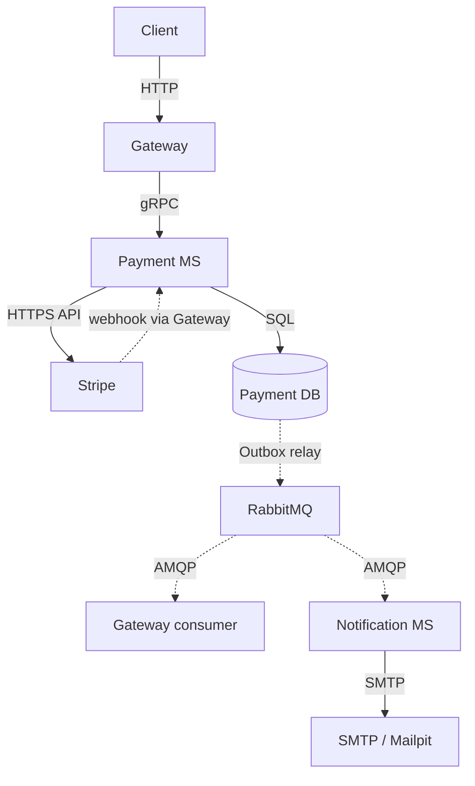
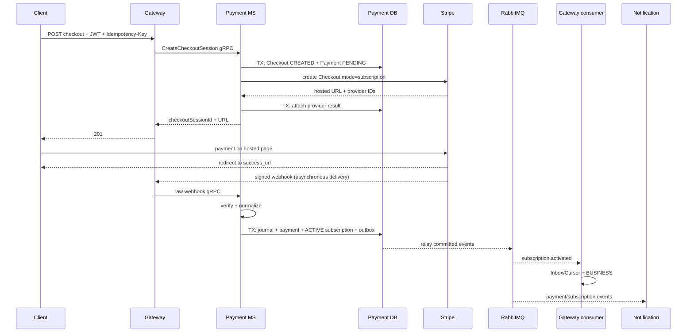
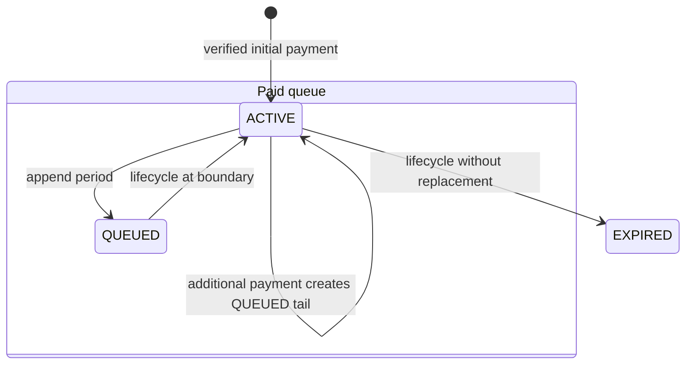
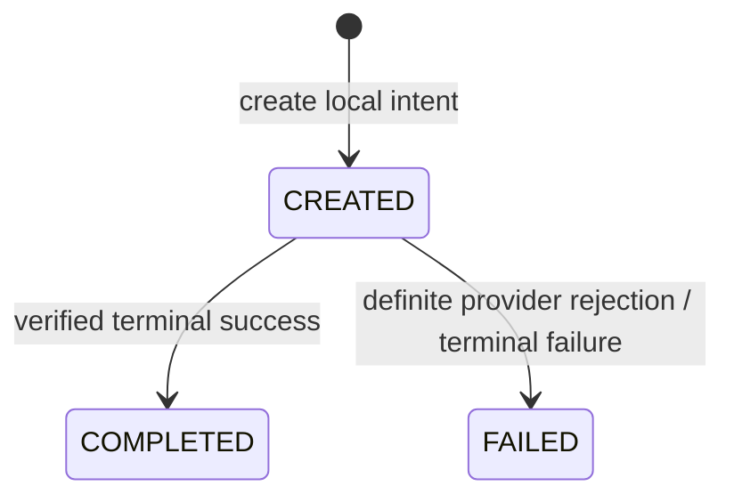
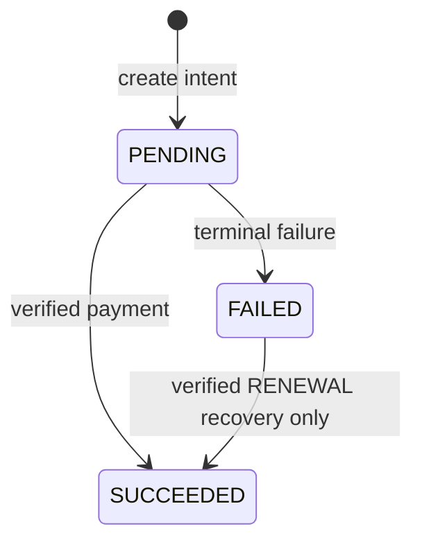
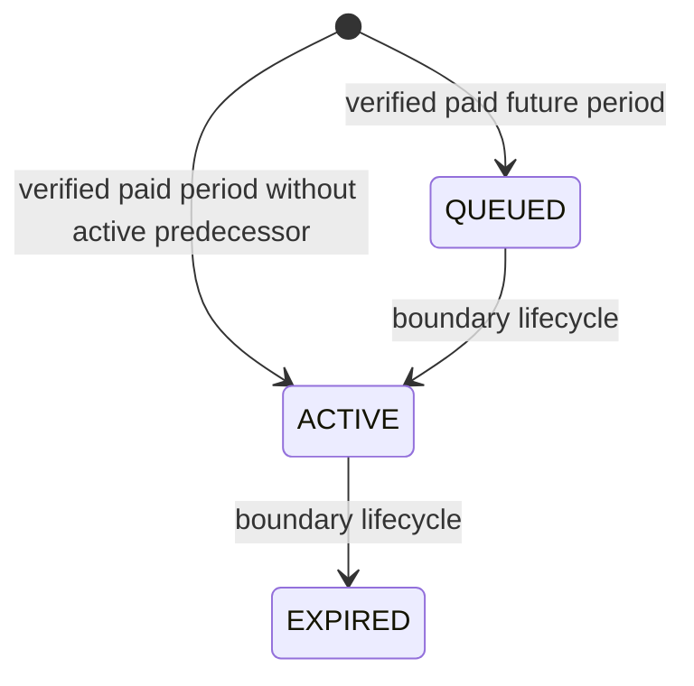
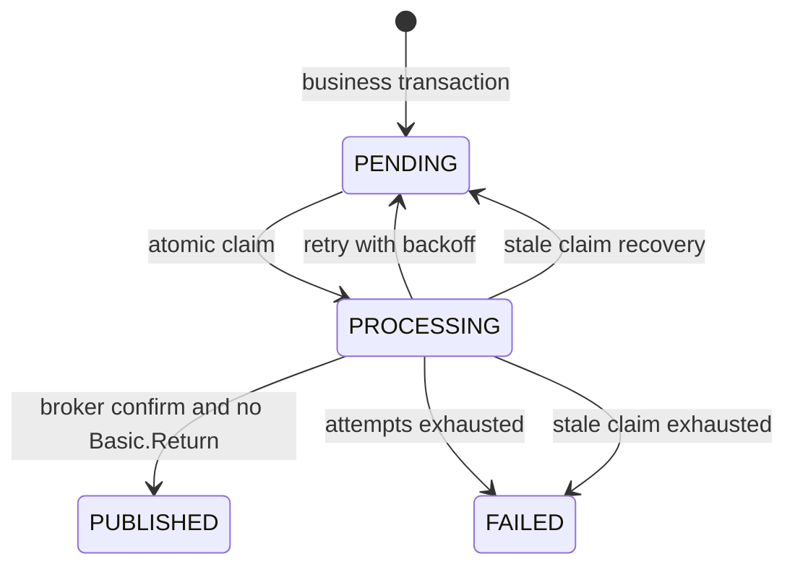
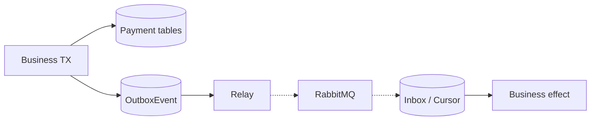
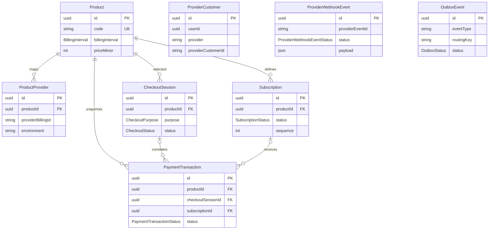
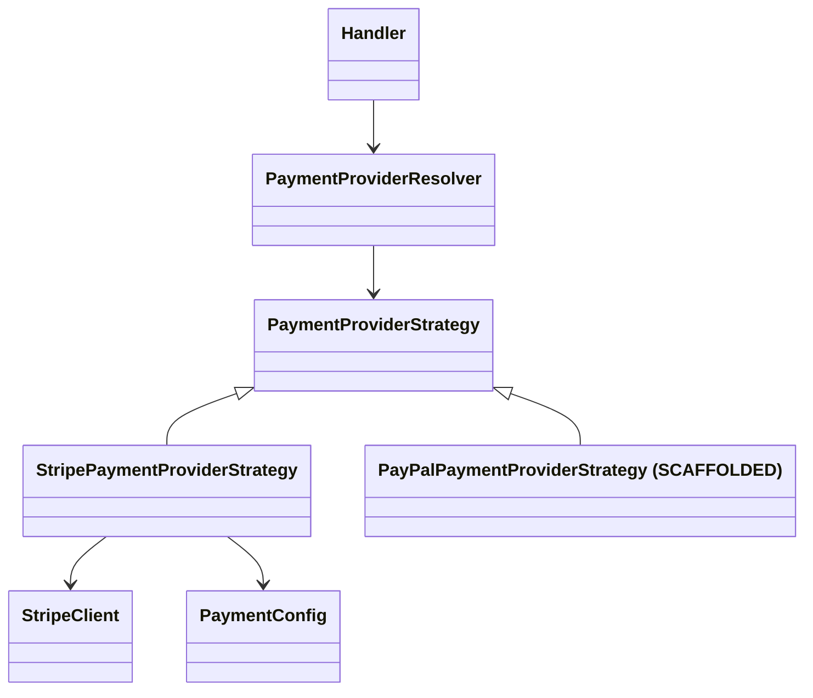

# Micro Payment Service

`micro-payment-service` — внутренний gRPC-сервис платёжных намерений, подтверждённых денежных
транзакций, оплаченной очереди периодов подписки и payment/subscription integration events.

> Last verified against commit: `58e0205`

### За пять минут

| Вопрос                    | Ответ                                                                                              |
| ------------------------- | -------------------------------------------------------------------------------------------------- |
| Что принимает             | gRPC commands/queries от Gateway и raw Stripe webhook bytes через Gateway                          |
| Что сохраняет             | `Product`, provider mapping/customer, Checkout, transaction, subscription, webhook journal, outbox |
| Что публикует             | V1 payment/subscription envelopes через `common_exchange`                                          |
| С кем взаимодействует     | Gateway, Stripe, PostgreSQL, RabbitMQ; косвенно Gateway consumer и Notification MS                 |
| Что получает пользователь | hosted Checkout URL, query state и, после relay, entitlement/email                                 |

### Оглавление

1. [Назначение сервиса](#1-назначение-сервиса)
2. [System context](#2-system-context)
3. [Карта публичного API](#3-карта-публичного-api)
4. [Синхронные взаимодействия](#4-синхронные-взаимодействия)
5. [Асинхронные взаимодействия](#5-асинхронные-взаимодействия)
6. [Initial Checkout и первый платёж](#6-initial-checkout-и-первый-платёж)
7. [Additional purchase и очередь периодов](#7-additional-purchase-и-очередь-периодов)
8. [Auto-renew и lifecycle scheduler](#8-auto-renew-и-lifecycle-scheduler)
9. [State machines](#9-state-machines)
10. [Transactional Outbox](#10-transactional-outbox)
11. [Идемпотентность](#11-идемпотентность)
12. [Payment DB](#12-payment-db)
13. [Provider Strategy](#13-provider-strategy)
14. [PayPal](#14-paypal)
15. [Как добавить альтернативного provider](#15-как-добавить-альтернативного-provider)
16. [Notification integration](#16-notification-integration)
17. [Business invariants](#17-business-invariants)
18. [Failure scenarios и recovery](#18-failure-scenarios-и-recovery)
19. [Feature flags](#19-feature-flags)
20. [Security boundaries](#20-security-boundaries)
21. [Configuration](#21-configuration)
22. [Локальный запуск](#22-локальный-запуск)
23. [Observability и troubleshooting](#23-observability-и-troubleshooting)
24. [Testing map](#24-testing-map)
25. [Code navigation map](#25-code-navigation-map)
26. [Glossary](#26-glossary)
27. [Known limitations](#27-known-limitations)

### Легенда статусов

Этот документ описывает только состояние текущего runtime:

- **IMPLEMENTED** — код существует, зарегистрирован в модулях и участвует в runtime.
- **SCAFFOLDED** — контракт или точка расширения существуют, но операция контролируемо недоступна либо неполна.
- **PLANNED** — runtime-реализации в текущем `HEAD` нет.

Основные источники истины: [Payment module](src/modules/payment/payment.module.ts),
[Payment Prisma schema](src/core/prisma/schema.prisma),
[gRPC contract](../../libs/contracts/src/proto/payment.proto) и
[V1 integration events](../../libs/contracts/src/events/payment-integration-events-v1.event.ts).

### Первые 30 минут

1. Прочитайте [назначение](#1-назначение-сервиса), [system context](#2-system-context) и
   [API map](#3-карта-публичного-api).
2. Пройдите [initial payment sequence](#6-initial-checkout-и-первый-платёж),
   [Transactional Outbox](#10-transactional-outbox) и [идемпотентность](#11-идемпотентность).
3. Изучите [Payment DB](#12-payment-db), [Provider Strategy](#13-provider-strategy) и
   [business invariants](#17-business-invariants).
4. Используйте [code navigation map](#25-code-navigation-map), чтобы открыть entrypoint нужного
   сценария.

## 1. Назначение сервиса

`micro-payment-service` владеет каталогом платных продуктов, локальными намерениями Checkout,
денежными транзакциями, оплаченной очередью периодов подписки, связями с провайдером, журналом
webhook и Payment Outbox. Сервис вызывает Stripe, проверяет подпись Stripe webhook и переводит
подтверждённые provider facts в локальное состояние.

Сервис не аутентифицирует браузер, не предоставляет публичный HTTP API, не хранит профиль
пользователя, не меняет `accountType` напрямую и не отправляет email. Публичная точка входа —
[Gateway PaymentController](../main-gateway-service/src/modules/payments/api/payment.controller.ts):
Gateway проверяет JWT, добавляет trusted `userId` и вызывает Payment MS по gRPC.

Источник истины для доступа — локальная `Subscription` с периодом `[startsAt, endsAt)`. Stripe
является источником provider payment facts, но факт существования Stripe Checkout, redirect на
`success_url` или provider identifier сами по себе не дают локальный entitlement. Локальная оплата
подтверждается только verified webhook и атомарной Payment DB transaction.

## 2. System context

- Client → Gateway: публичный HTTP/JSON.
- Gateway → Payment MS: синхронный gRPC по `payment.proto`.
- Payment MS → Stripe: Stripe HTTPS API из Infrastructure Strategy.
- Stripe → Gateway: причинно асинхронная webhook delivery; внутри HTTP request Gateway синхронно
  пересылает exact raw bytes в Payment MS по gRPC.
- Payment MS → Payment DB: Prisma/PostgreSQL transactions.
- Payment DB → RabbitMQ: отдельный relay читает committed Outbox и публикует AMQP messages.
- RabbitMQ → Gateway/Notification: асинхронная at-least-once delivery.
- Notification → Gateway: синхронный gRPC recipient lookup; Notification → SMTP: email delivery.

## 3. Карта публичного API

Префикс контроллера: `/api/v1/payments`. Swagger создаётся Gateway bootstrap; исходные DTO и
декораторы находятся рядом с [PaymentController](../main-gateway-service/src/modules/payments/api/payment.controller.ts).

| Method  | Path                                        | Auth                           | Назначение                | Gateway handler                        | gRPC                       | Payment handler                   |
| ------- | ------------------------------------------- | ------------------------------ | ------------------------- | -------------------------------------- | -------------------------- | --------------------------------- |
| `GET`   | `/history`                                  | Bearer/JWT                     | История транзакций        | `GetPaymentHistoryQueryHandler`        | `GetPaymentHistory`        | `GetPaymentHistoryHandler`        |
| `GET`   | `/subscriptions`                            | Bearer/JWT                     | Текущий и queued периоды  | `GetSubscriptionsQueryHandler`         | `GetSubscriptions`         | `GetSubscriptionsHandler`         |
| `POST`  | `/checkout`                                 | Bearer/JWT + `Idempotency-Key` | Создать/retrieve Checkout | `CreateCheckoutSessionHandler`         | `CreateCheckoutSession`    | `CreateCheckoutSessionHandler`    |
| `PATCH` | `/subscriptions/:subscriptionId/auto-renew` | Bearer/JWT                     | Изменить auto-renew tail  | `ToggleAutoRenewHandler`               | `ToggleAutoRenew`          | `ToggleAutoRenewHandler`          |
| `POST`  | `/webhook/stripe`                           | Public + `Stripe-Signature`    | Принять Stripe webhook    | `ProcessWebhookEventHandler`           | `ProcessWebhookEvent`      | `ProcessWebhookEventHandler`      |
| `GET`   | `/checkout/:checkoutSessionId/status`       | Bearer/JWT                     | Локальный status Checkout | `GetCheckoutSessionStatusQueryHandler` | `GetCheckoutSessionStatus` | `GetCheckoutSessionStatusHandler` |

Webhook не использует JWT. Gateway включает raw-body support, передаёт только allowlisted
`stripe-signature`, а signature verification выполняется в
[`StripePaymentProviderStrategy.verifyAndParseWebhook`](src/modules/payment/infrastructure/providers/stripe-payment-provider.strategy.ts).
Поэтому Gateway не должен хранить Stripe credentials.

## 4. Синхронные взаимодействия

| Инициатор       | Получатель | Transport / contract                      | Timeout/retry                                                           | Ошибка                                                       | Успешный результат            |
| --------------- | ---------- | ----------------------------------------- | ----------------------------------------------------------------------- | ------------------------------------------------------------ | ----------------------------- |
| Client          | Gateway    | HTTP/JSON, Gateway DTO                    | Явного application retry нет                                            | HTTP error contract `code/message/extensions/errorsMessages` | HTTP DTO                      |
| Gateway         | Payment    | gRPC `PaymentService`                     | Явный timeout/retry в Payment gRPC client не настроен                   | gRPC error mapper → Domain/HTTP error                        | protobuf response             |
| Payment         | Stripe     | Stripe SDK/HTTPS                          | SDK defaults; application retries не оборачивают вызов                  | `StripeErrorMapper` → safe `DomainException`                 | provider-neutral result       |
| Gateway webhook | Payment    | gRPC raw bytes + signature + `receivedAt` | Явного retry Gateway→Payment нет; Stripe повторяет non-2xx              | controlled 400/503                                           | accepted/duplicate/status     |
| Notification    | Gateway    | user gRPC recipient context               | Configured timeout, bounded retry для `UNAVAILABLE`/`DEADLINE_EXCEEDED` | Domain timeout/error                                         | userId/email/userName context |

Payment consumer не вызывает Gateway gRPC. Gateway entitlement consumer читает RabbitMQ и меняет
Gateway DB. Notification recipient lookup реализован в
[`UserGrpcClient`](../micro-notification-service/src/modules/notifications/infrastructure/grpc/user/user-grpc.client.ts).

Provider API calls выполняются вне PostgreSQL transaction при Checkout, auto-renew и additional
provider alignment. Business writes затем повторно проверяют snapshot под user advisory lock.

## 5. Асинхронные взаимодействия

**IMPLEMENTED.** Контракт событий: [payment-integration-events-v1.event.ts](../../libs/contracts/src/events/payment-integration-events-v1.event.ts).

| Contract/type                    | Producer и Outbox creation                                                        | Routing key                       | V1 payload                                                                                    | Consumer / side effect                                                                    | Idempotency и terminal/retry                                                                       | Status      |
| -------------------------------- | --------------------------------------------------------------------------------- | --------------------------------- | --------------------------------------------------------------------------------------------- | ----------------------------------------------------------------------------------------- | -------------------------------------------------------------------------------------------------- | ----------- |
| `PaymentSucceededV1`             | Initial, Additional и Recurring processors через transaction-bound `outbox.write` | `payment.succeeded`               | transaction/user/subscription/product, integer money, provider, kind, nullable purpose        | `PaymentEventsConsumer` → SMTP template `PAYMENT_SUCCEEDED`; recipient через Gateway gRPC | `eventId`; Notification unique `(eventId, templateVersion)`; retry до max, затем `Nack(false)`/DLQ | IMPLEMENTED |
| `PaymentFailedV1`                | Те же три processors; только подтверждённая terminal business failure             | `payment.failed`                  | transaction/user/product, integer money, provider, kind, nullable purpose, safe `failureCode` | Notification → SMTP `PAYMENT_FAILED`; Gateway recipient gRPC                              | То же; repeated equivalent invoice failure не создаёт второй Outbox                                | IMPLEMENTED |
| `QueuedSubscriptionPurchasedV1`  | `AdditionalPaymentWebhookProcessor.applySuccess`                                  | `subscription.queued`             | subscription/sequence/product/period, money, provider                                         | Notification → SMTP `SUBSCRIPTION_QUEUED`; Gateway recipient gRPC                         | Notification delivery key; terminal delivery не повторяет email                                    | IMPLEMENTED |
| `SubscriptionActivatedV1`        | Initial processor, immediate-active renewal и lifecycle replacement               | `subscription.activated`          | subscription/user/sequence/period/product                                                     | Gateway consumer → Inbox/Cursor/BUSINESS; Notification → SMTP `SUBSCRIPTION_ACTIVATED`    | Gateway `eventId` Inbox + monotonic Cursor; Notification delivery retry/DLQ                        | IMPLEMENTED |
| `SubscriptionExpiredV1`          | `SubscriptionLifecycleService.advanceUserQueue`                                   | `payment.subscription.expired`    | subscription/user/sequence/end/replacement facts                                              | Gateway consumer conditionally снимает entitlement; Notification email либо `SKIPPED`     | Gateway Inbox/Cursor; Notification delivery retry/DLQ                                              | IMPLEMENTED |
| `SubscriptionAutoRenewChangedV1` | `ToggleAutoRenewHandler` после provider confirmation и final local transaction    | `subscription.auto-renew.changed` | subscription/user, enabled/effectiveAt/nextBilling/provider                                   | Notification → SMTP `AUTO_RENEW_CHANGED`; Gateway recipient gRPC                          | Notification `(eventId, templateVersion)`; retry/DLQ                                               | IMPLEMENTED |

Exchange: `common_exchange`, type `topic`, durable, `autoDelete=false`. Payment publisher uses
persistent messages, `mandatory=true`, `messageId=eventId`, ConfirmChannel and Basic.Return
detection. Gateway queue consumes only activation/expiry. Notification queue binds all six routing
keys and dead-letters terminal failures to `notification.payment.dlq`.

Notification сначала резервирует `NotificationDelivery` со статусом `PROCESSING`. Успех сохраняет
`SENT`; исчерпание retry или terminal recipient/template error сохраняет `FAILED` и возвращает
`Nack(false)`. Для expiration с `hasActiveReplacement=true` сам `PaymentEventsConsumer` после claim
сохраняет `SKIPPED`, не выполняет recipient lookup и не отправляет email. Gateway независимо видит
replacement facts, сохраняет Inbox/Cursor и не переключает account в `PERSONAL`.

В текущем runtime отсутствуют отдельные события `payment.requires-action`, `checkout.expired`,
`subscription.expiring-soon`, refund и chargeback — **PLANNED** либо вовсе не определены контрактом.

## 6. Initial Checkout и первый платёж

1. Gateway требует UUID v4 `Idempotency-Key`; тот же ключ допустим только для того же canonical
   request.
2. Payment под user advisory lock выбирает purpose: без paid tail — `INITIAL_SUBSCRIPTION`, иначе
   `ADDITIONAL_SUBSCRIPTION`.
3. Локальные `CheckoutSession(CREATED)` и `PaymentTransaction(PENDING)` фиксируются до Stripe call.
4. Initial Stripe Checkout использует `mode=subscription`, mapped recurring Price и Stripe Customer.
5. Provider result присоединяется отдельной transaction; ambiguous error оставляет intent для retry,
   definite rejection переводит intent в `FAILED`.
6. Verified paid webhook создаёт `ACTIVE` sequence 1, завершает Checkout/transaction и атомарно
   пишет `PaymentSucceededV1` + `SubscriptionActivatedV1`.

> `success_url` — только UX-навигация. Webhook — подтверждение результата оплаты. Redirect никогда
> не является доказательством оплаты.

## 7. Additional purchase и очередь периодов

**IMPLEMENTED.** Если существует `ACTIVE`/`QUEUED` tail, Checkout получает purpose
`ADDITIONAL_SUBSCRIPTION`. Stripe Checkout использует `mode=payment`, local snapshot money через
`price_data`, существующего Customer и `payment_intent_data.setup_future_usage=off_session`.

После verified success provider alignment сохраняет PaymentMethod как default, завершает текущую
provider subscription на её boundary и создаёт future Stripe Schedule. Затем одна local transaction:

- создаёт `QUEUED` period с `startsAt = previousTail.endsAt`;
- вычисляет `endsAt` календарно (`WEEK` — 7 суток, `MONTH` — UTC calendar month);
- делает previous tail `autoRenew=false`, new tail `autoRenew=true`;
- завершает Checkout/transaction;
- пишет `PaymentSucceededV1` и `QueuedSubscriptionPurchasedV1`.

Период интерпретируется как `[startsAt, endsAt)`: начало включительно, конец исключительно.
`BUSINESS` не выдаётся за queued purchase; entitlement появляется только при
`SubscriptionActivatedV1`.

## 8. Auto-renew и lifecycle scheduler

**IMPLEMENTED**, operationally gated.

`ToggleAutoRenewHandler` разрешает изменение только последнего unfinished tail. Он делает provider
operation вне DB transaction, затем под lock повторно проверяет snapshot и применяет Domain method.
Disable отменяет future Schedule либо выставляет provider subscription `cancel_at_period_end=true`.
Enable восстанавливает subscription или создаёт Schedule согласно доступной provider correlation.
Успешное изменение создаёт `SubscriptionAutoRenewChangedV1`.

`SubscriptionLifecycleScheduler` создаёт timer только при
`SUBSCRIPTION_LIFECYCLE_ENABLED=true`. `SubscriptionLifecycleService` использует PostgreSQL time,
claim с `FOR UPDATE SKIP LOCKED` и user-scoped transaction lock. На boundary одна transaction:

- `ACTIVE → EXPIRED`;
- contiguous queue head `QUEUED → ACTIVE`, если есть;
- исходные boundaries не меняются;
- записываются expired и, при replacement, activated outbox events.

Повторный запуск идемпотентен, потому что due ACTIVE уже переведён в terminal status.

## 9. State machines

### CheckoutSession

Terminal Checkout нельзя перевести в другой terminal status. Provider Checkout ID присоединяется
только к `CREATED`; повторное присоединение допустимо лишь с теми же facts.
`CheckoutSessionEntity.expire()` и enum `EXPIRED` существуют, но текущий handler/processor их не
вызывает, поэтому `CREATED → EXPIRED` — **SCAFFOLDED**, а не runtime transition.

### PaymentTransaction

`PURCHASE FAILED` terminal. `FAILED → SUCCEEDED` разрешён только для `RENEWAL` того же invoice
lifecycle, без уже связанной Subscription и при совпадающих immutable facts. Enums `REFUNDED` и
`PARTIALLY_REFUNDED`/related construction invariants существуют, но refund handler отсутствует —
**SCAFFOLDED**.
Метод `markProcessing()` и status `PROCESSING` определены Domain model, но текущий Application код
не вызывает transition; поэтому он не показан как действующий runtime path.

### Subscription

`CANCELED` присутствует в enum/construction model, но provider cancellation processor не выполняет
local transition — **SCAFFOLDED**. Finished subscription не может владеть auto-renew.

### OutboxEvent

| Model / transition              | Trigger и caller                                                                | Guard/invariant                                              | Persistence / side effects                                         |
| ------------------------------- | ------------------------------------------------------------------------------- | ------------------------------------------------------------ | ------------------------------------------------------------------ |
| Checkout `[*] → CREATED`        | `CreateCheckoutSessionHandler`                                                  | UUID v4 key, canonical request, active Product/mapping       | Checkout + PENDING purchase в UoW                                  |
| Checkout `CREATED → COMPLETED`  | Initial/Additional success processor → `complete()`                             | Verified paid correlation, mutable intent                    | Checkout update вместе с transaction/subscription/outbox           |
| Checkout `CREATED → FAILED`     | definite Checkout rejection либо terminal initial/additional failure → `fail()` | Только CREATED                                               | Payment failure и, для webhook failure, `PaymentFailedV1`          |
| Payment `[*] → PENDING`         | Checkout handler или Recurring processor factory                                | PURCHASE требует Checkout; RENEWAL требует invoice lifecycle | Immutable money snapshot                                           |
| Payment `PENDING → SUCCEEDED`   | Initial/Additional/Recurring processor → `succeed()`                            | Verified facts; provider transaction или invoice ID          | Связь с paid Subscription и success Outbox                         |
| Payment `PENDING → FAILED`      | Checkout/provider или webhook failure → `fail()`                                | Safe immutable failure facts                                 | Failure Outbox создаёт webhook processor                           |
| Payment `FAILED → SUCCEEDED`    | Recurring success processor → `succeed()`                                       | Только RENEWAL того же invoice, Subscription ещё не связана  | Failure fields очищаются; history остаётся в journal/старом Outbox |
| Subscription `[*] → ACTIVE`     | Initial success или delayed renewal without ACTIVE                              | Valid paid period and queue invariants                       | Activated event для initial/immediate renewal                      |
| Subscription `[*] → QUEUED`     | Additional/renewal success with ACTIVE                                          | `startsAt = tail.endsAt`, ordered sequence                   | Не выдаёт entitlement немедленно                                   |
| Subscription `QUEUED → ACTIVE`  | `SubscriptionLifecycleService` → `activateQueued()`                             | Contiguous queue head, DB time within period                 | В одной TX с expiry и activated Outbox                             |
| Subscription `ACTIVE → EXPIRED` | Lifecycle → `expire()`                                                          | DB time `>= endsAt`                                          | Expired Outbox; optional replacement activation                    |
| Outbox transitions              | `PaymentOutboxRelayRepository` direct conditional updates                       | Status, owner, attempts, stale time                          | Claim/publish/retry state; business tables не меняются             |

В отличие от Domain aggregates, Outbox не имеет отдельной entity state machine: его формальные
переходы реализованы owner-conditional repository updates и SQL claim.

## 10. Transactional Outbox

Outbox устраняет окно «Payment DB commit прошёл, Rabbit publish потерян». Business state и
`OutboxEvent` пишутся через transaction-bound `PaymentOutboxWriter` внутри одного
`PaymentUnitOfWork`. Rabbit connection в этой transaction не открывается.

Relay атомарно восстанавливает stale claims, выбирает eligible rows по `occurredAt,id` через
`FOR UPDATE SKIP LOCKED`, увеличивает attempts и назначает unique worker ID. Publish выполняется вне
DB transaction. Только после broker confirm и проверки отсутствия Basic.Return owner-conditional
update ставит `PUBLISHED`. Ошибка возвращает row в `PENDING` с bounded exponential backoff либо в
`FAILED` после max attempts.

После restart `PENDING` снова eligible по `availableAt`, а оставшийся `PROCESSING` возвращается в
`PENDING` после `PAYMENT_OUTBOX_RELAY_LOCK_TIMEOUT_SECONDS` либо становится `FAILED`, если attempts
уже исчерпаны. Для terminal Outbox `FAILED` отдельного Rabbit DLQ нет: это DB terminal state,
требующий operator investigation.

Гарантия — **at-least-once**, не exactly-once. Crash после confirm до `PUBLISHED` может дать дубль.
Outbox защищает Payment DB → broker; Gateway Inbox/Cursor и NotificationDelivery защищают consumer
side. Весь distributed flow не является одной ACID transaction.

## 11. Идемпотентность

| Уровень              | Ключ / хранение                                     | Предотвращает                    | Срок                             | Conflict/retry                                                     |
| -------------------- | --------------------------------------------------- | -------------------------------- | -------------------------------- | ------------------------------------------------------------------ |
| HTTP                 | UUID v4 `Idempotency-Key`                           | Повтор logical Checkout request  | Постоянно в Checkout/transaction | Same canonical request возвращает тот же result; другой — Conflict |
| Local Checkout       | unique `CheckoutSession.idempotencyKey`             | Второй local intent              | Пока row хранится                | Re-read                                                            |
| Stripe Checkout      | derived key `checkout-{localId}`                    | Второй Stripe Checkout           | Stripe policy                    | Retrieve/retry                                                     |
| Provider customer    | `customer-{provider}-{userId}` + DB unique          | Второй customer mapping          | Постоянно                        | Re-read/consistent correlation                                     |
| Webhook              | `(provider, providerEventId)` journal unique        | Повтор provider event            | Постоянно                        | terminal duplicate → accepted                                      |
| Renewal invoice      | `(provider, providerInvoiceId)`                     | Два periods на invoice lifecycle | Постоянно                        | lock + re-read                                                     |
| Provider transaction | `(provider, providerTransactionId)`                 | Двойная monetary correlation     | Постоянно                        | DB unique                                                          |
| Outbox               | UUID `eventId`/row ID                               | Consumer dedupe identity         | Постоянно                        | Relay допускает redelivery                                         |
| Gateway              | `PaymentEntitlementInbox.eventId` + Cursor sequence | Дубли/stale entitlement          | Постоянно                        | duplicate/stale no-op                                              |
| Notification         | `(eventId, templateVersion)`                        | Повтор email                     | Постоянно                        | terminal no-op; retry failed                                       |
| Lifecycle            | row claim + user advisory lock                      | Двойной boundary transition      | На transaction                   | SKIP LOCKED/no-op after transition                                 |

Новый `Idempotency-Key` означает новую логическую покупку. Тот же webhook event ID — duplicate.
Разные Stripe event IDs одного invoice сериализуются user lock и invoice unique boundary. Out-of-order
entitlement events отбрасываются Gateway Cursor по subscription sequence.

## 12. Payment DB

`PaymentTransaction.checkoutSessionId` и `subscriptionId` nullable, поэтому обе связи на ER
показаны как `zero-or-one` со стороны transaction. `ProviderCustomer`, `ProviderWebhookEvent` и
`OutboxEvent` не имеют Prisma FK к остальным моделям: их связь только логическая через UUID/provider
correlation fields и потому не изображена relationship line.

| Table                     | Назначение / ключи / lifecycle                                                                     |
| ------------------------- | -------------------------------------------------------------------------------------------------- |
| `products`                | PK UUID; unique `code`; interval/count, integer `price_minor`, currency, active flag               |
| `product_providers`       | Provider Product/Price mapping; unique provider billing/environment и product/provider/environment |
| `provider_customers`      | User↔provider Customer; unique user/provider и provider/customer                                   |
| `checkout_sessions`       | Checkout intent/result; unique idempotency key и provider checkout correlation                     |
| `payment_transactions`    | Immutable money snapshot, PURCHASE/RENEWAL lifecycle; unique idempotency, invoice, transaction IDs |
| `subscriptions`           | Ordered paid periods; unique user/sequence, provider subscription and schedule correlations        |
| `provider_webhook_events` | Normalized allowlisted journal; unique provider/event ID; retry attempts/status                    |
| `outbox_events`           | Integration envelope, delivery claim, attempts/backoff/publish status                              |

Payment DB не содержит User FK: `userId` — provider-neutral UUID correlation. Inbox/Cursor находятся в
Gateway DB, NotificationDelivery — в Notification DB. Отдельных scheduler/lease tables нет: lifecycle
claim выполняется над Subscription rows, relay lease хранится в `outbox_events`.

| A                    | Relation        | B                                 | Business meaning                                 |
| -------------------- | --------------- | --------------------------------- | ------------------------------------------------ |
| Product              | 1:N             | ProductProvider                   | Один local продукт может иметь provider mappings |
| CheckoutSession      | 1:N             | PaymentTransaction                | Checkout purchase intent и его transaction       |
| Subscription         | 1:N             | PaymentTransaction                | Успешная transaction оплачивает period           |
| User UUID            | logical         | ProviderCustomer                  | Stable provider customer per provider            |
| ProviderWebhookEvent | correlation IDs | Checkout/transaction/subscription | Verified provider fact drives mutation           |

Деньги хранятся integer minor units (`800` = 8.00 для двухзнаковой валюты), не `float`. Currency —
трёхбуквенная uppercase строка; отображение decimal выполняет клиент/UI, не Domain calculation.

## 13. Provider Strategy

Контракт — [`PaymentProviderStrategy`](src/modules/payment/application/ports/payment-provider.strategy.ts).
Resolver строит registry из DI token `PAYMENT_PROVIDER_STRATEGIES`; дубли provider code fail-fast.
Stripe и PayPal регистрируются в [payment.module.ts](src/modules/payment/payment.module.ts).

Операции стратегии: initial/additional Checkout, retrieval, disable/enable auto-renew,
next-billing synchronization, subscription state и webhook verification/normalization. Stripe SDK
types остаются Infrastructure. Application получает только provider-neutral commands/results и
`NormalizedProviderEvent`.

Stripe-specific mapping, signature verification, Price/Customer/Schedule primitives и safe error
mapping находятся в `infrastructure/providers`.

## 14. PayPal

Статус: **SCAFFOLDED**.

- Provider enum/code и полный Strategy interface существуют.
- `PayPalPaymentProviderStrategy` зарегистрирован в runtime registry.
- API client/OAuth отсутствуют.
- Checkout, retrieval, signature verification, webhook mapping, recurring и Schedule отсутствуют.
- PayPal-specific automated tests отсутствуют.
- Любая операция, включая webhook, возвращает controlled BadRequest с reason
  `PROVIDER_NOT_SUPPORTED`.

Файл `Gateway infrastructure/paypal/paypal.service.ts` не делает Payment MS provider рабочим и не
участвует в текущем Payment checkout flow.

## 15. Как добавить альтернативного provider

1. Поддержать provider code в provider-neutral enum/validation.
2. Реализовать `PaymentProviderStrategy`.
3. Зарегистрировать implementation через `PAYMENT_PROVIDER_STRATEGIES`.
4. Добавить Infrastructure client.
5. Добавить fail-fast credential/config validation только владельцу provider-а.
6. Реализовать initial/additional Checkout capabilities.
7. Реализовать signature verification над exact raw bytes.
8. Нормализовать provider events в `NormalizedProviderEvent`.
9. Определить provider idempotency/correlation mapping.
10. Реализовать recurring/refund/schedule capabilities, только если контракт их требует.
11. Добавить DB mapping лишь при недостаточности существующих provider-neutral fields.
12. Менять gRPC/API contract только при доказанной provider-neutral нехватке.
13. Добавить unit/integration/contract tests.
14. Добавить sandbox config без live secrets.
15. Обновить event matrix и README.

Другой provider не обязан иметь Stripe Schedule. Application должна опираться на capability/result,
а не копировать Stripe primitives.

Запрещённые архитектурные shortcuts:

- разносить `if (provider === ...)` по handlers;
- передавать SDK types в Domain/Application;
- хранить provider secrets в Gateway;
- доверять redirect вместо webhook;
- публиковать RabbitMQ до business commit;
- создавать отдельную business subscription model на provider без необходимости.

## 16. Notification integration

Фактический consumer: [PaymentEventsConsumer](../micro-notification-service/src/modules/notifications/api/rabbit/payment-events.consumer.ts).

| Business situation                 | Event / routing key                                                  | Handler/channel/template purpose                          | Recipient              | Status      |
| ---------------------------------- | -------------------------------------------------------------------- | --------------------------------------------------------- | ---------------------- | ----------- |
| Успешная оплата                    | `PaymentSucceededV1` / `payment.succeeded`                           | Rabbit consumer → SMTP / `PAYMENT_SUCCEEDED`              | Gateway recipient gRPC | IMPLEMENTED |
| Неуспешная оплата                  | `PaymentFailedV1` / `payment.failed`                                 | SMTP / `PAYMENT_FAILED`                                   | Gateway gRPC           | IMPLEMENTED |
| Куплен queued period               | `QueuedSubscriptionPurchasedV1` / `subscription.queued`              | SMTP / `SUBSCRIPTION_QUEUED`                              | Gateway gRPC           | IMPLEMENTED |
| Подписка активирована              | `SubscriptionActivatedV1` / `subscription.activated`                 | SMTP / `SUBSCRIPTION_ACTIVATED`                           | Gateway gRPC           | IMPLEMENTED |
| Auto-renew изменён                 | `SubscriptionAutoRenewChangedV1` / `subscription.auto-renew.changed` | SMTP / `AUTO_RENEW_CHANGED`                               | Gateway gRPC           | IMPLEMENTED |
| Подписка истекла                   | `SubscriptionExpiredV1` / `payment.subscription.expired`             | SMTP / `SUBSCRIPTION_EXPIRED`; replacement expiry SKIPPED | Gateway gRPC           | IMPLEMENTED |
| Auto-renew charge succeeded/failed | Через обычные `PaymentSucceededV1`/`PaymentFailedV1`, kind RENEWAL   | Те же payment templates                                   | Gateway gRPC           | IMPLEMENTED |
| Скоро истечёт                      | События нет                                                          | —                                                         | —                      | PLANNED     |
| Requires action                    | События нет                                                          | —                                                         | —                      | PLANNED     |
| Checkout expired                   | События нет                                                          | —                                                         | —                      | PLANNED     |

Клиент получает email. WebSocket/push для этих событий не реализованы. Entitlement отражается через
Gateway API state, а не client event.

Local Compose Mailpit: SMTP `localhost:1025`, UI `localhost:8025`, без auth, `secure=false` для
host-run Notification. Mailpit — capture, не внешний SMTP.

## 17. Business invariants

| Invariant                                             | Enforcement                                                      |
| ----------------------------------------------------- | ---------------------------------------------------------------- |
| Money — safe positive integer minor units             | `Money`, Product/transaction entities, DB checks                 |
| Currency normalized uppercase, supported format       | `Currency`, webhook processors                                   |
| Intervals только `WEEK`/`MONTH`, count positive       | enums/specifications/Product/BillingPeriod                       |
| Period `[startsAt, endsAt)`                           | `BillingPeriod.contains`, period specifications                  |
| WEEK calendar weeks, MONTH UTC calendar months        | `BillingPeriod.calculateEndsAt`                                  |
| Не более одной ACTIVE и ordered contiguous queue      | subscription repository queries, user lock, queue specifications |
| Только tail владеет auto-renew                        | handlers/entities under user lock                                |
| Finished period не владеет auto-renew                 | `SubscriptionEntity`                                             |
| Initial purchase требует пустую paid queue            | initial processor                                                |
| Additional purchase не активирует entitlement рано    | additional processor creates QUEUED                              |
| Success требует verified amount/currency/correlation  | webhook processors + transaction entity                          |
| `SUCCEEDED` имеет provider transaction или invoice ID | Domain + DB CHECK migration                                      |
| Provider invoice не записывается как transaction ID   | normalized fields and processors                                 |
| Checkout/webhook/provider IDs стабильны и unique      | entities + Prisma unique constraints                             |
| BUSINESS меняется только entitlement event consumer   | Gateway `PaymentRabbitConsumer`                                  |

Поддерживаемый каталог в текущей Domain модели — WEEK/MONTH; фактические активные products являются
данными БД, не hardcoded runtime catalog.

## 18. Failure scenarios и recovery

| Failure                            | Local/provider state                           | Retry/recovery                                | Safe operator action                                       |
| ---------------------------------- | ---------------------------------------------- | --------------------------------------------- | ---------------------------------------------------------- |
| Definite Stripe Checkout rejection | Checkout/transaction FAILED; provider rejected | Same key terminal                             | Исправить request/catalog, новая logical operation         |
| Timeout/ambiguous Checkout result  | CREATED/PENDING; provider object возможен      | Same key retrieve/retry                       | Не создавать новый key до retrieval                        |
| User закрыл open Checkout          | CREATED/PENDING                                | Тот же hosted session пока valid              | Проверить status; не считать failure                       |
| Redirect недоступен                | Payment может быть успешен                     | Webhook остаётся authoritative                | Исправить UX URL, проверить journal                        |
| Webhook не дошёл                   | Payment PENDING                                | Stripe delivery retry                         | Проверить endpoint/TLS/listener; не менять DB вручную      |
| Duplicate webhook                  | Terminal journal                               | `accepted=true`, duplicate                    | Ничего                                                     |
| Out-of-order renewal               | Journal FAILED/retryable correlation-not-ready | Повтор после correlation event                | Проверить schedule/subscription correlation                |
| Invalid signature                  | Journal row не создаётся; HTTP 400             | Correct signed redelivery                     | Проверить raw body и webhook secret                        |
| Business transaction rollback      | Journal manager marks safe FAILED              | Provider retries 503                          | Проверить safe reason; не давать entitlement вручную       |
| Relay disabled                     | Outbox PENDING                                 | Enable controlled window                      | Сначала убедиться в durable compatible consumers           |
| Rabbit unavailable/nack/return     | PENDING+backoff или FAILED                     | Relay retry                                   | Восстановить broker/topology; не duplicate-publish вручную |
| Consumer crash                     | Broker redelivery                              | Inbox/Notification idempotency                | Проверить queue/DLQ и local delivery row                   |
| Gateway entitlement не применился  | Payment paid; account stale                    | Rabbit redelivery if available                | Проверить queue, Inbox/Cursor и safe consumer error        |
| Notification email failed          | NotificationDelivery FAILED                    | bounded retry, затем DLQ                      | Проверить recipient gRPC/SMTP/Mailpit                      |
| Scheduler restart на boundary      | Due ACTIVE остаётся claimable                  | Следующий tick                                | Проверить flag/cron/DB time                                |
| Provider/DB расходятся             | Controlled reconciliation error                | Автоматический reconciliation job отсутствует | Остановить mutation, расследовать correlation              |

Не существует общего reconciliation job — **PLANNED**. Нельзя «лечить» divergence повторной оплатой
или ручным присвоением provider identifiers без доказанных facts.

## 19. Feature flags

| Flag                             | Owner/default                                           | Включает                                             | Не включает             | Safe procedure                                                                               |
| -------------------------------- | ------------------------------------------------------- | ---------------------------------------------------- | ----------------------- | -------------------------------------------------------------------------------------------- |
| `PAYMENT_OUTBOX_RELAY_ENABLED`   | Payment; explicit boolean, implicit default отсутствует | timer, Rabbit connection on publish, outbox delivery | webhook/business writes | Начать `false`; проверить PENDING; убедиться в consumers; controlled `true`; вернуть `false` |
| `SUBSCRIPTION_LIFECYCLE_ENABLED` | Payment; explicit boolean                               | boundary scheduler                                   | provider charge, relay  | Включать только при valid paid queue и configured cron; выключение не меняет periods         |

При обоих flags `false` можно проверить Checkout, webhook, transaction, subscription и PENDING
Outbox. Gateway entitlement и Notification требуют временно включённого relay. Initial flow не требует
lifecycle scheduler.

## 20. Security boundaries

- User endpoints: Gateway JWT/Bearer guard.
- Stripe webhook: public HTTP, exact raw body и required `Stripe-Signature`.
- Gateway allowlists signature header; Authorization/Cookie не пересылаются.
- `STRIPE_SECRET_KEY`, `STRIPE_WEBHOOK_SECRET`, `PAYMENT_PROVIDER_ENVIRONMENT` принадлежат Payment MS.
- Redirect URLs принадлежат Gateway, передаются trusted gRPC fields и повторно валидируются Payment.
- Test config требует `sk_test_`, `whsec_`, environment `test`; live mode отклоняется.
- Raw webhook, signature, SDK event, payment method/card/email/address не сохраняются и не должны
  логироваться; journal хранит normalized allowlisted payload.
- Replay protection: provider event unique journal, monetary unique correlations, consumer Inbox.
- Local secrets должны оставаться в ignored env; deployment secrets — во внешнем secret store.

## 21. Configuration

### Gateway-owned Payment config

| Variable                     | Required | Secret | Purpose / format                                   |
| ---------------------------- | -------: | -----: | -------------------------------------------------- |
| `SUCCESS_PAYMENT_URL`        |      yes |     no | Absolute HTTPS или localhost HTTP trusted redirect |
| `CANCEL_PAYMENT_URL`         |      yes |     no | То же для cancellation UX                          |
| `PAYMENT_SERVICE_GRPC_URL`   |      yes |     no | `host:port`                                        |
| `PAYMENT_ACCOUNT_QUEUE_NAME` |      yes |     no | Durable entitlement queue                          |

### Payment MS

| Variable                                     | Required |    Secret | Purpose / format                    |
| -------------------------------------------- | -------: | --------: | ----------------------------------- |
| `PORT`                                       |      yes |        no | Application port                    |
| `GRPC_HOST`, `GRPC_PORT`                     |      yes |        no | gRPC listener                       |
| `DATABASE_URL`, `PRISMA_DB_URL`              |      yes |       yes | PostgreSQL connectivity             |
| `STRIPE_SECRET_KEY`                          |      yes |       yes | `sk_test_…` only in current runtime |
| `STRIPE_WEBHOOK_SECRET`                      |      yes |       yes | `whsec_…`                           |
| `PAYMENT_PROVIDER_ENVIRONMENT`               |      yes |        no | Only `test`                         |
| `PAYMENT_WEBHOOK_PROCESSING_TIMEOUT_SECONDS` |      yes |        no | Integer 10..900                     |
| `PAYPAL_CLIENT_ID/SECRET/WEBHOOK_ID/MODE`    |       no | yes/mixed | Currently unused scaffold           |

### Relay/lifecycle

| Variable                                    |                Required | Purpose                 |
| ------------------------------------------- | ----------------------: | ----------------------- |
| `PAYMENT_OUTBOX_RELAY_ENABLED`              |                     yes | Explicit gate           |
| `RABBITMQ_URL`                              | only when relay enabled | AMQP connection         |
| `PAYMENT_OUTBOX_RELAY_CRON`                 |                     yes | Six-field cron          |
| `PAYMENT_OUTBOX_RELAY_BATCH_SIZE`           |                     yes | 1..100                  |
| `PAYMENT_OUTBOX_RELAY_MAX_ATTEMPTS`         |                     yes | 1..20                   |
| `PAYMENT_OUTBOX_RELAY_BACKOFF_SECONDS`      |                     yes | 1..3600                 |
| `PAYMENT_OUTBOX_RELAY_LOCK_TIMEOUT_SECONDS` |                     yes | 5..3600                 |
| `SUBSCRIPTION_LIFECYCLE_ENABLED`            |                     yes | Explicit scheduler gate |
| `SUBSCRIPTION_CHECK_CRON`                   |                     yes | Six-field cron          |
| `SUBSCRIPTION_LIFECYCLE_BATCH_SIZE`         |                     yes | 1..100                  |

### Local Notification dependency

| Variable                                                           |        Required | Secret | Purpose                                        |
| ------------------------------------------------------------------ | --------------: | -----: | ---------------------------------------------- |
| `PAYMENT_NOTIFICATION_QUEUE_NAME`, `PAYMENT_NOTIFICATION_DLQ_NAME` |             yes |     no | Payment consumer queue/DLQ                     |
| `PAYMENT_NOTIFICATION_MAX_ATTEMPTS`                                |             yes |     no | Terminal retry threshold                       |
| `PAYMENT_NOTIFICATION_RETRY_BACKOFF_MS`                            |             yes |     no | Consumer retry delay                           |
| `PAYMENT_NOTIFICATION_PROCESSING_TIMEOUT_SECONDS`                  |             yes |     no | Stale claim timeout                            |
| `GATEWAY_SERVICE_GRPC_URL`                                         |             yes |     no | Recipient lookup                               |
| `NOTIFICATION_RECIPIENT_GRPC_TIMEOUT_MS` и retry variables         |             yes |     no | Recipient timeout/retry                        |
| `SMTP_HOST`, `SMTP_PORT`, `SMTP_SECURE`                            |             yes |     no | SMTP transport                                 |
| `SMTP_USER`, `SMTP_PASSWORD`                                       | paired optional |    yes | Оба заданы для auth либо оба пусты для Mailpit |
| `SMTP_FROM_EMAIL`, `SMTP_FROM_NAME`                                |             yes |     no | Sender identity                                |

Legacy `UNSUCCESS_PAYMENT_URL` не является runtime config. Redirect env в Payment MS и Stripe env в
Gateway также не являются runtime-owned configuration.

## 22. Локальный запуск

Команды выполняются из корня monorepo. Не используйте DB reset как обычный startup step.

1. Проверить ignored development env без вывода secret values.
2. Поднять локальную инфраструктуру командой `pnpm infra:up`: root Compose запускает PostgreSQL,
   RabbitMQ и Mailpit и ожидает их healthchecks.
3. Проверить Mailpit: SMTP `127.0.0.1:1025`, UI `http://localhost:8025`.
4. Применить существующие Payment migrations:
   `pnpm exec prisma migrate deploy --config apps/micro-payment-service/src/core/prisma/prisma.config.ts`.
5. Применить Gateway/Notification migrations их собственными config-командами перед consumers.
6. Запустить Gateway: `pnpm run start:dev` (HTTP `4278`, internal gRPC `50050` в текущем local env).
7. Запустить Payment: `pnpm run start:payment` (gRPC `50053` в текущем local env).
8. Запустить Notification: `pnpm run start:notification`.
9. Для local Stripe test delivery выполнить `stripe listen --forward-to
http://localhost:4278/api/v1/payments/webhook/stripe` и поместить новый `whsec_…` только в ignored
   Payment env; затем перезапустить Payment.
10. Начать с relay/lifecycle `false`.
11. Создать test Checkout через Gateway с JWT, active local Product UUID и новым UUID v4
    `Idempotency-Key`; использовать только Stripe test mode.
12. После verified DB state включать relay только controlled window; письма смотреть в Mailpit.

Текущий frontend payment redirect contract не реализован; перед ручной оплатой redirect URLs должны
быть отдельно согласованы. Не направляйте Stripe test flow на production webhook.

## 23. Observability и troubleshooting

Безопасные correlation identifiers: local Checkout ID, transaction ID, provider event ID, outbox
event/message ID, subscription ID/sequence. Не логируйте hosted Checkout URL, signature, raw payload,
secret, email или provider SDK object.

| Симптом                                   | Где проверить                       | Expected                                                | Вероятная причина                                 | Safe next step                                    |
| ----------------------------------------- | ----------------------------------- | ------------------------------------------------------- | ------------------------------------------------- | ------------------------------------------------- |
| Stripe paid, backend PENDING              | webhook HTTP + journal              | actionable `PROCESSED`                                  | webhook/TLS/signature/processor error             | Проверить safe reason и signed redelivery         |
| Checkout URL не открывается               | local/provider Checkout status      | `CREATED`, provider open                                | expired/invalid result                            | Provider-neutral retrieval, не новый Checkout     |
| Webhook 400                               | Gateway response                    | `INVALID_WEBHOOK_SIGNATURE`                             | raw body/header/secret mismatch                   | Обновить local listener secret                    |
| Webhook TLS error                         | ingress/certificate logs            | Stripe reaches public HTTPS                             | certificate/DNS/ingress                           | Исправить transport, не Payment DB                |
| Outbox PENDING                            | outbox status/flag                  | attempts 0 when disabled                                | relay disabled                                    | Проверить consumers, controlled enable            |
| Rabbit event не доставлен                 | exchange/queue/bindings             | ready/unacked settle                                    | missing binding/consumer                          | Read-only topology inspection                     |
| Account PERSONAL                          | Gateway queue/Inbox/Cursor          | activation APPLIED                                      | event not delivered, stale, user absent, DB error | Проверить safe consumer log                       |
| Mailpit пуст                              | NotificationDelivery/DLQ/SMTP       | SENT + one email                                        | recipient/SMTP/template failure                   | Проверить safe error and local ports              |
| Direct SMTP smoke прошёл, flow-письма нет | NotificationDelivery, затем Mailpit | Integration требует consumer + recipient gRPC + adapter | Проверен только SMTP transport                    | Не переоплачивать; проверить queue/delivery state |
| Duplicate webhook                         | journal                             | one row, duplicate true                                 | provider retry                                    | Ничего                                            |
| Lifecycle не сработал                     | flag/cron/DB time/status            | due ACTIVE claimed                                      | disabled, not due, invalid queue                  | Read-only DB time/queue inspection                |

Safe relay markers включают `Payment outbox relay batch failed`, ownership warnings и safe error codes.
Gateway entitlement consumer пишет allowlisted structured Prisma metadata без payload/IDs.

## 24. Testing map

В текущем repository отсутствуют Payment-specific `*.spec.ts`/`*.test.ts` для перечисленных flows.

| Scenario               | Test file   | Level | Dependencies | Proves | Gap                                                       |
| ---------------------- | ----------- | ----- | ------------ | ------ | --------------------------------------------------------- |
| Domain transitions     | отсутствует | —     | —            | —      | Unit tests needed                                         |
| Checkout/idempotency   | отсутствует | —     | —            | —      | Application + Stripe fake tests needed                    |
| Webhook normalization  | отсутствует | —     | —            | —      | Signed fixture unit/contract tests needed                 |
| Webhook persistence    | отсутствует | —     | —            | —      | PostgreSQL integration tests needed                       |
| Outbox claim/publisher | отсутствует | —     | —            | —      | Concurrent DB + disposable Rabbit tests needed            |
| Consumers              | отсутствует | —     | —            | —      | Inbox/DLQ/idempotency tests needed                        |
| Lifecycle scheduler    | отсутствует | —     | —            | —      | DB-time/concurrency tests needed                          |
| End-to-end             | отсутствует | —     | —            | —      | Local Stripe test + Rabbit + Mailpit smoke remains manual |

Generated compilation и прошлые manual diagnostics не являются automated regression coverage.

## 25. Code navigation map

| Если нужно понять…      | Начните с                                                                                                              | Затем откройте                                                                                         | Что там                         |
| ----------------------- | ---------------------------------------------------------------------------------------------------------------------- | ------------------------------------------------------------------------------------------------------ | ------------------------------- |
| Public API              | [PaymentController](../main-gateway-service/src/modules/payments/api/payment.controller.ts)                            | [Gateway adapter](../main-gateway-service/src/modules/payments/infrastructure/payment-grpc.adapter.ts) | HTTP, auth, DTO→gRPC            |
| gRPC contract           | [payment.proto](../../libs/contracts/src/proto/payment.proto)                                                          | [PaymentGrpcController](src/modules/payment/api/grpc/payment-grpc.controller.ts)                       | Six RPC methods                 |
| Checkout                | [CreateCheckoutSessionHandler](src/modules/payment/application/commands/create-checkout-session.command.ts)            | [Stripe Strategy](src/modules/payment/infrastructure/providers/stripe-payment-provider.strategy.ts)    | Intent, provider call, retry    |
| Webhook                 | [ProcessWebhookEventHandler](src/modules/payment/application/commands/process-webhook-event.command.ts)                | [Normalizer](src/modules/payment/infrastructure/providers/stripe-webhook.normalizer.ts)                | Verification, journal, dispatch |
| Initial payment         | [Initial processor](src/modules/payment/application/services/initial-payment-webhook.processor.ts)                     | entities/UoW                                                                                           | ACTIVE + events                 |
| Additional payment      | [Additional processor](src/modules/payment/application/services/additional-payment-webhook.processor.ts)               | Stripe alignment                                                                                       | QUEUED + Schedule               |
| Renewal                 | [Recurring processor](src/modules/payment/application/services/recurring-payment-webhook.processor.ts)                 | normalizer                                                                                             | Invoice lifecycle               |
| Provider selection      | [Resolver](src/modules/payment/infrastructure/providers/payment-provider.resolver.ts)                                  | [Strategy port](src/modules/payment/application/ports/payment-provider.strategy.ts)                    | Registry/capabilities           |
| Transactions            | [PaymentUnitOfWork](src/modules/payment/infrastructure/repositories/payment-unit-of-work.ts)                           | repository interfaces                                                                                  | Prisma TX/user lock             |
| Subscription invariants | [SubscriptionEntity](src/modules/payment/domain/entities/subscription.entity.ts)                                       | [BillingPeriod](src/modules/payment/domain/value-objects/billing-period.value-object.ts)               | Queue/period/renewal            |
| Outbox                  | [Writer](src/modules/payment/infrastructure/repositories/payment-outbox.writer.ts)                                     | [Relay service](src/modules/payment/infrastructure/messaging/payment-outbox-relay.service.ts)          | Atomic event + publish          |
| Rabbit publisher        | [Publisher](src/modules/payment/infrastructure/messaging/payment-outbox.publisher.ts)                                  | [Event contracts](../../libs/contracts/src/events/payment-integration-events-v1.event.ts)              | ConfirmChannel/envelope         |
| Entitlement             | [Gateway consumer](../main-gateway-service/src/modules/users/infrastructure/payment.rabbit.consumer.ts)                | Gateway Prisma schema                                                                                  | Inbox/Cursor/accountType        |
| Notification            | [Notification consumer](../micro-notification-service/src/modules/notifications/api/rabbit/payment-events.consumer.ts) | mail/recipient adapters                                                                                | Delivery/retry/templates        |
| DB                      | [Payment schema](src/core/prisma/schema.prisma)                                                                        | [Migrations](src/core/prisma/migrations)                                                               | Tables/constraints/indexes      |
| Config                  | [PaymentConfig](src/core/payment.config.ts)                                                                            | [PaymentModule](src/modules/payment/payment.module.ts)                                                 | Validation/DI/flags             |
| Tests                   | repository `test` directories                                                                                          | section 24                                                                                             | Current coverage gaps           |

## 26. Glossary

- **CheckoutSession** — локальное намерение открыть hosted provider Checkout.
- **PaymentTransaction** — локальный денежный lifecycle с immutable money snapshot.
- **Product** — продаваемый период и цена в локальном каталоге.
- **Subscription / Paid Period** — один оплаченный interval доступа.
- **Queued Period** — оплаченный будущий period после текущего tail.
- **ProviderCustomer** — связь user UUID с provider Customer ID.
- **Outbox** — committed integration events, ожидающие broker publication.
- **Inbox** — consumer-side таблица обработанных event IDs.
- **Cursor** — monotonic sequence состояния entitlement пользователя.
- **Relay** — worker Outbox→RabbitMQ.
- **Entitlement** — право на `BUSINESS`, выводимое из ACTIVE paid period.
- **Auto-renew** — право последнего paid tail продолжать provider billing.
- **Lifecycle** — boundary transition EXPIRED/ACTIVE без provider charge.
- **Idempotency** — повтор безопасной той же операции без второго эффекта.
- **Webhook** — подписанное provider event delivery.
- **Routing key** — topic key RabbitMQ event-а.
- **Minor units** — целочисленная минимальная единица валюты.

## 27. Known limitations

- PayPal — **SCAFFOLDED**, все операции controlled `PROVIDER_NOT_SUPPORTED`.
- Refund/partial refund statuses существуют, но handlers/provider flow отсутствуют.
- Provider cancellation нормализуется, но local cancellation processor отсутствует.
- Нет reconciliation job для provider/DB divergence.
- Нет automated Payment unit/integration/e2e tests.
- Нет notification scenarios для expiring-soon, requires-action и checkout-expired.
- Frontend payment success/cancel route/query contract отсутствует; текущие local redirects требуют
  согласования до нового smoke.
- Gateway advisory-lock deserialization fix присутствует в текущем коде, но отдельный post-fix
  entitlement runtime replay не зафиксирован automated test-ом.
- Stripe Test Clock delivery и failure→success renewal recovery остаются manual hardening gap.
- Current Payment config поддерживает только Stripe test mode; live rollout не реализован config policy.
- RabbitMQ topology создаётся приложениями; root Compose предоставляет только локальный broker.
