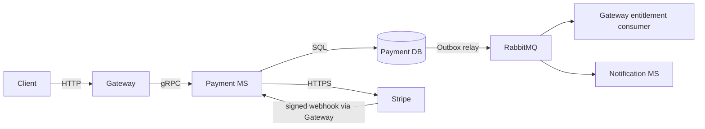

# Micro Payment Service

`micro-payment-service` — внутренний сервис каталога платёжных продуктов, Checkout, денежных
транзакций, оплаченных периодов подписки, Stripe webhook и Payment Outbox. Единственная публичная
HTTP-точка входа — `main-gateway-service`: Gateway проверяет JWT и синхронно вызывает Payment MS по
gRPC. Entitlement и события Notification MS передаются асинхронно через RabbitMQ.

Stripe — реализованный provider. PayPal присутствует только как scaffold/port и не является рабочим
платёжным flow.

## Architecture overview



Payment MS владеет моделями `Product`, `ProductProvider`, `ProviderCustomer`, `CheckoutSession`,
`PaymentTransaction`, `Subscription`, `ProviderWebhookEvent` и `OutboxEvent`. Он не
аутентифицирует браузер, не меняет `User.accountType` напрямую и не предоставляет публичный
business HTTP API.

Основные источники истины:

- [Payment module](src/modules/payment/payment.module.ts);
- [Payment Prisma schema](src/core/prisma/schema.prisma);
- [gRPC contract](../../libs/contracts/src/proto/payment.proto);
- [Gateway Payment controller](../main-gateway-service/src/modules/payments/api/payment.controller.ts);
- [V1 integration events](../../libs/contracts/src/events/payment-integration-events-v1.event.ts).

## Implemented capabilities

Префикс публичного Gateway API — `/api/v1/payments`.

| Method  | Path                                        | Auth             | Idempotency key           | Назначение                                                          |
| ------- | ------------------------------------------- | ---------------- | ------------------------- | ------------------------------------------------------------------- |
| `GET`   | `/products`                                 | JWT              | Нет                       | Активные доступные для покупки Business-продукты                    |
| `POST`  | `/checkout`                                 | JWT              | UUID v4 `Idempotency-Key` | Создать либо идемпотентно получить hosted Checkout                  |
| `GET`   | `/checkout/:checkoutSessionId/status`       | JWT              | Нет                       | Получить локальный статус Checkout                                  |
| `GET`   | `/history`                                  | JWT              | Нет                       | Получить paginated историю транзакций и связанный оплаченный период |
| `GET`   | `/subscriptions`                            | JWT              | Нет                       | Получить текущий и queued оплаченные периоды                        |
| `PATCH` | `/subscriptions/:subscriptionId/auto-renew` | JWT              | Нет                       | Изменить auto-renew последнего незавершённого периода               |
| `POST`  | `/webhook/stripe`                           | Stripe signature | Нет                       | Передать exact raw webhook bytes в Payment MS для проверки подписи  |

Redirect на success/cancel page не подтверждает оплату. Авторитетный результат появляется только
после проверенного provider webhook и успешной Payment DB transaction.

### Product catalog

`GET /api/v1/payments/products` выполняет один пакетный read path:

```text
один HTTP request
→ один Gateway gRPC call
→ GetAvailableProductsQuery
→ один Prisma Product.findMany
→ один gRPC response с массивом
→ { items: [...] }
```

В каталог входят только активные `Product` с активным `ProductProvider` для `STRIPE` и
environment из валидированного `PAYMENT_PROVIDER_ENVIRONMENT`. Порядок детерминирован: interval,
interval count, цена, Product ID. Поддерживаются `WEEK` и `MONTH`.

Публичный элемент содержит только:

```json
{
  "productId": "UUID",
  "name": "Business subscription",
  "amountMinor": 700,
  "currency": "USD",
  "billingInterval": "WEEK",
  "billingIntervalCount": 1
}
```

`amountMinor` — целое число в minor units; decimal-форматирование выполняет клиент. Provider Product
и Price IDs, provider metadata, внутренние статусы и timestamps наружу не передаются. Пустой каталог
возвращает `200 { "items": [] }`. На новой БД это ожидаемо, пока отдельно не созданы Products и
активные provider mappings; автоматического Product provisioning сейчас нет.

## Checkout and Stripe flows

### Initial purchase

1. Gateway принимает JWT, `productId`, trusted success/cancel URLs и UUID v4
   `Idempotency-Key`.
2. Payment MS проверяет активный Product и mapping текущего provider environment.
3. В Payment DB создаются локальные `CheckoutSession(CREATED)` и
   `PaymentTransaction(PENDING)`.
4. Stripe Strategy создаёт hosted subscription-mode Checkout для provider Customer и mapped Price.
5. Signed Stripe webhook подтверждает provider result; webhook journal предотвращает повторную
   обработку одного provider event.
6. Успех атомарно завершает Checkout/transaction, создаёт оплаченный период и Outbox events.

Повтор того же canonical Checkout request с тем же ключом возвращает прежний результат. Повтор
provider event не создаёт вторую transaction, Subscription или Outbox event.

### Additional purchase

Новая покупка выполняется сразу, но следующий непрерывный оплаченный период создаётся как `QUEUED`
с `startsAt = endsAt` предыдущего tail. Auto-renew предыдущего периода отключается; уже оплаченный
доступ не сокращается. Provider subscription/schedule выравнивается с локальной очередью.

### Recurring payment

Recurring processor обрабатывает success и failure invoice events. Success создаёт или завершает
ровно одну `RENEWAL` transaction и один оплаченный период. Failure не сокращает текущий оплаченный
период. Поздняя успешная оплата той же invoice может восстановить `FAILED → SUCCEEDED`; поздний
failure не откатывает уже `SUCCEEDED` transaction.

Webhook принимает публичный Gateway route, но подпись проверяет
`StripePaymentProviderStrategy` над exact raw body. Journal хранит нормализованный allowlisted
payload, а не raw Stripe object. Test/live environment разделяется config; текущая validation
Payment MS разрешает только Stripe test mode.

## Subscription lifecycle

Оплаченный доступ определяется периодом:

```text
startsAt <= now < endsAt
```

`startsAt` включителен, `endsAt` исключителен. Фактические runtime-статусы периода — `ACTIVE`,
`QUEUED` и `EXPIRED`; `CANCELED` присутствует в модели, но отдельный local cancellation
processor не реализован.

- Первый подтверждённый оплаченный период становится `ACTIVE`.
- Следующий непрерывный оплаченный период становится `QUEUED`.
- Только последний незавершённый tail может владеть auto-renew.
- Failed renewal не сокращает текущий paid period и не создаёт преждевременную деактивацию.
- На boundary lifecycle transaction переводит старый `ACTIVE → EXPIRED` и contiguous replacement
  `QUEUED → ACTIVE` без промежуточного `PERSONAL`.
- `BUSINESS → PERSONAL` происходит только после окончания последнего оплаченного периода без
  активной замены.
- Одна provider invoice не создаёт несколько `PaymentTransaction` или оплаченных периодов.

Lifecycle scheduler включается только через `SUBSCRIPTION_LIFECYCLE_ENABLED`. Выборка использует
PostgreSQL time, bounded batch, `FOR UPDATE SKIP LOCKED` и user-scoped transaction lock. Повторный
run после уже выполненного transition является no-op.

## Outbox and entitlement delivery

```text
Payment DB transaction
→ Payment Outbox
→ RabbitMQ common_exchange
→ Gateway PaymentRabbitConsumer
→ PaymentEntitlementInbox / PaymentEntitlementCursor / User transaction
```

Business changes и `OutboxEvent` фиксируются одной Payment transaction. Relay отдельно claim-ит
rows, публикует persistent messages с publisher confirm и `mandatory=true`, затем переводит Outbox
в `PUBLISHED`. Ошибки возвращаются в bounded backoff либо в terminal `FAILED`; delivery остаётся
at-least-once.

Gateway Inbox дедуплицирует `eventId`. Cursor хранит монотонную sequence entitlement и не позволяет
старому/out-of-order событию откатить более новое состояние. Gateway обновляет `User.accountType`
в той же transaction; оплаченный активный период даёт `BUSINESS`, окончание последнего покрытия —
`PERSONAL`.

Entitlement consumer использует существующую durable retry queue и terminal DLQ:

| Сценарий                  | Поведение                                                                 |
| ------------------------- | ------------------------------------------------------------------------- |
| Успех                     | Gateway transaction, затем ACK                                            |
| Duplicate/stale           | Идемпотентный результат и ACK                                             |
| Обычная transaction error | Confirmed persistent retry через 5 минут; максимум 3 попытки, затем DLQ   |
| Invalid event             | Сразу confirmed terminal DLQ с reason `INVALID_EVENT`, без обычных retry  |
| User отсутствует          | Сразу confirmed terminal DLQ с reason `USER_NOT_FOUND`, без обычных retry |
| Retry/DLQ publish failure | Без ACK; задержка 5 минут, затем anti-loss `Nack(true)`                   |

Original message ACK выполняется только после подтверждённой retry/DLQ публикации. Обычная ошибка
entitlement transaction не использует immediate `Nack(true)`, поэтому прежний tight redelivery
loop не является нормальным error path.

Payment events также читает Notification MS. Он хранит `NotificationDelivery`, дедуплицирует
`eventId`/template version и отправляет существующие payment/subscription email через SMTP.
Notification failure не участвует в Gateway entitlement transaction и не блокирует изменение
`accountType`.

## Data and idempotency

- Деньги хранятся как positive integer minor units вместе с immutable currency snapshot.
- Checkout дедуплицируется UUID v4 `Idempotency-Key`.
- Webhook journal имеет unique provider/event correlation.
- Provider invoice и provider transaction IDs защищены уникальными ограничениями.
- Payment Outbox предоставляет стабильный `eventId`; consumers обязаны быть идемпотентными.
- History возвращает `subscriptionId` и фактический `Subscription.endsAt` связанного периода; при
  отсутствии relation оба поля равны `null`. Дата не вычисляется из `paidAt` или billing interval.

## Configuration

Фактические значения хранятся только в ignored env/deployment secrets и не должны попадать в README.
У `PaymentConfig` нет скрытых production defaults: обязательные параметры должны пройти validation.

### Payment MS

| Variable                                                                       | Required/default               | Purpose                                  |
| ------------------------------------------------------------------------------ | ------------------------------ | ---------------------------------------- |
| `PORT`                                                                         | Required                       | Nest application port                    |
| `GRPC_HOST`, `GRPC_PORT`                                                       | Required                       | Внутренний gRPC listener                 |
| `DATABASE_URL`                                                                 | Required                       | Общая DB connectivity validation         |
| `PRISMA_DB_URL`                                                                | Required                       | Runtime Prisma connection                |
| `PRISMA_DB_URL_DIRECT`                                                         | Required для migration command | Datasource для `prisma migrate deploy`   |
| `PAYMENT_PROVIDER_ENVIRONMENT`                                                 | Required; сейчас только `test` | Provider mapping/environment selection   |
| `STRIPE_SECRET_KEY`                                                            | Required secret                | Stripe test API access                   |
| `STRIPE_WEBHOOK_SECRET`                                                        | Required secret                | Webhook signature verification           |
| `PAYMENT_WEBHOOK_PROCESSING_TIMEOUT_SECONDS`                                   | Required, `10..900`            | Recovery timeout journal processing      |
| `PAYMENT_OUTBOX_RELAY_ENABLED`                                                 | Required boolean               | Включает Outbox scheduler/publisher path |
| `RABBITMQ_URL`                                                                 | Required при включённом relay  | AMQP connection                          |
| `PAYMENT_OUTBOX_RELAY_CRON`                                                    | Required six-field cron        | Outbox schedule                          |
| `PAYMENT_OUTBOX_RELAY_BATCH_SIZE`                                              | Required, `1..100`             | Максимум rows в batch                    |
| `PAYMENT_OUTBOX_RELAY_MAX_ATTEMPTS`                                            | Required, `1..20`              | Terminal relay threshold                 |
| `PAYMENT_OUTBOX_RELAY_BACKOFF_SECONDS`                                         | Required, `1..3600`            | Relay retry backoff                      |
| `PAYMENT_OUTBOX_RELAY_LOCK_TIMEOUT_SECONDS`                                    | Required, `5..3600`            | Stale claim recovery                     |
| `SUBSCRIPTION_LIFECYCLE_ENABLED`                                               | Required boolean               | Включает boundary scheduler              |
| `SUBSCRIPTION_CHECK_CRON`                                                      | Required six-field cron        | Lifecycle schedule                       |
| `SUBSCRIPTION_LIFECYCLE_BATCH_SIZE`                                            | Required, `1..100`             | Lifecycle batch limit                    |
| `PAYPAL_CLIENT_ID`, `PAYPAL_CLIENT_SECRET`, `PAYPAL_WEBHOOK_ID`, `PAYPAL_MODE` | Optional scaffold              | Сейчас не образуют рабочий PayPal flow   |

### Gateway-owned Payment integration

| Variable                                    | Required/default | Purpose                                                         |
| ------------------------------------------- | ---------------- | --------------------------------------------------------------- |
| `PAYMENT_SERVICE_GRPC_URL`                  | Required         | Адрес внутреннего Payment gRPC service                          |
| `SUCCESS_PAYMENT_URL`, `CANCEL_PAYMENT_URL` | Required         | Trusted frontend redirects для Checkout                         |
| `PAYMENT_ACCOUNT_QUEUE_NAME`                | Required         | Durable entitlement queue; `.retry` и `.dlq` выводятся из имени |

Retry entitlement `3 attempts / 5 minutes` сейчас задан константами Gateway consumer, а не env.

## Local development

Команды выполняются из корня monorepo:

```bash
pnpm install
pnpm infra:up
pnpm run prisma:payment:migrate
pnpm run gen:contracts
pnpm run start:payment
pnpm run start:dev
```

`infra:up` запускает только локальные PostgreSQL, RabbitMQ и Mailpit containers; приложения и
migrations запускаются отдельно. `prisma:payment:migrate` использует development migration flow и
должен указывать на локальную БД. `gen:contracts` нужен после изменения `.proto`, а не при каждом
старте.

Для opt-in Stripe webhook/E2E используется Stripe CLI с forwarding только на локальный
`/api/v1/payments/webhook/stripe`. Listener secret передаётся через временное process environment;
Stripe test credentials и URLs не сохраняются в tracked files. Test run обязан использовать local
test DB/RabbitMQ и Stripe test mode.

Остановка локальной инфраструктуры без удаления containers, network, volumes и данных:

```bash
pnpm infra:down
```

## Verification

Существующий test contour включает:

- focused unit tests initial/recurring payment, transaction recovery, lifecycle и Product catalog;
- PostgreSQL integration tests Product filtering, lifecycle batching/concurrency/rollback;
- локальный PostgreSQL/RabbitMQ integration flow Payment Outbox → Gateway Inbox/Cursor/User;
- Gateway Product mapping, history mapping, entitlement retry/DLQ и bootstrap/DI tests;
- opt-in Stripe Layer C harness в `test/e2e`.

Stripe E2E выключен по умолчанию и запускается только при явном
`PAYMENT_TEST_STRIPE_E2E=true`. Safety preflight требует test key, уникальный run ID, локальные
test databases, локальный RabbitMQ и локальный webhook endpoint. Mock/fake-clock coverage не следует
называть реальным Stripe E2E.

## Known limitations and deferred work

### Operational debt

- Автоматического Product provisioning нет. После миграций новой БД нужно отдельно создать Products
  и активные provider mappings для выбранного environment.
- Для terminal entitlement DLQ нет административного UI/API replay и удаления. Review, replay и
  cleanup пока являются ручной операционной процедурой.
- Мониторинг Payment Outbox backlog, retry queue, DLQ и аномального роста DB operations ещё не
  автоматизирован полностью.
- Gateway entitlement retry `3 attempts / 5 minutes` задан в коде.
- Автоматический десятидневный DLQ TTL не реализован; до отдельного решения применяется ручная
  review/cleanup policy.

### Verification gaps

- Duplicate/out-of-order handling покрыт focused unit/integration tests, но автоматического полного
  replay старых подписанных Stripe deliveries на provider transport level нет.
- Stripe Test Clock не заменяет local wall-clock lifecycle worker; boundaries отдельно покрываются
  deterministic и PostgreSQL integration tests.
- Production load/chaos validation RabbitMQ и PostgreSQL не входит в обычный test contour.

### Next feature: notifications

Notification MS уже отправляет payment/subscription email и хранит технический
`NotificationDelivery`, но следующие пользовательские возможности ещё не реализованы:

- сохранённая история пользовательских уведомлений;
- `seenAt` и `unseenCount`;
- payment/subscription reminders;
- WebSocket delivery;
- Notification Inbox для новых notification events.

### Out of the current Stripe MVP

- полноценный PayPal flow;
- refunds и partial refunds;
- автоматическая provider cancellation/refund обработка;
- reconciliation job для provider/Payment DB divergence;
- Stripe live-mode provisioning/readiness;
- frontend success/cancel pages и их UX-контракт — внешняя frontend-зависимость, не доказательство
  платежа.

### Current release assessment

После direct-DLQ обработки terminal entitlement errors подтверждённых критических дефектов текущего
Stripe Payment lifecycle в проверенном коде не обнаружено. Оставшиеся пункты относятся к operational
debt, verification gaps или отдельному roadmap scope и не блокируют начало реализации WebSocket
notifications.
